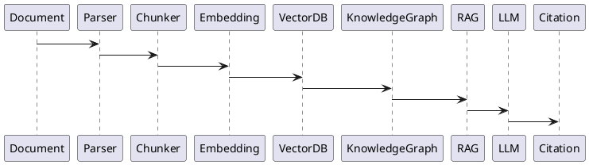
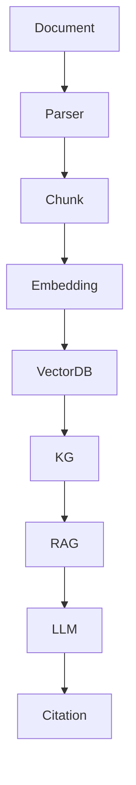

# BOOK-2

# IS-019

# Knowledge Graph & RAG Implementation Specification

**Document ID：IS-019**  
**Module：Knowledge Graph & Retrieval-Augmented Generation Platform**  
**Status：Official Edition v2.0**  
**Baseline：PEP-Knowledge Graph、PEP-RAG、PEP-AI Runtime**

---

# 1. Module Information

Module Code

```text
KG
```

Canonical ID

```text
KG-001
```

Owner

```text
Knowledge Platform Team
```

---

# 2. Responsibility

Knowledge Platform 負責：

- Knowledge Graph
- Vector Database
- Embedding
- RAG Pipeline
- Document Management
- Knowledge Versioning
- Knowledge Validation
- Semantic Search
- Citation Engine
- Knowledge Governance
- AI Traceability

Knowledge Platform 不負責：

- Business Workflow
- Payment
- Inspection
- UI Rendering

---

# 3. Design Principles

KG-001

Knowledge Is Versioned

---

KG-002

Knowledge Never Lost

---

KG-003

Everything Traceable

---

KG-004

Every Answer Has Citation

---

KG-005

Hybrid Retrieval

---

KG-006

Knowledge Before LLM

---

KG-007

Human Verified Knowledge Preferred

---

KG-008

AI Never Invents Evidence

---

# 4. Knowledge Architecture

```text
Source

↓

Parser

↓

Chunk

↓

Embedding

↓

Vector DB

↓

Knowledge Graph

↓

Hybrid Search

↓

RAG

↓

LLM

↓

Citation

↓

Answer
```

---

# 5. Knowledge Sources

Platform Internal

```text
Case

Workflow

Checklist

Evidence

Contract

Payment

Inspection

Warranty

Project History
```

External

```text
Building Codes

Government Regulations

Construction Standards

Material Catalog

Manufacturer Manual

Technical Whitepaper

Open Knowledge

Academic Papers
```

Enterprise

```text
Portfolio

Proposal

Drawing

CAD

BIM

Company SOP

Training Documents
```

---

# 6. Knowledge Lifecycle

```text
Imported

↓

Parsed

↓

Chunked

↓

Embedded

↓

Indexed

↓

Verified

↓

Published

↓

Referenced

↓

Archived
```

---

# 7. Document Processing

Supported

```text
PDF

DOCX

Markdown

HTML

TXT

CSV

Excel

PowerPoint

JSON

XML

CAD Metadata

BIM Metadata
```

---

# 8. Chunk Strategy

Chunk Types

```text
Paragraph

Section

Table

Image OCR

Checklist

Evidence Metadata

Contract Clause
```

Metadata

```text
Document ID

Chunk ID

Page

Section

Version

Source

Created Time

Language
```

---

# 9. Embedding

Supported

```text
OpenAI

BGE-M3

E5

Jina

Nomic

Local Embedding
```

Embedding Metadata

```text
Embedding Model

Dimension

Version

Created Time

Quality Score
```

---

# 10. Vector Database

Supported

```text
Qdrant

Milvus

pgvector

Weaviate

Chroma

FAISS(Local)
```

Index

```text
Project

Organization

Case

Language

Permission

Knowledge Type
```

---

# 11. Knowledge Graph

Entities

```text
Project

Case

Organization

Person

Material

Contract

Evidence

Inspection

Checklist

Workflow

Risk

Warranty
```

Relations

```text
BELONGS_TO

GENERATED_BY

USES

REFERENCES

RELATED_TO

INSPECTED_BY

SIGNED_BY

DEPENDS_ON
```

---

# 12. Hybrid Retrieval

Search Order

```text
Knowledge Graph

↓

Keyword

↓

Vector Search

↓

Metadata Filter

↓

Re-ranking

↓

Citation Builder
```

---

# 13. RAG Pipeline

```text
User Query

↓

Intent Analysis

↓

Permission Check

↓

Retriever

↓

Vector Search

↓

Knowledge Graph

↓

Re-ranker

↓

Prompt Builder

↓

LLM

↓

Citation

↓

Response
```

---

# 14. Citation Engine

每個回答必須包含：

```text
Document

Page

Chunk

Version

Knowledge Source

Confidence

Retrieved Time
```

---

# 15. Permission Model

Knowledge Scope

```text
Public

Tenant

Organization

Project

Case

Private
```

所有 Retrieval 必須經 RBAC 驗證。

---

# 16. OpenAPI

## POST

```text
/api/v1/knowledge/import
```

---

## POST

```text
/api/v1/knowledge/embed
```

---

## POST

```text
/api/v1/knowledge/search
```

---

## POST

```text
/api/v1/rag/query
```

---

## GET

```text
/api/v1/knowledge/document/{id}
```

---

## GET

```text
/api/v1/knowledge/graph
```

---

## GET

```text
/api/v1/knowledge/citation
```

---

# 17. Error Codes

```text
KG-4001

Document Not Found

KG-4002

Embedding Failed

KG-4003

Vector Missing

KG-4004

Permission Denied

KG-4005

Knowledge Not Indexed

KG-4006

Citation Missing

KG-5001

Knowledge Platform Failure
```

---

# 18. SQL

```sql
CREATE TABLE knowledge_document(

document_id BIGINT PRIMARY KEY,

document_type VARCHAR(50),

title VARCHAR(255),

version_no INT,

status VARCHAR(30),

created_at TIMESTAMP

);
```

```sql
CREATE TABLE knowledge_chunk(

chunk_id BIGINT PRIMARY KEY,

document_id BIGINT,

chunk_index INT,

page_no INT,

content TEXT,

embedding_version VARCHAR(30)

);
```

```sql
CREATE TABLE knowledge_citation(

citation_id BIGINT PRIMARY KEY,

document_id BIGINT,

chunk_id BIGINT,

query_hash CHAR(64),

confidence DECIMAL(5,2),

created_at TIMESTAMP

);
```

---

# 19. Repository

```text
KnowledgeRepository

ChunkRepository

EmbeddingRepository

CitationRepository

GraphRepository
```

---

# 20. Domain Services

```text
KnowledgeEngine

ChunkService

EmbeddingService

VectorSearchService

KnowledgeGraphService

RAGService

CitationService

PermissionFilterService
```

---

# 21. Commands

```text
ImportDocumentCommand

ChunkDocumentCommand

EmbedDocumentCommand

PublishKnowledgeCommand

RunRAGCommand
```

---

# 22. Queries

```text
SearchKnowledge

SearchVector

GetDocument

GetCitation

GetKnowledgeGraph
```

---

# 23. PHP Structure

```text
src/

Domain/Knowledge/

Application/

Infrastructure/

Presentation/
```

Classes

```text
KnowledgeEngine.php

EmbeddingService.php

VectorSearch.php

KnowledgeGraph.php

CitationService.php

KnowledgeController.php
```

---

# 24. FastAPI

```text
knowledge/

router.py

document.py

embedding.py

vector.py

graph.py

rag.py

citation.py

audit.py
```

---

# 25. React

Pages

```text
Knowledge Dashboard

Document Library

Knowledge Graph

RAG Console

Citation Viewer

Embedding Monitor
```

Components

```text
KnowledgeTree

GraphViewer

ChunkViewer

CitationPanel

VectorSearchResult

DocumentPreview
```

---

# 26. Runtime Events

```text
DocumentImported

DocumentChunked

EmbeddingCompleted

KnowledgePublished

VectorIndexed

RAGExecuted

CitationGenerated

KnowledgeArchived
```

---

# 27. PlantUML



---

# 28. Mermaid



---

# 29. Unit Test

```text
KG-UT-001 Document Import

KG-UT-002 Chunking

KG-UT-003 Embedding

KG-UT-004 Vector Search

KG-UT-005 Knowledge Graph

KG-UT-006 RAG

KG-UT-007 Citation

KG-UT-008 Permission Filter
```

---

# 30. Integration Test

```text
KG-IT-001 AI Gateway

KG-IT-002 Agent Runtime

KG-IT-003 StyleMatch AI

KG-IT-004 TWCID

KG-IT-005 iSAFE Workflow

KG-IT-006 Vector Database

KG-IT-007 Knowledge Graph

KG-IT-008 Audit
```

---

# 31. Acceptance Criteria

- 文件可自動解析與 Chunk
- Embedding 正常建立
- Vector Database 可完成索引
- Knowledge Graph 關聯完整
- Hybrid Search 正確運作
- RAG 回答附完整 Citation
- RBAC 權限控制正確
- AI 回答可追溯至知識來源
- OpenAPI 驗證通過
- SQL Migration 成功
- 單元測試覆蓋率 ≥90%
- 整合測試全部通過

---

# 32. TIGI 知識來源優先順序

```text
Level 1
平台治理資料（Case／Workflow／Evidence／Checklist）

↓

Level 2
企業知識（SOP／作品集／合約／設計標準）

↓

Level 3
政府法規與官方技術文件

↓

Level 4
第三方技術資料

↓

Level 5
LLM 一般知識（最低優先）
```

LLM 必須優先引用平台與企業知識，再引用外部知識。

---

# 33. Codex Build Instruction

**Input**

- PEP-Knowledge Graph
- PEP-RAG
- IS-017 AI Gateway
- IS-018 AI Agent Runtime
- IS-019 Knowledge Graph & RAG

**Output**

- PHP DDD Knowledge Platform
- FastAPI Knowledge Service
- React Knowledge Console
- OpenAPI 3.1 YAML
- Knowledge Graph
- Vector Database Integration
- RAG Pipeline
- Citation Engine
- Unit Tests
- Integration Tests
- Docker Configuration

---

## IS-019 Status

**IS-019 Knowledge Graph & RAG Platform**

**Status：Completed**

**Frozen：Yes**

---

下一份將直接進入 **IS-020：Analytics & Governance Dashboard Implementation Specification**，建立 TIGI／StyleMatch AI／TWCID／iSAFE 2.0 的營運分析、治理 KPI、AI KPI、Risk Dashboard、BI、即時監控與決策中心，作為整個平台的管理駕駛艙。
