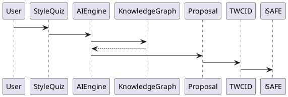
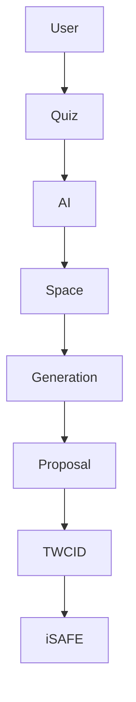

# BOOK-2

# IS-016

# StyleMatch AI Implementation Specification

**Document ID：IS-016**  
**Module：StyleMatch AI Platform**  
**Status：Official Edition v2.0**  
**Baseline：PEP-AI、PEP-Knowledge Graph、StyleMatch AI Baseline v1.0**

---

# 1. Module Information

Module Code

```text
STYLEAI
```

Canonical ID

```text
STYLEAI-001
```

Owner

```text
AI Platform Team
```

---

# 2. Responsibility

StyleMatch AI 負責：

- AI Design Consultation
- Style Analysis
- Preference Learning
- Space Understanding
- Requirement Collection
- Budget Recommendation
- Material Recommendation
- Layout Recommendation
- AI Image Generation
- Designer Matching
- Vendor Matching
- Proposal Generation
- Knowledge Retrieval
- AI Conversation
- Governance Integration

StyleMatch AI 不負責：

- Workflow Runtime（IS-007）
- Contract（IS-012）
- Payment（IS-013）
- Inspection（IS-014）

---

# 3. Platform Position

StyleMatch AI 是 TIGI 的 AI Front Office。

平台定位：

```text
User

↓

AI Conversation

↓

Requirement Collection

↓

Space Understanding

↓

Style Analysis

↓

Proposal Generation

↓

Designer Matching

↓

TWCID

↓

iSAFE Workflow
```

---

# 4. AI Lifecycle

```text
Visitor

↓

Style Quiz

↓

Requirement Collection

↓

Space Analysis

↓

Style Prediction

↓

Image Generation

↓

Proposal

↓

Designer Matching

↓

Project Created

↓

iSAFE Governance
```

---

# 5. Core AI Modules

```text
Style Quiz AI

Preference Engine

Space Understanding AI

Image Generation AI

Budget AI

Material AI

Designer Match AI

Vendor Match AI

Proposal AI

Conversation AI

Knowledge Graph

RAG Engine
```

---

# 6. Requirement Collection

必填：

```text
Project Type

Space Type

Floor Area

Room Count

Building Age

Location

Budget

Completion Target

Lifestyle

Family Members

Preferred Materials

Color Preference

Storage Preference

Special Requirements
```

---

# 7. Style Quiz

依目前正式版本：

第一階段

約30張圖片

五星評分

輸出：

```text
Primary Style

Secondary Style

Style Distribution %

Top 5 Styles
```

第二階段

AI 深度訪談

補足需求資訊。

---

# 8. Space Understanding

輸入：

- Floor Plan
- Photos
- 360 Images
- Room Dimensions
- CAD
- BIM（Optional）

AI 輸出：

```text
Room Type

Object Detection

Layout

Lighting

Circulation

Storage

Window

Door

Constraint
```

---

# 9. Style Analysis

AI 必須分析：

```text
Modern

Japandi

Nordic

Industrial

Luxury

Minimalism

Wabi-Sabi

Contemporary

Scandinavian

American

Classic

New Classical

Muji

Zen

...

30 Styles
```

每個 Style：

```text
Probability

Confidence

Reason
```

---

# 10. AI Image Generation

支援：

```text
Text to Image

Image to Image

Style Transfer

Partial Regeneration

Inpainting

Outpainting

360 Panorama

Before/After

Multiple Variants
```

模型：

```text
ComfyUI

SDXL

Flux

LoRA

ControlNet

IP Adapter
```

---

# 11. Budget AI

輸入：

```text
Floor Area

Project Type

Material Grade

Equipment Grade

Region
```

輸出：

```text
Estimated Budget

Budget Range

Budget Risk

Recommendation
```

---

# 12. Material AI

推薦：

```text
Floor

Wall

Ceiling

Cabinet

Lighting

Bathroom

Kitchen

Hardware

Furniture

Curtain
```

每項：

- Brand
- Price
- Grade
- Sustainability

---

# 13. Designer Matching

Matching Factors：

```text
Style Score

Portfolio Similarity

Budget

Location

Experience

Review Score

Availability

Certification

iSAFE Rating

TWCID Level
```

---

# 14. Vendor Matching

Matching：

- Contractor
- Supplier
- Furniture
- Smart Home
- Appliance

依：

- Area
- Budget
- Specialty
- Rating
- Capacity

---

# 15. Proposal Generator

AI 自動產生：

```text
Project Summary

Requirement

Style Analysis

Mood Board

Reference Images

Layout

Budget

Material

Timeline

Designer Recommendation

Vendor Recommendation
```

輸出：

- PDF
- PPT
- Word

---

# 16. Knowledge Sources

Knowledge Graph：

```text
Design Rules

Building Codes

Material Database

Project History

Portfolio

Product Catalog

Inspection History

Risk Knowledge

Construction Knowledge
```

---

# 17. Integration

StyleMatch AI

↓

TWCID

```text
Designer

Vendor

Portfolio

Certification
```

↓

iSAFE

```text
Case

Workflow

Contract

Inspection

Warranty
```

---

# 18. OpenAPI

## POST

```text
/api/v1/style-ai/quiz
```

---

## POST

```text
/api/v1/style-ai/analyze
```

---

## POST

```text
/api/v1/style-ai/generate
```

---

## POST

```text
/api/v1/style-ai/proposal
```

---

## GET

```text
/api/v1/style-ai/designer-match
```

---

## GET

```text
/api/v1/style-ai/vendor-match
```

---

## POST

```text
/api/v1/style-ai/create-case
```

---

# 19. Error Codes

```text
STYLEAI-4001

Quiz Invalid

STYLEAI-4002

Image Invalid

STYLEAI-4003

Prompt Invalid

STYLEAI-4004

Budget Invalid

STYLEAI-4005

No Designer Found

STYLEAI-4006

Generation Failed

STYLEAI-5001

AI Platform Failure
```

---

# 20. SQL

```sql
CREATE TABLE style_ai_session(

session_id BIGINT PRIMARY KEY,

user_id BIGINT,

style_result JSON,

budget_result JSON,

proposal_uri VARCHAR(500),

created_at TIMESTAMP

);
```

```sql
CREATE TABLE style_ai_generation(

generation_id BIGINT PRIMARY KEY,

session_id BIGINT,

generation_type VARCHAR(50),

model_name VARCHAR(50),

prompt_hash CHAR(64),

image_uri VARCHAR(500),

created_at TIMESTAMP

);
```

---

# 21. Repository

```text
StyleQuizRepository

SpaceRepository

GenerationRepository

ProposalRepository

DesignerMatchRepository

VendorMatchRepository
```

---

# 22. Domain Services

```text
StyleAnalysisEngine

SpaceUnderstandingEngine

GenerationEngine

BudgetEngine

MaterialEngine

DesignerMatchingEngine

VendorMatchingEngine

ProposalEngine

ConversationEngine
```

---

# 23. Commands

```text
CreateQuizCommand

AnalyzeStyleCommand

GenerateImageCommand

GenerateProposalCommand

MatchDesignerCommand

CreateCaseCommand
```

---

# 24. Queries

```text
GetQuiz

GetGeneration

GetProposal

GetDesignerMatch

GetVendorMatch
```

---

# 25. PHP Structure

```text
src/

Domain/StyleAI/

Application/

Infrastructure/

Presentation/
```

Classes

```text
StyleAnalysisEngine.php

SpaceUnderstanding.php

GenerationEngine.php

ProposalEngine.php

BudgetEngine.php

DesignerMatching.php

StyleAIController.php
```

---

# 26. FastAPI

```text
style_ai/

router.py

quiz.py

analysis.py

generation.py

proposal.py

budget.py

matching.py

rag.py

kg.py
```

---

# 27. React

Pages

```text
Style Quiz

AI Chat

Requirement Form

Space Upload

Image Generator

Proposal

Designer Match

Vendor Match
```

Components

```text
StyleCard

StarRating

ImageUploader

GenerationViewer

ProposalViewer

BudgetCard

DesignerCard
```

---

# 28. Runtime Events

```text
QuizCompleted

StyleAnalyzed

SpaceAnalyzed

ImageGenerated

ProposalGenerated

DesignerMatched

VendorMatched

CaseCreated
```

---

# 29. PlantUML



---

# 30. Mermaid



---

# 31. Unit Test

```text
STYLEAI-UT-001 Quiz

STYLEAI-UT-002 Style Analysis

STYLEAI-UT-003 Space Understanding

STYLEAI-UT-004 Budget

STYLEAI-UT-005 Generation

STYLEAI-UT-006 Proposal

STYLEAI-UT-007 Designer Match

STYLEAI-UT-008 Case Creation
```

---

# 32. Integration Test

```text
STYLEAI-IT-001 TWCID Integration

STYLEAI-IT-002 iSAFE Integration

STYLEAI-IT-003 Knowledge Graph

STYLEAI-IT-004 RAG

STYLEAI-IT-005 AI Gateway
```

---

# 33. Acceptance Criteria

- Style Quiz 可完成 30 風格分析
- AI 可完成空間理解
- AI 可生成風格圖
- Proposal 可完整輸出 PDF／PPT／Word
- Designer Matching 正確
- Vendor Matching 正確
- 一鍵建立 iSAFE Case
- TWCID 串接正常
- OpenAPI 驗證通過
- SQL Migration 成功
- 單元測試覆蓋率 ≥90%
- 整合測試全部通過

---

# 34. Codex Build Instruction

**Input**

- StyleMatch AI Baseline
- PEP-AI
- IS-016 StyleMatch AI

**Output**

- PHP DDD StyleMatch AI Module
- FastAPI AI Service
- React AI Console
- OpenAPI 3.1 YAML
- SQL Migration
- AI Workflow
- Unit Tests
- Integration Tests
- Docker Configuration

---

## IS-016 Status

**IS-016 StyleMatch AI Platform**

**Status：Completed**

**Frozen：Yes**

---

下一份將直接進入 **IS-017：AI Gateway Implementation Specification**，定義所有 AI 模型（GPT、Claude、Gemini、ComfyUI、Flux、Embedding、RAG、Knowledge Graph）的統一 Gateway、Provider Routing、Prompt Registry、Model Registry、Token Accounting、Cost Control 與 Failover 機制。
