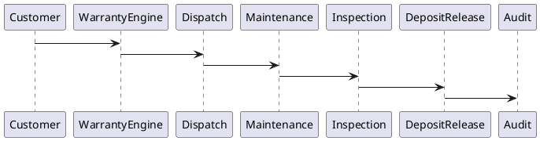
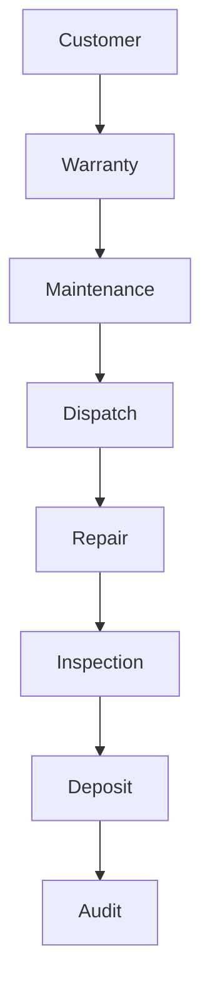

# BOOK-2

# IS-015

# Warranty & Maintenance Implementation Specification

**Document ID：IS-015**  
**Module：Warranty & Maintenance Engine**  
**Status：Official Edition v2.0**  
**Baseline：PEP-005 Inspection & Warranty、PEP-006 Governance Core**

---

# 1. Module Information

Module Code

```text
WM
```

Canonical ID

```text
WM-001
```

Owner

```text
Quality Assurance Team
```

---

# 2. Responsibility

Warranty Engine 負責：

- Warranty Registration
- Warranty Policy
- Warranty Coverage
- Warranty Lifecycle
- Maintenance Request
- Repair Order
- Dispatch Management
- SLA Management
- Warranty Deposit Release
- Customer Service
- Maintenance History
- PGP Binding

Warranty Engine 不負責：

- Workflow Runtime（IS-007）
- Payment Settlement（IS-013）
- Inspection（IS-014）
- CRM Marketing

---

# 3. Design Principles

WM-001

Every Warranty Traceable

---

WM-002

Warranty Starts After Acceptance

---

WM-003

Every Repair Auditable

---

WM-004

Warranty Never Deleted

---

WM-005

Maintenance History Immutable

---

WM-006

SLA Must Be Measured

---

WM-007

Evidence Required

---

WM-008

Warranty Linked To PGP

---

# 4. Warranty Types

```text
Construction Warranty

Waterproof Warranty

Equipment Warranty

Material Warranty

Manufacturer Warranty

Extended Warranty

Maintenance Contract

Emergency Service
```

---

# 5. Warranty Lifecycle

```text
Created

↓

Activated

↓

Effective

↓

Maintenance

↓

Expired

↓

Archived
```

---

# 6. Maintenance Lifecycle

```text
Customer Report

↓

Accepted

↓

Assigned

↓

Scheduled

↓

Repairing

↓

Inspection

↓

Completed

↓

Closed
```

---

# 7. Warranty Coverage

Coverage

```text
Labor

Material

Equipment

Hidden Work

Structure

Waterproof

Electrical

Plumbing

HVAC

Smart Device
```

Exclude

```text
Natural Disaster

Intentional Damage

Unauthorized Modification

Force Majeure
```

---

# 8. SLA Rules

Priority

Critical

```text
4 Hours
```

High

```text
8 Hours
```

Medium

```text
24 Hours
```

Low

```text
72 Hours
```

SLA Timeout：

自動通知主管。

---

# 9. Warranty Deposit

流程：

```text
Acceptance

↓

Warranty Active

↓

Warranty Period

↓

No Outstanding Issue

↓

Gate PASS

↓

Deposit Release
```

若仍有：

- Open Maintenance
- Critical Defect

則：

```text
Warranty Deposit Blocked
```

---

# 10. PGP Binding

Warranty 必須綁定：

- Case
- Contract
- Inspection
- Payment
- Evidence
- Maintenance
- Audit

---

# 11. OpenAPI

## POST

```text
/api/v1/warranty
```

建立 Warranty

---

## GET

```text
/api/v1/warranty/{warrantyId}
```

---

## POST

```text
/api/v1/warranty/request
```

建立報修

---

## POST

```text
/api/v1/warranty/{requestId}/dispatch
```

派工

---

## POST

```text
/api/v1/warranty/{requestId}/complete
```

完成維修

---

## POST

```text
/api/v1/warranty/{warrantyId}/release-deposit
```

釋放保固金

---

## GET

```text
/api/v1/warranty/history
```

---

## GET

```text
/api/v1/warranty/report
```

---

# 12. Error Codes

```text
WM-4001

Warranty Not Found

WM-4002

Warranty Expired

WM-4003

Coverage Excluded

WM-4004

Repair Pending

WM-4005

SLA Timeout

WM-4006

Deposit Locked

WM-4007

Inspection Required

WM-5001

Warranty Engine Failure
```

---

# 13. SQL

```sql
CREATE TABLE warranty_master(

warranty_id BIGINT PRIMARY KEY,

case_id BIGINT,

contract_id BIGINT,

inspection_id BIGINT,

warranty_type VARCHAR(50),

effective_date DATE,

expire_date DATE,

status VARCHAR(30),

created_at TIMESTAMP

);
```

```sql
CREATE TABLE maintenance_request(

request_id BIGINT PRIMARY KEY,

warranty_id BIGINT,

request_no VARCHAR(50),

priority VARCHAR(20),

description TEXT,

status VARCHAR(30),

requested_at TIMESTAMP

);
```

```sql
CREATE TABLE maintenance_work_order(

work_order_id BIGINT PRIMARY KEY,

request_id BIGINT,

assigned_to BIGINT,

scheduled_at TIMESTAMP,

completed_at TIMESTAMP,

status VARCHAR(30)

);
```

```sql
CREATE TABLE warranty_history(

history_id BIGINT PRIMARY KEY,

warranty_id BIGINT,

event_type VARCHAR(50),

trace_id VARCHAR(100),

created_at TIMESTAMP

);
```

---

# 14. Repository

```text
WarrantyRepository

MaintenanceRepository

WorkOrderRepository

WarrantyHistoryRepository

WarrantyAuditRepository
```

---

# 15. Domain Services

```text
WarrantyEngine

MaintenanceService

DispatchService

SLAService

DepositReleaseService

WarrantyValidationService

PGPBindingService
```

---

# 16. Commands

```text
CreateWarrantyCommand

CreateMaintenanceRequestCommand

DispatchWorkOrderCommand

CompleteMaintenanceCommand

ReleaseWarrantyDepositCommand
```

---

# 17. Queries

```text
GetWarranty

GetMaintenanceHistory

GetWorkOrder

GetSLAStatus

GetWarrantyReport
```

---

# 18. PHP Structure

```text
src/

Domain/Warranty/

Application/

Infrastructure/

Presentation/
```

Classes

```text
WarrantyAggregate.php

WarrantyRepository.php

WarrantyEngine.php

MaintenanceService.php

DispatchService.php

SLAService.php

WarrantyController.php
```

---

# 19. FastAPI

```text
warranty/

router.py

warranty.py

maintenance.py

dispatch.py

sla.py

deposit.py

audit.py
```

---

# 20. React

Pages

```text
Warranty Dashboard

Warranty Detail

Maintenance Request

Dispatch Center

SLA Monitor

Warranty Report
```

Components

```text
WarrantyCard

MaintenanceTimeline

DispatchBoard

SLABadge

CoveragePanel

DepositStatus

HistoryViewer
```

---

# 21. Runtime Events

```text
WarrantyCreated

WarrantyActivated

MaintenanceRequested

WorkOrderAssigned

RepairCompleted

InspectionPassed

DepositReleased

WarrantyExpired
```

---

# 22. PlantUML



---

# 23. Mermaid



---

# 24. Unit Test

```text
WM-UT-001 Create Warranty

WM-UT-002 Maintenance Request

WM-UT-003 Dispatch

WM-UT-004 Repair Completion

WM-UT-005 SLA Validation

WM-UT-006 Deposit Release

WM-UT-007 Warranty Expiration

WM-UT-008 Audit
```

---

# 25. Integration Test

```text
WM-IT-001 Contract Integration

WM-IT-002 Inspection Integration

WM-IT-003 Payment Integration

WM-IT-004 PGP Integration

WM-IT-005 Audit Integration
```

---

# 26. Acceptance Criteria

- Warranty 自動於驗收完成後啟用
- 報修流程完整
- 派工流程可追蹤
- SLA 自動監控與逾時通知
- 維修履歷完整保存
- 保固金符合 Gate 條件後才能釋放
- PGP 關聯完整
- Audit 不可竄改
- OpenAPI 驗證通過
- SQL Migration 成功
- 單元測試覆蓋率 ≥90%
- 整合測試全部通過

---

# 27. Codex Build Instruction

**Input**

- PEP-005 Inspection & Warranty
- PEP-006 Governance Core
- IS-013 Payment & Escrow
- IS-014 Inspection Management
- IS-015 Warranty & Maintenance

**Output**

- PHP DDD Warranty Module
- FastAPI Warranty Service
- React Warranty & Maintenance Console
- OpenAPI 3.1 YAML
- SQL Migration
- Unit Tests
- Integration Tests
- Docker Configuration

---

## IS-015 Status

**IS-015 Warranty & Maintenance Engine**

**Status：Completed**

**Frozen：Yes**

---

下一份將直接進入 **IS-016：StyleMatch AI Implementation Specification**，正式定義 StyleMatch AI 的 AI 風格分析、空間理解、需求收集、風格匹配、AI 提案生成、設計師媒合，以及與 **TWCID**、**iSAFE 2.0** 的完整治理整合規格。
