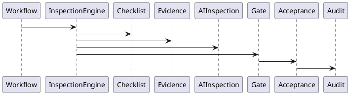
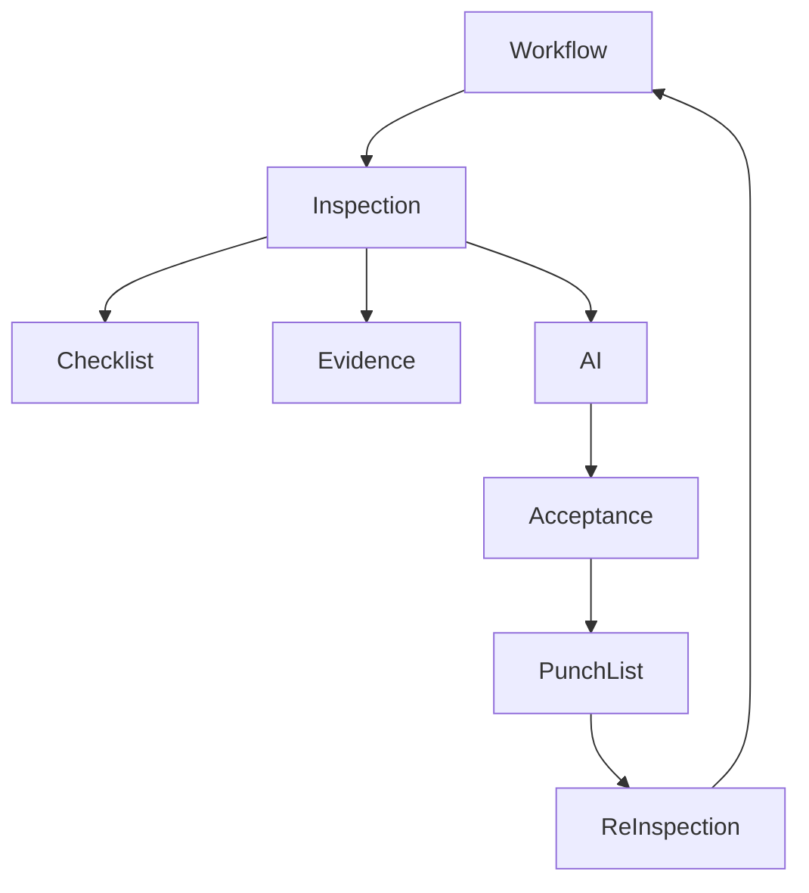

# BOOK-2

# IS-014

# Inspection Management Implementation Specification

**Document ID：IS-014**  
**Module：Inspection Management Engine**  
**Status：Official Edition v2.0**  
**Baseline：PEP-005 Inspection & Warranty、PEP-006 Governance Core**

---

# 1. Module Information

Module Code

```text
INSP
```

Canonical ID

```text
INSP-001
```

Owner

```text
Quality Governance Team
```

---

# 2. Responsibility

Inspection Engine 負責：

- Inspection Planning
- Inspection Execution
- Punch List
- Defect Tracking
- Re-inspection
- Acceptance Report
- AI Assisted Inspection
- Inspection Approval
- Inspection Audit
- PGP Binding

Inspection Engine 不負責：

- Workflow Runtime（IS-007）
- Evidence Storage（IS-011）
- Payment Release（IS-013）
- Warranty（IS-015）

---

# 3. Design Principles

INSP-001

Inspection Before Acceptance

---

INSP-002

Every Defect Traceable

---

INSP-003

Evidence Required

---

INSP-004

Inspection Never Deleted

---

INSP-005

AI Assist Only

---

INSP-006

Manual Acceptance Required

---

INSP-007

Every Result Auditable

---

INSP-008

Acceptance Controls Workflow

---

# 4. Inspection Types

```text
Design Review

Pre-Construction Inspection

Hidden Work Inspection

Material Inspection

Progress Inspection

Intermediate Inspection

Final Inspection

Warranty Inspection

Maintenance Inspection
```

---

# 5. Inspection Lifecycle

```text
Planned

↓

Scheduled

↓

In Progress

↓

Completed

↓

Verified

↓

Accepted

↓

Archived
```

Exception

```text
Rejected

Rework Required

Cancelled
```

---

# 6. Punch List Lifecycle

```text
Created

↓

Assigned

↓

In Progress

↓

Corrected

↓

Re-Inspection

↓

Closed
```

---

# 7. Defect Severity

```text
Critical

Major

Minor

Observation
```

Critical：

```text
Workflow Blocked

Payment Blocked
```

---

# 8. AI Assisted Inspection

AI 支援：

- Surface Crack Detection
- Tile Alignment Detection
- Paint Defect Detection
- Ceiling Flatness Detection
- Dimension Verification
- OCR
- Drawing Comparison
- Missing Installation Detection
- Material Recognition
- PPE Detection（施工階段）

AI 不可：

- 驗收完成
- 關閉缺失
- 通過 Gate
- 核准付款

---

# 9. Acceptance Rules

Acceptance 必須：

- Checklist PASS
- Evidence Complete
- No Critical Defect
- Gate PASS
- Inspector Approval
- Customer Confirmation（可設定）

否則：

```text
Acceptance Rejected
```

---

# 10. Re-inspection Rules

複驗必須：

- 綁定原 Punch List
- 建立新 Inspection Record
- 保留歷史紀錄
- 保留原照片
- 建立新版 Evidence
- 更新 PGP

---

# 11. OpenAPI

## POST

```text
/api/v1/inspections
```

建立 Inspection

---

## GET

```text
/api/v1/inspections/{inspectionId}
```

---

## POST

```text
/api/v1/inspections/{inspectionId}/complete
```

---

## POST

```text
/api/v1/inspections/{inspectionId}/accept
```

---

## POST

```text
/api/v1/inspections/{inspectionId}/reject
```

---

## POST

```text
/api/v1/punch-list
```

---

## POST

```text
/api/v1/punch-list/{punchId}/close
```

---

## GET

```text
/api/v1/inspections/{inspectionId}/report
```

---

# 12. Error Codes

```text
INSP-4001

Inspection Not Found

INSP-4002

Checklist Incomplete

INSP-4003

Evidence Missing

INSP-4004

Critical Defect Exists

INSP-4005

Acceptance Rejected

INSP-4006

Punch List Open

INSP-4007

Gate Failed

INSP-5001

Inspection Engine Failure
```

---

# 13. SQL

```sql
CREATE TABLE inspection_master(

inspection_id BIGINT PRIMARY KEY,

case_id BIGINT,

workflow_id BIGINT,

inspection_type VARCHAR(50),

status VARCHAR(30),

inspector_id BIGINT,

inspection_date TIMESTAMP,

created_at TIMESTAMP

);
```

```sql
CREATE TABLE inspection_defect(

defect_id BIGINT PRIMARY KEY,

inspection_id BIGINT,

severity VARCHAR(20),

category VARCHAR(50),

description TEXT,

status VARCHAR(30),

assigned_to BIGINT

);
```

```sql
CREATE TABLE punch_list(

punch_id BIGINT PRIMARY KEY,

defect_id BIGINT,

reinspection_id BIGINT,

status VARCHAR(30),

closed_at TIMESTAMP

);
```

```sql
CREATE TABLE inspection_report(

report_id BIGINT PRIMARY KEY,

inspection_id BIGINT,

report_uri VARCHAR(500),

version_no INT,

created_at TIMESTAMP

);
```

---

# 14. Repository

```text
InspectionRepository

DefectRepository

PunchListRepository

InspectionReportRepository

InspectionAuditRepository
```

---

# 15. Domain Services

```text
InspectionEngine

DefectService

PunchListService

AcceptanceService

ReInspectionService

AIInspectionService

InspectionReportService
```

---

# 16. Commands

```text
CreateInspectionCommand

CompleteInspectionCommand

AcceptInspectionCommand

RejectInspectionCommand

CreatePunchListCommand

ClosePunchListCommand
```

---

# 17. Queries

```text
GetInspection

GetDefects

GetPunchList

GetInspectionReport

GetAcceptanceHistory
```

---

# 18. PHP Structure

```text
src/

Domain/Inspection/

Application/

Infrastructure/

Presentation/
```

Classes

```text
InspectionAggregate.php

InspectionRepository.php

InspectionEngine.php

AcceptanceService.php

DefectService.php

PunchListService.php

InspectionController.php
```

---

# 19. FastAPI

```text
inspection/

router.py

inspection.py

acceptance.py

defect.py

punch.py

ai.py

report.py

audit.py
```

---

# 20. React

Pages

```text
Inspection Dashboard

Inspection Detail

Punch List

Acceptance Report

AI Inspection
```

Components

```text
InspectionStepper

DefectTable

PunchBoard

SeverityBadge

AIInspectionCard

AcceptancePanel

ReportViewer
```

---

# 21. Runtime Events

```text
InspectionCreated

InspectionCompleted

InspectionAccepted

InspectionRejected

DefectCreated

PunchClosed

ReInspectionCompleted

InspectionReported
```

---

# 22. PlantUML



---

# 23. Mermaid



---

# 24. Unit Test

```text
INSP-UT-001 Create Inspection

INSP-UT-002 Complete Inspection

INSP-UT-003 Accept Inspection

INSP-UT-004 Reject Inspection

INSP-UT-005 Create Punch List

INSP-UT-006 Re-Inspection

INSP-UT-007 AI Inspection

INSP-UT-008 Audit
```

---

# 25. Integration Test

```text
INSP-IT-001 Workflow Integration

INSP-IT-002 Checklist Integration

INSP-IT-003 Evidence Integration

INSP-IT-004 Gate Integration

INSP-IT-005 Payment Blocking

INSP-IT-006 Audit Integration
```

---

# 26. Acceptance Criteria

- Inspection 流程完整
- Punch List 可完整追蹤
- Critical Defect 阻擋 Workflow
- Critical Defect 阻擋 Payment
- Re-inspection 保留完整歷史
- AI 僅提供輔助分析
- Acceptance Report 可重建
- PGP 關聯完整
- Audit 不可竄改
- OpenAPI 驗證通過
- SQL Migration 成功
- 單元測試覆蓋率 ≥90%
- 整合測試全部通過

---

# 27. Codex Build Instruction

**Input**

- PEP-005 Inspection & Warranty
- PEP-006 Governance Core
- IS-009 Gate Engine
- IS-010 Checklist Engine
- IS-011 Evidence Management
- IS-013 Payment & Escrow
- IS-014 Inspection Management

**Output**

- PHP DDD Inspection Module
- FastAPI Inspection Service
- React Inspection & Punch List Console
- OpenAPI 3.1 YAML
- SQL Migration
- Unit Tests
- Integration Tests
- Docker Configuration

---

## IS-014 Status

**IS-014 Inspection Management Engine**

**Status：Completed**

**Frozen：Yes**

---

下一份直接進入 **IS-015：Warranty & Maintenance Implementation Specification**，完整定義保固、維修、報修、派工、保固金釋放、C5 保固治理、維修履歷與 PGP 全生命週期管理。
