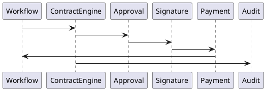
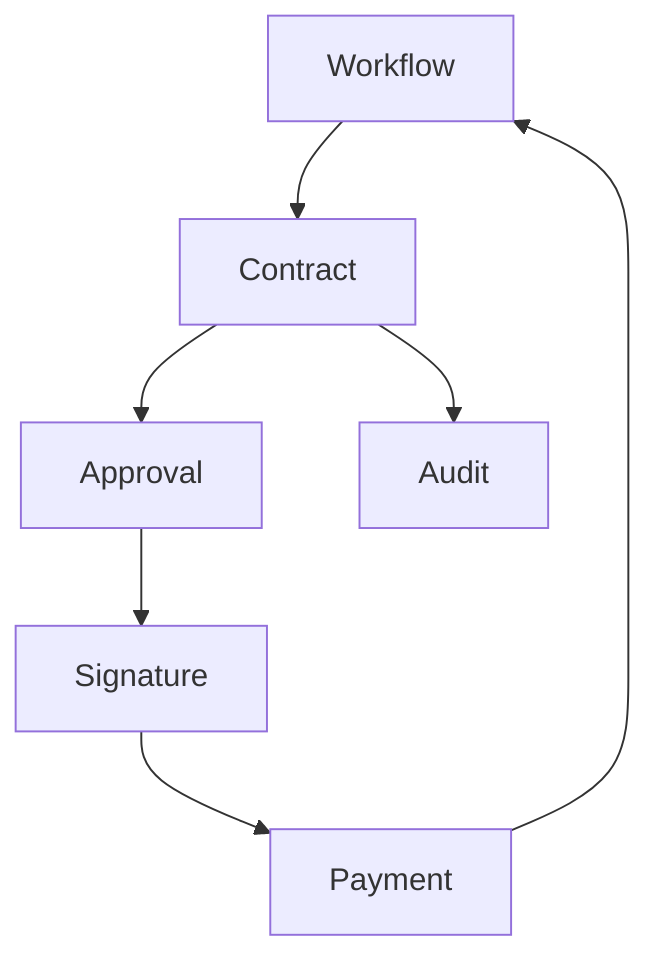

# BOOK-2

# IS-012

# Contract Management Implementation Specification

**Document ID：IS-012**  
**Module：Contract Management Engine**  
**Status：Official Edition v2.0**  
**Baseline：PEP-004 Contract & Payment Governance、PEP-006 Governance Core**

---

# 1. Module Information

Module Code

```text
CONTRACT
```

Canonical ID

```text
CONTRACT-001
```

Owner

```text
Commercial Governance Team
```

---

# 2. Responsibility

Contract Engine 負責：

- Contract Lifecycle
- Contract Version
- Digital Signature
- Electronic Signature
- Contract Approval
- Payment Milestone Binding
- Scope Management
- Change Order
- Contract Evidence
- PGP Binding
- Contract Audit

Contract Engine 不負責：

- Payment Execution（IS-013）
- Workflow Runtime（IS-007）
- Evidence Storage（IS-011）

---

# 3. Design Principles

CONTRACT-001

One Active Contract

---

CONTRACT-002

Version Never Overwritten

---

CONTRACT-003

Digital Signature Required

---

CONTRACT-004

Every Contract Traceable

---

CONTRACT-005

Every Revision Versioned

---

CONTRACT-006

Every Signature Auditable

---

CONTRACT-007

Payment Milestones Immutable

---

CONTRACT-008

Contract Must Bind Workflow

---

# 4. Contract Types

```text
Design Contract

Construction Contract

Procurement Contract

Consulting Contract

Maintenance Contract

Warranty Contract

Change Order

Supplement Agreement
```

---

# 5. Contract Lifecycle

```text
Draft

↓

Internal Review

↓

Customer Review

↓

Approved

↓

Signing

↓

Effective

↓

Executing

↓

Completed

↓

Archived
```

---

# 6. Contract Structure

Contract 必須包含：

```text
Header

Parties

Scope

Deliverables

Payment Schedule

Milestones

Timeline

Warranty

Penalty

Attachments

Evidence

Digital Signature

PGP Reference
```

---

# 7. Signature Workflow

```text
Create Draft

↓

Internal Approval

↓

Organization Approval

↓

Customer Signature

↓

Company Signature

↓

Effective

↓

Workflow Continue
```

未完成簽署：

```text
Workflow Blocked
```

---

# 8. Change Order

Change Order 必須：

- New Version
- Previous Version Reference
- Change Reason
- Approval Record
- Digital Signature
- PGP Update

舊版本：

永遠保存。

---

# 9. Payment Binding

Contract 必須綁定：

```text
D5

↓

Payment Plan

↓

Milestone

↓

Gate

↓

Workflow
```

Payment 不可脫離 Contract。

---

# 10. PGP Binding

Contract 必須綁定：

- Case
- Workflow
- Evidence
- Payment
- Warranty
- Audit

---

# 11. OpenAPI

## POST

```text
/api/v1/contracts
```

建立 Contract

---

## GET

```text
/api/v1/contracts/{contractId}
```

---

## PATCH

```text
/api/v1/contracts/{contractId}
```

---

## POST

```text
/api/v1/contracts/{contractId}/approve
```

---

## POST

```text
/api/v1/contracts/{contractId}/sign
```

---

## POST

```text
/api/v1/contracts/{contractId}/change-order
```

---

## GET

```text
/api/v1/contracts/{contractId}/versions
```

---

## GET

```text
/api/v1/contracts/{contractId}/audit
```

---

# 12. Error Codes

```text
CONTRACT-4001

Contract Not Found

CONTRACT-4002

Contract Locked

CONTRACT-4003

Signature Missing

CONTRACT-4004

Approval Missing

CONTRACT-4005

Version Conflict

CONTRACT-4006

Payment Binding Missing

CONTRACT-4007

Workflow Conflict

CONTRACT-5001

Contract Engine Failure
```

---

# 13. SQL

```sql
CREATE TABLE contract_master(

contract_id BIGINT PRIMARY KEY,

case_id BIGINT,

workflow_id BIGINT,

contract_no VARCHAR(50) UNIQUE,

contract_type VARCHAR(50),

version_no INT,

status VARCHAR(30),

effective_date DATE,

expire_date DATE,

created_at TIMESTAMP

);
```

```sql
CREATE TABLE contract_signature(

signature_id BIGINT PRIMARY KEY,

contract_id BIGINT,

signer_id BIGINT,

sign_role VARCHAR(50),

signature_method VARCHAR(50),

signature_hash CHAR(64),

signed_at TIMESTAMP

);
```

```sql
CREATE TABLE contract_version(

version_id BIGINT PRIMARY KEY,

contract_id BIGINT,

version_no INT,

previous_version INT,

change_reason TEXT,

created_at TIMESTAMP

);
```

---

# 14. Repository

```text
ContractRepository

ContractVersionRepository

SignatureRepository

ContractAuditRepository

ContractAttachmentRepository
```

---

# 15. Domain Services

```text
ContractEngine

ContractVersionService

SignatureService

ApprovalService

ChangeOrderService

ContractValidationService

PGPBindingService
```

---

# 16. Commands

```text
CreateContractCommand

ApproveContractCommand

SignContractCommand

CreateChangeOrderCommand

ArchiveContractCommand
```

---

# 17. Queries

```text
GetContract

GetContractVersion

GetSignatureHistory

GetContractAudit

GetPaymentMilestones
```

---

# 18. PHP Structure

```text
src/

Domain/Contract/

Application/

Infrastructure/

Presentation/
```

Classes

```text
ContractAggregate.php

ContractRepository.php

ContractEngine.php

SignatureService.php

ApprovalService.php

ChangeOrderService.php

ContractController.php
```

---

# 19. FastAPI

```text
contract/

router.py

contract.py

signature.py

approval.py

version.py

change_order.py

audit.py
```

---

# 20. React

Pages

```text
Contract Dashboard

Contract Detail

Version History

Digital Signature

Change Order

Contract Audit
```

Components

```text
ContractViewer

SignaturePanel

VersionTimeline

ApprovalFlow

MilestoneTable

AuditTimeline
```

---

# 21. Runtime Events

```text
ContractCreated

ContractApproved

ContractSigned

ContractActivated

ChangeOrderCreated

ContractCompleted

ContractArchived
```

---

# 22. PlantUML



---

# 23. Mermaid



---

# 24. Unit Test

```text
CONTRACT-UT-001 Create Contract

CONTRACT-UT-002 Approve Contract

CONTRACT-UT-003 Sign Contract

CONTRACT-UT-004 Version Control

CONTRACT-UT-005 Change Order

CONTRACT-UT-006 Payment Binding

CONTRACT-UT-007 PGP Binding

CONTRACT-UT-008 Audit
```

---

# 25. Integration Test

```text
CONTRACT-IT-001 Workflow Integration

CONTRACT-IT-002 Payment Integration

CONTRACT-IT-003 Evidence Integration

CONTRACT-IT-004 Signature Integration

CONTRACT-IT-005 Audit Integration
```

---

# 26. Acceptance Criteria

- Contract Version 永不覆寫
- Digital Signature 全程可驗證
- Payment Milestone 與 Contract 完整綁定
- Change Order 自動建立新版本
- PGP 關聯完整
- Audit 不可竄改
- Workflow 與 Contract 狀態同步
- OpenAPI 驗證通過
- SQL Migration 成功
- 單元測試覆蓋率 ≥90%
- 整合測試全部通過

---

# 27. Codex Build Instruction

**Input**

- PEP-004 Contract & Payment Governance
- PEP-006 Governance Core
- IS-007 Workflow
- IS-011 Evidence Management
- IS-012 Contract Management

**Output**

- PHP DDD Contract Module
- FastAPI Contract Service
- React Contract Management Console
- OpenAPI 3.1 YAML
- SQL Migration
- Unit Tests
- Integration Tests
- Docker Configuration

---

## IS-012 Status

**IS-012 Contract Management Engine**

**Status：Completed**

**Frozen：Yes**

---

下一份直接進入 **IS-013：Payment & Escrow Implementation Specification**，完整定義 TIGI／iSAFE 2.0 的付款節點（Milestone）、第三方履約支付、Escrow、Gate 綁定、撥款規則、退款、對帳、發票及完整金流治理模型。
