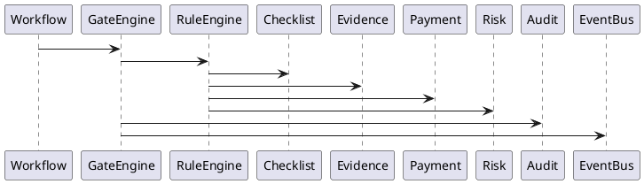
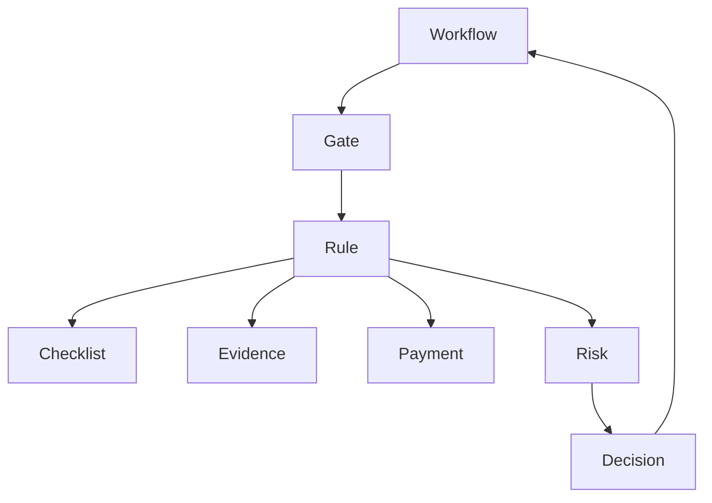

# BOOK-2

# IS-009

# Gate Engine Implementation Specification

**Document ID：IS-009**  
**Module：Governance Gate Decision Engine**  
**Status：Official Edition v2.0**  
**Baseline：PEP-002 Workflow Governance、PEP-006 Governance Core**

---

# 1. Module Information

Module Code

```text
GATE
```

Canonical ID

```text
GATE-001
```

Owner

```text
Governance Core Team
```

---

# 2. Responsibility

Gate Engine 負責：

- Governance Validation
- Stage Entry Validation
- Stage Exit Validation
- Rule Evaluation
- Gate Decision
- Exception Handling
- Override Validation
- Risk Validation
- Event Publishing
- Audit Logging

Gate Engine 不負責：

- Workflow Runtime（IS-007）
- State Machine（IS-008）
- Checklist Execution（IS-010）
- Evidence Storage（IS-011）

---

# 3. Design Principles

GATE-001

No Gate

No Transition

---

GATE-002

Every Transition

Must Pass Gate

---

GATE-003

All Rules

Are Configurable

---

GATE-004

Rules

Version Controlled

---

GATE-005

Evaluation Immutable

---

GATE-006

Every Decision Auditable

---

GATE-007

Policy First

---

GATE-008

AI Cannot Override Gate

---

# 4. Gate Categories

Core Gates

```text
FILE_GATE

CHECKLIST_GATE

EVIDENCE_GATE

PAYMENT_GATE

SIGNATURE_GATE

APPROVAL_GATE

RISK_GATE

POLICY_GATE

DOCUMENT_GATE

TIME_GATE
```

---

# 5. Gate Evaluation Flow

```text
Workflow Transition

↓

Load Gate Profile

↓

Load Rules

↓

Evaluate

↓

Pass ?

↓

Yes

↓

Next Stage

──────────────

No

↓

Block

↓

Audit

↓

Notification
```

---

# 6. Gate Decision

Possible Results

```text
PASS

FAIL

WARNING

OVERRIDE_REQUIRED

MANUAL_REVIEW
```

---

# 7. Standard Gate Matrix

| Stage | Required Gate |
|---------|--------------|
| D1 | File Gate |
| D2 | Checklist Gate |
| D3 | Evidence Gate |
| D4 | Payment Gate |
| D5 | Signature Gate |
| C1 | Approval Gate |
| C2 | Evidence + Checklist |
| C3 | Payment + Risk |
| C4 | Final Inspection |
| C5 | Warranty Verification |

---

# 8. Rule Engine

Rule Format

```json
{
  "ruleCode":"RULE-001",
  "expression":"checklist.completed == true",
  "priority":100,
  "enabled":true
}
```

Rule Types

- Boolean
- Expression
- Script
- SQL
- AI Evaluation（Read Only）

---

# 9. Override Policy

Override 必須：

- Supervisor Approval
- Override Reason
- Digital Signature
- Trace ID
- Audit
- Risk Review

Override 不得刪除原 Gate Result。

---

# 10. Risk Gate

Risk Score

```text
0~30

PASS

31~60

WARNING

61~80

MANUAL REVIEW

81~100

BLOCK
```

Risk Source

- Checklist
- Evidence
- Delay
- Payment
- AI Analysis
- Manual Review

---

# 11. OpenAPI

## POST

```text
/api/v1/gates/evaluate
```

Request

```json
{
  "workflowId":1001,
  "stage":"D3",
  "traceId":""
}
```

Response

```json
{
  "decision":"PASS",
  "gateResults":[
    {
      "gate":"CHECKLIST",
      "result":"PASS"
    },
    {
      "gate":"EVIDENCE",
      "result":"PASS"
    }
  ]
}
```

---

## GET

```text
/api/v1/gates/history
```

---

## GET

```text
/api/v1/gates/rules
```

---

## POST

```text
/api/v1/gates/override
```

---

## POST

```text
/api/v1/gates/replay
```

---

# 12. Error Codes

```text
GATE-4001

Gate Failed

GATE-4002

Rule Missing

GATE-4003

Checklist Missing

GATE-4004

Evidence Missing

GATE-4005

Payment Pending

GATE-4006

Approval Missing

GATE-4007

Override Required

GATE-5001

Gate Engine Failure
```

---

# 13. SQL

```sql
CREATE TABLE gate_profile(

gate_profile_id BIGINT PRIMARY KEY,

stage_code VARCHAR(20),

gate_code VARCHAR(50),

version_no INT,

enabled BOOLEAN

);
```

```sql
CREATE TABLE gate_rule(

gate_rule_id BIGINT PRIMARY KEY,

gate_profile_id BIGINT,

rule_code VARCHAR(50),

priority INT,

expression TEXT,

enabled BOOLEAN

);
```

```sql
CREATE TABLE gate_execution(

execution_id BIGINT PRIMARY KEY,

workflow_id BIGINT,

stage_code VARCHAR(20),

decision VARCHAR(30),

risk_score INT,

trace_id VARCHAR(100),

created_at TIMESTAMP

);
```

```sql
CREATE TABLE gate_override(

override_id BIGINT PRIMARY KEY,

execution_id BIGINT,

approved_by BIGINT,

reason TEXT,

signature_id BIGINT,

created_at TIMESTAMP

);
```

---

# 14. Repository

```text
GateProfileRepository

GateRuleRepository

GateExecutionRepository

GateOverrideRepository

RiskRepository
```

---

# 15. Domain Services

```text
GateEngine

RuleEngine

GateEvaluator

RiskEvaluator

OverrideService

ReplayService
```

---

# 16. Commands

```text
EvaluateGateCommand

OverrideGateCommand

ReplayGateCommand

ApproveGateCommand
```

---

# 17. Queries

```text
GetGateHistory

GetGateRules

GetGateProfile

GetRiskScore

GetOverrideHistory
```

---

# 18. PHP Structure

```text
src/

Domain/Gate/

Application/

Infrastructure/

Presentation/
```

Classes

```text
GateAggregate.php

GateEngine.php

RuleEngine.php

GateEvaluator.php

RiskEvaluator.php

OverrideService.php

GateController.php
```

---

# 19. FastAPI

```text
gate/

router.py

engine.py

rules.py

evaluation.py

risk.py

override.py

audit.py
```

---

# 20. React

Pages

```text
Gate Dashboard

Gate History

Gate Rules

Risk Dashboard

Override Center
```

Components

```text
GateResultCard

RuleTable

RiskGauge

OverrideDialog

GateTimeline
```

---

# 21. Runtime Events

```text
GateStarted

GatePassed

GateFailed

GateOverridden

RiskCalculated

GateReplay

NotificationSent
```

---

# 22. PlantUML



---

# 23. Mermaid



---

# 24. Unit Test

```text
GATE-UT-001 Rule Evaluation

GATE-UT-002 Checklist Gate

GATE-UT-003 Evidence Gate

GATE-UT-004 Payment Gate

GATE-UT-005 Risk Gate

GATE-UT-006 Override

GATE-UT-007 Replay

GATE-UT-008 Audit
```

---

# 25. Integration Test

```text
GATE-IT-001 Workflow Integration

GATE-IT-002 Checklist Integration

GATE-IT-003 Evidence Integration

GATE-IT-004 Risk Integration

GATE-IT-005 Audit Integration
```

---

# 26. Acceptance Criteria

- Gate Rule 全數可設定
- Stage 必須通過 Gate 才能轉移
- Rule Version 可追溯
- Risk Score 正確計算
- Override 流程完整
- Replay 可重現 Gate Decision
- EventBus 正常發送
- Audit 完整保存
- OpenAPI 驗證通過
- SQL Migration 成功
- 單元測試覆蓋率 ≥90%
- 整合測試全部通過

---

# 27. Codex Build Instruction

**Input**

- PEP-002 Workflow Governance
- PEP-006 Governance Core
- IS-007 Workflow
- IS-008 State Machine
- IS-009 Gate Engine

**Output**

- PHP DDD Gate Engine
- FastAPI Gate Service
- React Gate Management Console
- OpenAPI 3.1 YAML
- SQL Migration
- Unit Tests
- Integration Tests
- Docker Configuration

---

## IS-009 Status

**IS-009 Governance Gate Decision Engine**

**Status：Completed**

**Frozen：Yes**

---

下一份將直接進入 **IS-010：Checklist Engine Implementation Specification**，完整定義 **GS-01～GS-24**、Checklist Runtime、AI Assisted Inspection、Checklist Template Engine 與治理檢核規則。
