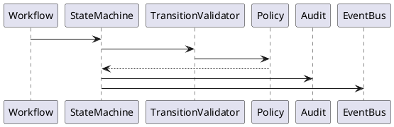
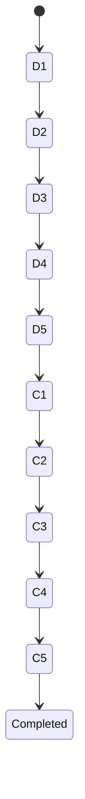

# BOOK-2

# IS-008

# State Machine Implementation Specification

**Document ID：IS-008**  
**Module：Governance State Machine Engine**  
**Status：Official Edition v2.0**  
**Baseline：PEP-002 Workflow Governance、PEP-006 Governance Core**

---

# 1. Module Information

Module Code

```text
SM
```

Canonical ID

```text
SM-001
```

Owner

```text
Governance Core Team
```

---

# 2. Responsibility

State Machine Engine 負責：

- Workflow State Management
- State Validation
- State Transition Matrix
- Transition Policy
- Rollback Policy
- Override Policy
- State History
- State Audit
- State Event Publishing

State Machine 不負責：

- Workflow UI
- Gate Rule
- Checklist
- Evidence
- Payment

---

# 3. Design Principles

SM-001

Single Active State

---

SM-002

Only One Valid Transition

---

SM-003

Forward First

---

SM-004

Illegal Transition Rejected

---

SM-005

State Immutable

---

SM-006

Event Driven

---

SM-007

Audit Required

---

SM-008

Override by Policy Only

---

SM-009

Rollback by Policy Only

---

SM-010

State Machine is Single Source of Truth

---

# 4. Aggregate

Aggregate Root

```text
StateMachine
```

Entities

```text
State

Transition

TransitionRule

StateHistory

StateSnapshot

OverrideRecord

RollbackRecord
```

---

# 5. Governance States

```text
D1 Requirement

↓

D2 Proposal

↓

D3 Design

↓

D4 Quotation

↓

D5 Contract

↓

C1 Construction Start

↓

C2 Hidden Work

↓

C3 Progress

↓

C4 Completion

↓

C5 Warranty
```

Terminal States

```text
Completed

Cancelled

Archived
```

---

# 6. Legal Transition Matrix

| From | To | Allowed |
|------|----|----------|
| D1 | D2 | Yes |
| D2 | D3 | Yes |
| D3 | D4 | Yes |
| D4 | D5 | Yes |
| D5 | C1 | Yes |
| C1 | C2 | Yes |
| C2 | C3 | Yes |
| C3 | C4 | Yes |
| C4 | C5 | Yes |
| C5 | Completed | Yes |

所有未定義 Transition：

```text
Forbidden
```

---

# 7. Illegal Transition

例如：

```text
D1 → D4

D2 → C1

D5 → C3

C2 → D4

Completed → D1
```

全部回傳：

```text
HTTP 409

Illegal Transition
```

---

# 8. Override Policy

Override 必須：

- Super Admin
- Override Reason
- Approval Record
- Audit Record
- Trace ID

Override 不修改 History。

---

# 9. Rollback Policy

Rollback 必須：

- Workflow Locked
- Supervisor Approval
- Audit
- Rollback Snapshot
- Event Published

Rollback 永遠保留原 Transition。

---

# 10. State Lifecycle

```text
Pending

↓

Ready

↓

Running

↓

Completed

↓

Locked
```

---

# 11. Runtime Flow

```text
Request

↓

Current State

↓

Transition Matrix

↓

Policy Validation

↓

Gate Validation

↓

Transition

↓

History

↓

Audit

↓

Event

↓

Next State
```

---

# 12. OpenAPI

## POST

```text
/api/v1/state-machine/transition
```

Request

```json
{
  "workflowId":1001,
  "from":"D2",
  "to":"D3",
  "traceId":""
}
```

---

## POST

```text
/api/v1/state-machine/override
```

---

## POST

```text
/api/v1/state-machine/rollback
```

---

## GET

```text
/api/v1/state-machine/history
```

---

## GET

```text
/api/v1/state-machine/matrix
```

---

# 13. Error Codes

```text
SM-4001

Illegal Transition

SM-4002

State Locked

SM-4003

Override Required

SM-4004

Rollback Forbidden

SM-4005

Terminal State

SM-4006

Policy Rejected

SM-5001

State Engine Failure
```

---

# 14. SQL

```sql
CREATE TABLE state_machine(

state_machine_id BIGINT PRIMARY KEY,

workflow_id BIGINT,

current_state VARCHAR(30),

version INT,

status VARCHAR(30),

updated_at TIMESTAMP

);
```

```sql
CREATE TABLE state_transition(

transition_id BIGINT PRIMARY KEY,

workflow_id BIGINT,

from_state VARCHAR(30),

to_state VARCHAR(30),

transition_type VARCHAR(30),

operator_id BIGINT,

trace_id VARCHAR(100),

created_at TIMESTAMP

);
```

```sql
CREATE TABLE state_override(

override_id BIGINT PRIMARY KEY,

workflow_id BIGINT,

reason TEXT,

approved_by BIGINT,

trace_id VARCHAR(100),

created_at TIMESTAMP

);
```

---

# 15. Repository

```text
StateMachineRepository

TransitionRepository

OverrideRepository

RollbackRepository

StateHistoryRepository
```

---

# 16. Domain Services

```text
StateMachineEngine

TransitionValidator

OverrideService

RollbackService

StateHistoryService

StateSnapshotService
```

---

# 17. Commands

```text
ExecuteTransitionCommand

OverrideTransitionCommand

RollbackTransitionCommand

LockStateCommand

UnlockStateCommand
```

---

# 18. Queries

```text
GetCurrentState

GetStateHistory

GetTransitionMatrix

GetOverrideHistory

GetRollbackHistory
```

---

# 19. PHP Structure

```text
src/

Domain/StateMachine/

Application/

Infrastructure/

Presentation/
```

Classes

```text
StateMachineAggregate.php

TransitionValidator.php

StateMachineEngine.php

RollbackService.php

OverrideService.php

StateMachineController.php
```

---

# 20. FastAPI

```text
state_machine/

router.py

engine.py

transition.py

rollback.py

override.py

history.py

audit.py
```

---

# 21. React

Pages

```text
State Matrix

Transition History

Override Center

Rollback Center

Workflow Status
```

Components

```text
StateDiagram

TransitionGrid

OverrideDialog

RollbackDialog

StateBadge
```

---

# 22. Runtime Events

```text
StateInitialized

TransitionValidated

TransitionExecuted

OverrideApproved

RollbackCompleted

StateLocked

StateUnlocked

TerminalReached
```

---

# 23. PlantUML



---

# 24. Mermaid



---

# 25. Unit Test

```text
SM-UT-001 Transition

SM-UT-002 Illegal Transition

SM-UT-003 Override

SM-UT-004 Rollback

SM-UT-005 State Lock

SM-UT-006 Terminal State

SM-UT-007 Matrix Validation

SM-UT-008 Audit
```

---

# 26. Integration Test

```text
SM-IT-001 Workflow Integration

SM-IT-002 Gate Integration

SM-IT-003 Timeline Integration

SM-IT-004 EventBus

SM-IT-005 Audit Integration
```

---

# 27. Acceptance Criteria

- 所有合法 Transition 通過
- 所有非法 Transition 阻擋
- Override 需符合 Policy
- Rollback 保留完整歷史
- State Snapshot 可重建
- Workflow 與 State Machine 一致
- EventBus 正常發送
- Audit 完整記錄
- OpenAPI 驗證通過
- 單元測試覆蓋率 ≥ 90%
- 整合測試全部通過

---

# 28. Codex Build Instruction

**Input**

- PEP-002 Workflow Governance
- PEP-006 Governance Core
- IS-007 Workflow
- IS-008 State Machine

**Output**

- PHP DDD State Machine Engine
- FastAPI State Engine
- React State Management Console
- OpenAPI 3.1 YAML
- SQL Migration
- Unit Tests
- Integration Tests
- Docker Configuration

---

## IS-008 Status

**IS-008 Governance State Machine Engine**

**Status：Completed**

**Frozen：Yes**

---

下一份直接進入 **IS-009：Gate Engine Implementation Specification**，定義 TIGI／iSAFE 2.0 的 **Gate Decision Engine**（File Gate、Evidence Gate、Checklist Gate、Payment Gate、Risk Gate、Approval Gate 等完整治理阻擋機制）。
