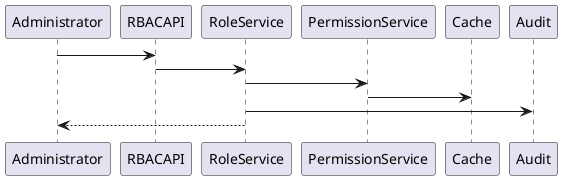
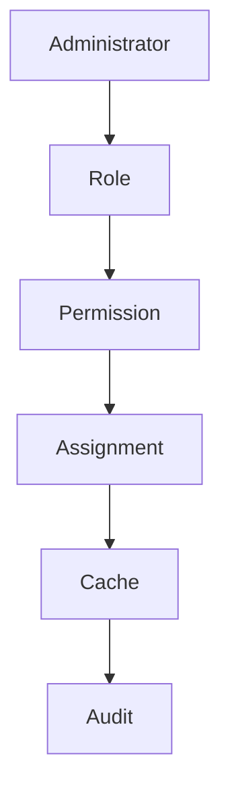

# BOOK-2

# IS-005

# RBAC (Role-Based Access Control) Implementation Specification

**Document ID：IS-005**  
**Module：Role-Based Access Control**  
**Status：Official Edition v2.0**  
**Baseline：PEP-009 Security、IS-002 IAM**

---

# 1. Module Information

Module Code

```text
RBAC
```

Canonical ID

```text
RBAC-001
```

Owner

```text
Platform Security
```

---

# 2. Responsibility

RBAC Module 負責：

- Role Management
- Permission Management
- Role Assignment
- Role Hierarchy
- Permission Inheritance
- Module Permission
- Menu Permission
- API Permission
- Data Scope Permission

RBAC 不負責：

- Authentication（IS-001）
- Identity（IS-002）
- User Profile（IS-004）
- Business Workflow

---

# 3. Business Rules

RBAC-001

所有權限均來自 Role。

---

RBAC-002

User 可同時擁有多個 Role。

---

RBAC-003

Role 可繼承 Parent Role。

---

RBAC-004

Permission 採白名單模式。

---

RBAC-005

Default Deny。

---

RBAC-006

Role 更新立即失效 Permission Cache。

---

RBAC-007

Role 不可跨 Tenant。

---

RBAC-008

Role Assignment 必須 Audit。

---

RBAC-009

Role 不得直接修改 System Role。

---

RBAC-010

Permission 採 Version 管理。

---

# 4. Aggregate

Aggregate Root

```text
Role
```

Entities

```text
Permission

RolePermission

RoleHierarchy

RoleAssignment

PermissionVersion
```

---

# 5. Role Hierarchy

```text
Platform Owner

↓

Platform Admin

↓

Tenant Admin

↓

Organization Admin

↓

Project Manager

↓

Designer

↓

Supervisor

↓

Inspector

↓

Contractor

↓

Supplier

↓

Customer
```

---

# 6. Use Cases

UC-001

Create Role

---

UC-002

Update Role

---

UC-003

Assign Permission

---

UC-004

Assign Role

---

UC-005

Remove Role

---

UC-006

Clone Role

---

UC-007

Role Compare

---

UC-008

Permission Audit

---

# 7. Permission Categories

Platform

Organization

Project

Case

Workflow

Evidence

Contract

Payment

Inspection

Warranty

Knowledge

AI

Administration

Marketplace

Analytics

---

# 8. OpenAPI

## POST

```text
/api/v1/rbac/roles
```

---

## GET

```text
/api/v1/rbac/roles
```

---

## GET

```text
/api/v1/rbac/roles/{roleId}
```

---

## PATCH

```text
/api/v1/rbac/roles/{roleId}
```

---

## POST

```text
/api/v1/rbac/roles/{roleId}/permissions
```

---

## POST

```text
/api/v1/rbac/users/{userId}/roles
```

---

## DELETE

```text
/api/v1/rbac/users/{userId}/roles/{roleId}
```

---

## POST

```text
/api/v1/rbac/evaluate
```

---

# 9. Error Codes

```text
RBAC-4001

Role Not Found

RBAC-4002

Permission Not Found

RBAC-4003

Assignment Exists

RBAC-4004

Role Protected

RBAC-4005

Tenant Conflict

RBAC-4006

Permission Denied

RBAC-5001

RBAC Service Failure
```

---

# 10. SQL

```sql
CREATE TABLE rbac_role(

role_id BIGINT PRIMARY KEY,

tenant_id BIGINT,

role_code VARCHAR(100),

role_name VARCHAR(255),

parent_role_id BIGINT,

system_role BOOLEAN,

permission_version INT,

status VARCHAR(30),

created_at TIMESTAMP

);
```

---

```sql
CREATE TABLE rbac_permission(

permission_id BIGINT PRIMARY KEY,

permission_code VARCHAR(100),

module_code VARCHAR(50),

resource_code VARCHAR(50),

action_code VARCHAR(50),

permission_version INT

);
```

---

```sql
CREATE TABLE rbac_role_permission(

role_permission_id BIGINT PRIMARY KEY,

role_id BIGINT,

permission_id BIGINT
);
```

---

```sql
CREATE TABLE rbac_user_role(

user_role_id BIGINT PRIMARY KEY,

user_id BIGINT,

organization_id BIGINT,

role_id BIGINT,

assigned_at TIMESTAMP
);
```

---

# 11. Index

```sql
idx_role_code

idx_role_parent

idx_permission_code

idx_permission_module

idx_user_role
```

---

# 12. Repository

```text
RoleRepository

PermissionRepository

RoleAssignmentRepository

RoleHierarchyRepository

PermissionCacheRepository
```

---

# 13. Domain Services

```text
RoleService

PermissionService

RoleAssignmentService

RoleHierarchyService

PermissionCacheService

RoleValidationService
```

---

# 14. Commands

```text
CreateRoleCommand

UpdateRoleCommand

AssignPermissionCommand

AssignRoleCommand

RemoveRoleCommand

CloneRoleCommand
```

---

# 15. Queries

```text
GetRole

GetRolePermissions

GetUserRoles

GetPermissionTree

EvaluatePermission
```

---

# 16. PHP Structure

```text
src/

Domain/RBAC/

Application/

Infrastructure/

Presentation/
```

Classes

```text
RoleAggregate.php

PermissionAggregate.php

RoleRepository.php

PermissionRepository.php

RoleAssignmentService.php

PermissionCacheService.php

RBACController.php
```

---

# 17. FastAPI

```text
rbac/

router.py

role.py

permission.py

assignment.py

hierarchy.py

cache.py

audit.py
```

---

# 18. React

Pages

```text
Role List

Role Detail

Permission Matrix

Role Assignment

Permission Audit
```

Components

```text
RoleTable

PermissionTree

PermissionMatrix

RoleSelector

AssignmentHistory

AuditTimeline
```

---

# 19. DTO

```text
CreateRoleRequest

UpdateRoleRequest

RoleResponse

PermissionResponse

RoleAssignmentResponse

PermissionEvaluationResponse
```

---

# 20. Validation

Role Code

```text
ROLE_[A-Z0-9_]+
```

Permission Code

```text
MODULE.RESOURCE.ACTION
```

Hierarchy

```text
No Circular Reference
```

---

# 21. Security

- Default Deny
- Least Privilege
- Immutable Audit
- Tenant Isolation
- Organization Scope Validation
- Permission Version Control
- System Role Protection

---

# 22. PlantUML



---

# 23. Mermaid



---

# 24. Unit Test

```text
RBAC-UT-001 Create Role

RBAC-UT-002 Update Role

RBAC-UT-003 Assign Permission

RBAC-UT-004 Remove Permission

RBAC-UT-005 Assign User Role

RBAC-UT-006 Hierarchy

RBAC-UT-007 Cache Refresh

RBAC-UT-008 Audit
```

---

# 25. Integration Test

```text
RBAC-IT-001 Role CRUD

RBAC-IT-002 Permission CRUD

RBAC-IT-003 User Assignment

RBAC-IT-004 Authorization

RBAC-IT-005 Audit Verification
```

---

# 26. Acceptance Criteria

- Role CRUD 正常
- Permission Matrix 正常
- User Role Assignment 正常
- Hierarchy 無循環依賴
- Cache 自動更新
- Tenant Isolation 驗證通過
- Immutable Audit 完整
- OpenAPI 驗證通過
- SQL Migration 成功
- 單元測試覆蓋率 ≥ 90%
- 整合測試全部通過

---

# 27. Codex Build Instruction

**Input**

- PEP-009 Security
- IS-001 Authentication
- IS-002 IAM
- IS-004 User
- IS-005 RBAC

**Output**

- PHP DDD RBAC Module
- FastAPI RBAC Service
- React RBAC Management Console
- OpenAPI 3.1 YAML
- SQL Migration
- Unit Tests
- Integration Tests
- Docker Configuration

---

**IS-005 RBAC（Official Edition）完成。下一份直接進入 IS-006：Case Management。**
