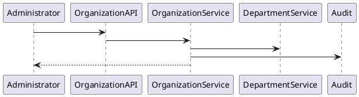
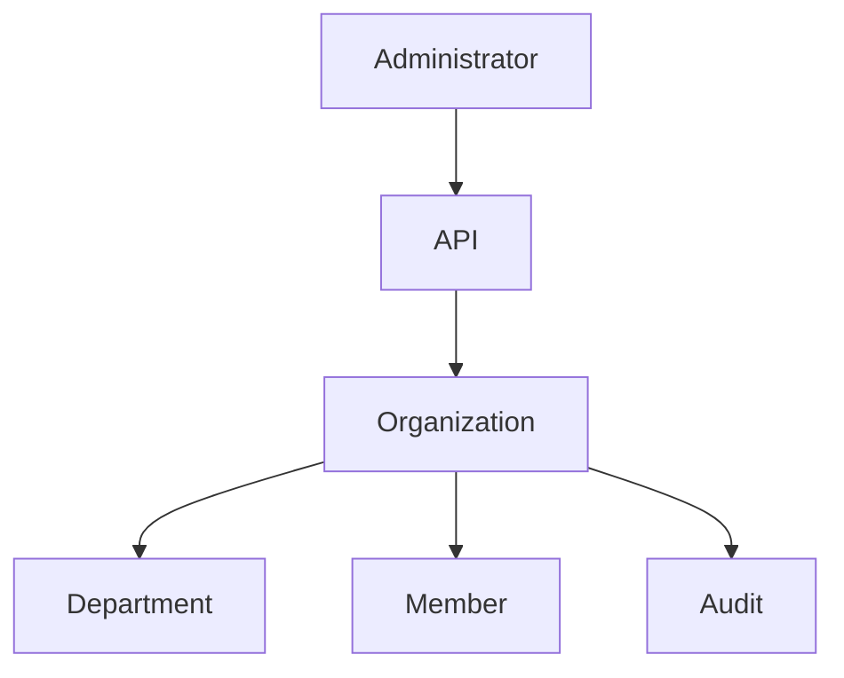

# BOOK-2

# IS-003

# Organization Implementation Specification

**Document ID：IS-003**  
**Module：Organization**  
**Status：Official Edition v2.0**  
**Baseline：PEP-014 Administration**

---

# 1. Module Information

Module Code

```text
ORG
```

Canonical ID

```text
ORG-001
```

Owner

```text
Platform Administration
```

---

# 2. Responsibility

Organization Module 負責：

- Organization Management
- Organization Hierarchy
- Organization Profile
- Department Management
- Organization Membership
- Organization Policy
- Organization Configuration
- Organization Scope

Organization 不負責：

- Authentication（IS-001）
- IAM（IS-002）
- User Profile（IS-004）
- License Management

---

# 3. Business Rules

ORG-001

所有 Organization 必須屬於一個 Tenant。

---

ORG-002

Organization Code 全平台唯一。

---

ORG-003

Organization 可建立部門。

---

ORG-004

Organization 可建立 Project。

---

ORG-005

Organization 可管理 Members。

---

ORG-006

Organization 不得跨 Tenant。

---

ORG-007

Organization 停用後不得登入平台。

---

ORG-008

Organization 所有異動必須 Audit。

---

ORG-009

Organization 可設定模組啟用。

---

ORG-010

Organization Configuration 採 Version 控制。

---

# 4. Aggregate

Aggregate Root

```text
Organization
```

Entities

```text
Department

OrganizationMember

OrganizationProfile

OrganizationSetting

OrganizationPolicy
```

---

# 5. Lifecycle

```text
Created

↓

Configured

↓

Verified

↓

Activated

↓

Suspended

↓

Archived
```

---

# 6. Use Cases

UC-001

Create Organization

---

UC-002

Update Organization

---

UC-003

Suspend Organization

---

UC-004

Archive Organization

---

UC-005

Create Department

---

UC-006

Assign Member

---

UC-007

Organization Configuration

---

UC-008

Organization Audit

---

# 7. OpenAPI

## POST

```text
/api/v1/organizations
```

Request

```json
{
  "organizationCode":"ORG001",
  "organizationName":"Demo Design",
  "tenantId":1,
  "organizationType":"DESIGN"
}
```

---

## GET

```text
/api/v1/organizations
```

---

## GET

```text
/api/v1/organizations/{organizationId}
```

---

## PATCH

```text
/api/v1/organizations/{organizationId}
```

---

## POST

```text
/api/v1/organizations/{organizationId}/activate
```

---

## POST

```text
/api/v1/organizations/{organizationId}/suspend
```

---

## POST

```text
/api/v1/organizations/{organizationId}/archive
```

---

# 8. Error Codes

```text
ORG-4001

Organization Not Found

ORG-4002

Organization Code Exists

ORG-4003

Tenant Invalid

ORG-4004

Organization Suspended

ORG-4005

Department Exists

ORG-5001

Organization Failure
```

---

# 9. SQL

```sql
CREATE TABLE organization_master(

organization_id BIGINT PRIMARY KEY,

tenant_id BIGINT NOT NULL,

organization_code VARCHAR(50) UNIQUE,

organization_name VARCHAR(255),

organization_type VARCHAR(50),

status VARCHAR(30),

created_at TIMESTAMP,

updated_at TIMESTAMP

);
```

```sql
CREATE TABLE organization_department(

department_id BIGINT PRIMARY KEY,

organization_id BIGINT,

department_code VARCHAR(50),

department_name VARCHAR(255),

parent_department_id BIGINT,

status VARCHAR(30)

);
```

```sql
CREATE TABLE organization_member(

organization_member_id BIGINT PRIMARY KEY,

organization_id BIGINT,

user_id BIGINT,

role_id BIGINT,

status VARCHAR(30),

joined_at TIMESTAMP

);
```

---

# 10. Index

```sql
idx_org_code

idx_org_tenant

idx_department_org

idx_member_org

idx_member_user
```

---

# 11. Repository

```text
OrganizationRepository

DepartmentRepository

OrganizationMemberRepository

OrganizationPolicyRepository

OrganizationConfigurationRepository
```

---

# 12. Domain Services

```text
OrganizationService

DepartmentService

OrganizationValidationService

OrganizationPolicyService

OrganizationConfigurationService
```

---

# 13. Application Commands

```text
CreateOrganizationCommand

UpdateOrganizationCommand

ActivateOrganizationCommand

SuspendOrganizationCommand

ArchiveOrganizationCommand

AssignMemberCommand
```

---

# 14. Queries

```text
GetOrganization

GetOrganizationList

GetDepartments

GetMembers

GetOrganizationConfiguration
```

---

# 15. PHP Structure

```text
src/

Domain/Organization/

Application/

Infrastructure/

Presentation/
```

Classes

```text
OrganizationAggregate.php

OrganizationRepository.php

DepartmentRepository.php

CreateOrganizationHandler.php

UpdateOrganizationHandler.php

OrganizationValidator.php

OrganizationController.php
```

---

# 16. FastAPI

```text
organization/

router.py

organization.py

department.py

member.py

policy.py

configuration.py

audit.py
```

---

# 17. React

Pages

```text
Organization List

Organization Detail

Department

Members

Organization Settings
```

Components

```text
OrganizationTable

DepartmentTree

MemberTable

OrganizationProfileCard

ConfigurationPanel
```

---

# 18. DTO

```text
CreateOrganizationRequest

UpdateOrganizationRequest

OrganizationResponse

DepartmentResponse

MemberResponse

OrganizationSettingResponse
```

---

# 19. Validation

Organization Code

```text
ORG_[A-Z0-9_]+
```

Organization Name

```text
1~255 Characters
```

Department Code

```text
DEP_[A-Z0-9_]+
```

---

# 20. Security

- Tenant Isolation
- Organization Scope Validation
- RBAC Authorization
- Immutable Audit
- Configuration Version Control

---

# 21. PlantUML



---

# 22. Mermaid



---

# 23. Unit Test

```text
ORG-UT-001 Create Organization

ORG-UT-002 Update Organization

ORG-UT-003 Suspend Organization

ORG-UT-004 Archive Organization

ORG-UT-005 Create Department

ORG-UT-006 Assign Member

ORG-UT-007 Configuration Update

ORG-UT-008 Audit
```

---

# 24. Integration Test

```text
ORG-IT-001 Organization CRUD

ORG-IT-002 Department CRUD

ORG-IT-003 Member Assignment

ORG-IT-004 Organization Scope

ORG-IT-005 Audit Verification
```

---

# 25. Acceptance Criteria

- Tenant 隔離驗證通過
- Organization CRUD 正常
- Department Tree 正常
- Member 管理正常
- Configuration 版本管理正常
- Audit 完整記錄
- OpenAPI 驗證通過
- SQL Migration 成功
- 單元測試覆蓋率 ≥ 90%
- 整合測試全部通過

---

# 26. Codex Build Instruction

**Input**

- PEP-014 Administration
- IS-001 Authentication
- IS-002 IAM
- IS-003 Organization

**Output**

- PHP DDD Organization Module
- FastAPI Organization Service
- React Organization Console
- OpenAPI 3.1 YAML
- SQL Migration
- Unit Tests
- Integration Tests
- Docker Configuration

---

**IS-003 Organization（Official Edition）完成。下一份直接進入 IS-004：User。**
