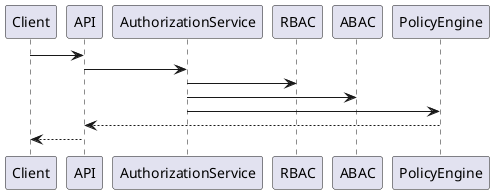
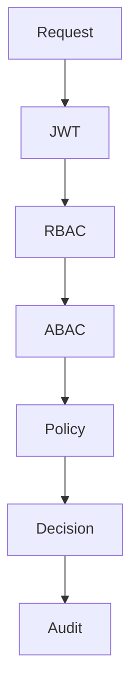

# BOOK-2

# IS-002

# Identity & Access Management (IAM) Implementation Specification

**Document ID：IS-002**  
**Module：Identity & Access Management**  
**Status：Official Edition v2.0**  
**Baseline：PEP-009 Security**

---

# 1. Module Information

Module Code

```text
IAM
```

Canonical ID

```text
IAM-001
```

Owner

```text
Platform Security
```

---

# 2. Responsibility

IAM Module 負責：

- Identity Management
- Access Control
- RBAC
- ABAC
- Policy Decision Point (PDP)
- Policy Enforcement Point (PEP)
- Session Authorization
- Permission Cache
- Organization Scope
- Tenant Isolation

IAM 不負責：

- Login Authentication（IS-001）
- User Profile（IS-004）
- Workflow Authorization Logic
- Business Rules

---

# 3. Business Rules

IAM-001

所有 API 必須先經 Authentication。

---

IAM-002

所有 API 必須經 Authorization。

---

IAM-003

Default Deny。

---

IAM-004

Permission 採 Version 控制。

---

IAM-005

Permission 更新立即失效舊 Cache。

---

IAM-006

所有 Decision 必須 Audit。

---

IAM-007

Tenant 不得跨越。

---

IAM-008

Organization 不得跨越。

---

IAM-009

Case Scope 必須驗證。

---

IAM-010

Project Scope 必須驗證。

---

# 4. Aggregate

Aggregate Root

```text
AccessControl
```

Entities

```text
Identity

Role

Permission

Policy

OrganizationScope

TenantScope

AccessDecision
```

---

# 5. Access Flow

```text
Request

↓

JWT Verify

↓

Identity Load

↓

Role Load

↓

Permission Load

↓

ABAC

↓

Policy Engine

↓

Decision

↓

Audit

↓

Response
```

---

# 6. Use Cases

UC-001

Authorize API

---

UC-002

Assign Role

---

UC-003

Remove Role

---

UC-004

Permission Query

---

UC-005

Policy Evaluation

---

UC-006

Tenant Validation

---

UC-007

Organization Validation

---

UC-008

Case Validation

---

# 7. OpenAPI

## GET

```text
/api/v1/iam/me
```

---

## GET

```text
/api/v1/iam/permissions
```

---

## GET

```text
/api/v1/iam/roles
```

---

## POST

```text
/api/v1/iam/evaluate
```

Request

```json
{
  "resource":"case",
  "action":"update",
  "resourceId":1001
}
```

Response

```json
{
  "allowed":true,
  "policy":"POLICY-001",
  "traceId":""
}
```

---

## POST

```text
/api/v1/iam/role/assign
```

---

## POST

```text
/api/v1/iam/role/remove
```

---

# 8. Error Codes

```text
IAM-4001

Permission Denied

IAM-4002

Role Missing

IAM-4003

Tenant Invalid

IAM-4004

Organization Invalid

IAM-4005

Case Forbidden

IAM-4006

Policy Reject

IAM-5001

Authorization Failure
```

---

# 9. SQL

```sql
CREATE TABLE iam_role(

role_id BIGINT PRIMARY KEY,

role_code VARCHAR(50),

role_name VARCHAR(100),

status VARCHAR(20),

created_at TIMESTAMP

);
```

---

```sql
CREATE TABLE iam_permission(

permission_id BIGINT PRIMARY KEY,

permission_code VARCHAR(100),

module_code VARCHAR(50),

action_code VARCHAR(50),

permission_version INT,

created_at TIMESTAMP

);
```

---

```sql
CREATE TABLE iam_role_permission(

role_permission_id BIGINT PRIMARY KEY,

role_id BIGINT,

permission_id BIGINT

);
```

---

```sql
CREATE TABLE iam_policy(

policy_id BIGINT PRIMARY KEY,

policy_code VARCHAR(50),

priority INT,

status VARCHAR(20),

created_at TIMESTAMP

);
```

---

# 10. Index

```sql
idx_role_code

idx_permission_code

idx_permission_version

idx_policy_priority
```

---

# 11. Repository

```text
IdentityRepository

RoleRepository

PermissionRepository

PolicyRepository

AccessRepository
```

---

# 12. Domain Service

```text
AuthorizationService

RBACService

ABACService

PolicyEngine

ScopeValidator

PermissionCache
```

---

# 13. Application Commands

```text
AssignRoleCommand

RemoveRoleCommand

EvaluatePermissionCommand

RefreshPermissionCacheCommand
```

---

# 14. Queries

```text
GetRoles

GetPermissions

GetPolicies

GetCurrentIdentity
```

---

# 15. PHP Structure

```text
src/

Domain/IAM/

Application/

Infrastructure/

Presentation/
```

Classes

```text
AuthorizationService.php

RBACService.php

ABACService.php

PolicyEngine.php

PermissionRepository.php

RoleRepository.php

IAMController.php
```

---

# 16. FastAPI

```text
iam/

router.py

authorization.py

rbac.py

abac.py

policy.py

scope.py

audit.py
```

---

# 17. React

Pages

```text
Role Management

Permission Management

Policy Management

Access Audit
```

Components

```text
RoleTable

PermissionMatrix

PolicyEditor

AccessDecisionViewer
```

---

# 18. DTO

```text
AssignRoleRequest

RemoveRoleRequest

PermissionResponse

PolicyResponse

AccessDecisionResponse
```

---

# 19. Validation

Role Code

```text
ROLE_[A-Z_]+
```

Permission Code

```text
MODULE.ACTION
```

Policy Priority

```text
Positive Integer
```

---

# 20. Security

Authorization

```text
RBAC + ABAC
```

Policy

```text
Default Deny
```

Permission Cache

```text
Version Controlled
```

Audit

```text
Immutable
```

---

# 21. PlantUML



---

# 22. Mermaid



---

# 23. Unit Test

```text
IAM-UT-001 Role Check

IAM-UT-002 Permission Check

IAM-UT-003 Policy Allow

IAM-UT-004 Policy Deny

IAM-UT-005 Tenant Validation

IAM-UT-006 Organization Validation

IAM-UT-007 Permission Cache

IAM-UT-008 Audit
```

---

# 24. Integration Test

```text
IAM-IT-001 JWT Authorization

IAM-IT-002 RBAC

IAM-IT-003 ABAC

IAM-IT-004 Policy Engine

IAM-IT-005 Access Audit
```

---

# 25. Acceptance Criteria

- JWT 身分可正確解析
- RBAC 授權正確
- ABAC 條件判斷正確
- Policy Engine 正常運作
- Tenant 完全隔離
- Organization 完全隔離
- Permission Cache 自動更新
- Audit 完整記錄
- OpenAPI 驗證通過
- 單元測試覆蓋率 ≥ 90%
- 整合測試全部通過

---

# 26. Codex Build Instruction

**Input**

- PEP-009 Security
- IS-001 Authentication
- IS-002 IAM

**Output**

- PHP DDD IAM Module
- FastAPI Authorization Service
- React IAM Console
- OpenAPI 3.1 YAML
- SQL Migration
- Unit Tests
- Integration Tests
- Docker Configuration

---

**IS-002 Identity & Access Management（Official Edition）完成。下一份直接進入 IS-003：Organization。**
