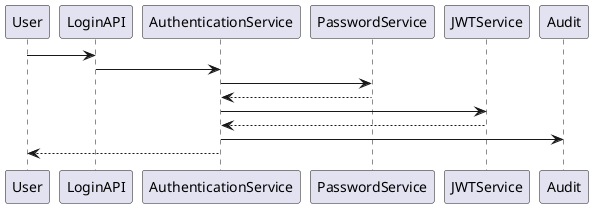
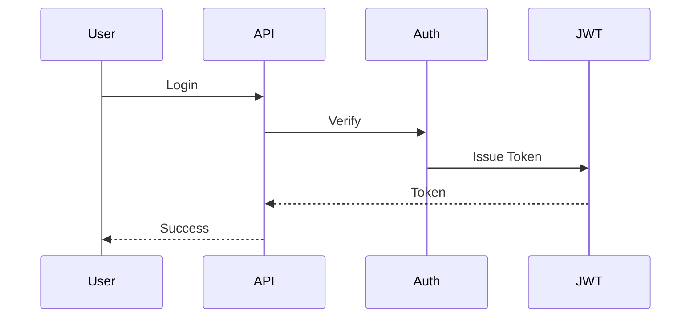

# BOOK-2

# IS-001

# Authentication Implementation Specification

**Document ID：IS-001**  
**Module：Authentication**  
**Status：Official Edition v2.0**  
**Baseline：PEP-009 Security**

---

# 1. Module Information

Module Code

```text
AUTH
```

Canonical ID

```text
AUTH-001
```

Owner

```text
Platform Core
```

---

# 2. Responsibility

Authentication Module 負責：

- Identity Verification
- Login
- Logout
- Token Issue
- Refresh Token
- Session Control
- MFA
- Device Registration
- Login Audit

Authentication 不負責：

- Authorization（IS-005）
- RBAC
- ABAC
- Organization
- User Profile

---

# 3. Business Rules

AUTH-001

使用 Email Login

---

AUTH-002

Password 使用 Argon2id

---

AUTH-003

JWT Access Token

15 minutes

---

AUTH-004

Refresh Token

30 Days

---

AUTH-005

Single Device Policy

Configurable

---

AUTH-006

MFA Optional

Platform Configurable

---

AUTH-007

所有 Login 必須產生 Audit

---

AUTH-008

所有 Token 必須具有：

```text
TraceID

TenantID

OrganizationID

UserID

Role

PermissionVersion
```

---

# 4. Aggregate

Aggregate Root

```text
Authentication
```

Entities

```text
Credential

Session

RefreshToken

Device

LoginHistory
```

---

# 5. State Machine

```text
Registered

↓

Activated

↓

Authenticated

↓

Verified

↓

Expired

↓

Revoked
```

---

# 6. Use Cases

UC-001

Login

---

UC-002

Logout

---

UC-003

Refresh Token

---

UC-004

Forgot Password

---

UC-005

Reset Password

---

UC-006

Register Device

---

UC-007

Verify MFA

---

UC-008

Revoke Session

---

# 7. OpenAPI

## POST

```text
/api/v1/auth/login
```

Request

```json
{
  "email":"",
  "password":"",
  "deviceId":"",
  "deviceName":""
}
```

Response

```json
{
  "accessToken":"",
  "refreshToken":"",
  "expiresIn":900,
  "traceId":""
}
```

---

## POST

```text
/api/v1/auth/logout
```

---

## POST

```text
/api/v1/auth/refresh
```

---

## POST

```text
/api/v1/auth/mfa
```

---

## POST

```text
/api/v1/auth/forgot-password
```

---

## POST

```text
/api/v1/auth/reset-password
```

---

# 8. Error Codes

```text
AUTH-4001

Invalid Email

AUTH-4002

Wrong Password

AUTH-4003

User Disabled

AUTH-4004

MFA Required

AUTH-4005

Token Expired

AUTH-4006

Refresh Invalid

AUTH-4007

Device Blocked

AUTH-5001

Authentication Failure
```

---

# 9. SQL

```sql
CREATE TABLE auth_session(

session_id BIGINT PRIMARY KEY,

user_id BIGINT NOT NULL,

tenant_id BIGINT,

organization_id BIGINT,

device_id VARCHAR(100),

refresh_token_hash CHAR(64),

access_expired_at TIMESTAMP,

refresh_expired_at TIMESTAMP,

status VARCHAR(30),

created_at TIMESTAMP

);
```

---

```sql
CREATE TABLE auth_login_history(

login_history_id BIGINT PRIMARY KEY,

user_id BIGINT,

login_ip VARCHAR(100),

user_agent TEXT,

device_name VARCHAR(200),

result VARCHAR(20),

trace_id VARCHAR(100),

created_at TIMESTAMP

);
```

---

# 10. Index

```sql
idx_auth_session_user

idx_auth_session_refresh

idx_login_history_user

idx_login_history_trace
```

---

# 11. Repository

```text
AuthenticationRepository

SessionRepository

RefreshTokenRepository

DeviceRepository

LoginHistoryRepository
```

---

# 12. Domain Service

```text
AuthenticationService

TokenService

PasswordService

MFAService

SessionService

DeviceService
```

---

# 13. Application Commands

```text
LoginCommand

LogoutCommand

RefreshTokenCommand

VerifyMFACommand

ForgotPasswordCommand

ResetPasswordCommand
```

---

# 14. Queries

```text
GetCurrentSession

GetLoginHistory

GetDeviceList
```

---

# 15. PHP Structure

```text
src/

Domain/

Authentication/

Application/

Infrastructure/

Presentation/
```

Classes

```text
AuthenticationAggregate.php

AuthenticationRepository.php

LoginHandler.php

LogoutHandler.php

RefreshHandler.php

TokenService.php

PasswordHasher.php

JWTService.php

AuthenticationController.php
```

---

# 16. FastAPI

```text
auth/

router.py

login.py

logout.py

refresh.py

jwt.py

mfa.py

password.py

audit.py
```

---

# 17. React

Pages

```text
Login

ForgotPassword

ResetPassword

MFA

DeviceManagement
```

Components

```text
LoginForm

PasswordField

OTPInput

RememberDevice

DeviceList
```

---

# 18. DTO

```text
LoginRequest

LoginResponse

RefreshRequest

RefreshResponse

LogoutRequest

ForgotPasswordRequest

ResetPasswordRequest
```

---

# 19. Validation

Email

RFC5322

Password

12+

Uppercase

Lowercase

Number

Special Character

DeviceID

UUID

---

# 20. JWT Payload

```json
{
  "sub":"user_id",
  "tenant":"tenant_id",
  "organization":"organization_id",
  "role":"role",
  "permissionVersion":1,
  "traceId":"",
  "iat":0,
  "exp":0
}
```

---

# 21. Security

Password

Argon2id

JWT

Ed25519

TLS

1.3

Cookie

HttpOnly

SameSite=Strict

---

# 22. PlantUML



---

# 23. Mermaid



---

# 24. Unit Test

```text
AUTH-UT-001

Login Success

AUTH-UT-002

Wrong Password

AUTH-UT-003

Expired Token

AUTH-UT-004

Refresh Success

AUTH-UT-005

Logout

AUTH-UT-006

Password Reset

AUTH-UT-007

MFA

AUTH-UT-008

Device Verify
```

---

# 25. Integration Test

```text
AUTH-IT-001

Login

AUTH-IT-002

Refresh

AUTH-IT-003

JWT

AUTH-IT-004

Audit

AUTH-IT-005

Session Revoke
```

---

# 26. Acceptance Criteria

- JWT 可正常簽發與驗證
- Refresh Token 可輪替
- Argon2id 驗證成功
- MFA 流程正常
- Session 可撤銷
- Audit 完整記錄
- Trace ID 全程傳遞
- 所有 API 通過 OpenAPI 驗證
- 單元測試覆蓋率 ≥90%
- 整合測試全部通過

---

# 27. Codex Build Instruction

**Input**

- PEP-009 Security
- PEP-008 Integration
- IS-001 Authentication

**Output**

- PHP DDD Authentication Module
- FastAPI Authentication Service
- React Authentication UI
- OpenAPI 3.1 YAML
- SQL Migration
- Unit Tests
- Integration Tests
- Docker Configuration

**IS-001 Authentication（Official Edition）完成。下一份將直接進入 IS-002：IAM（Identity & Access Management）。**
