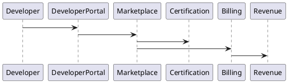
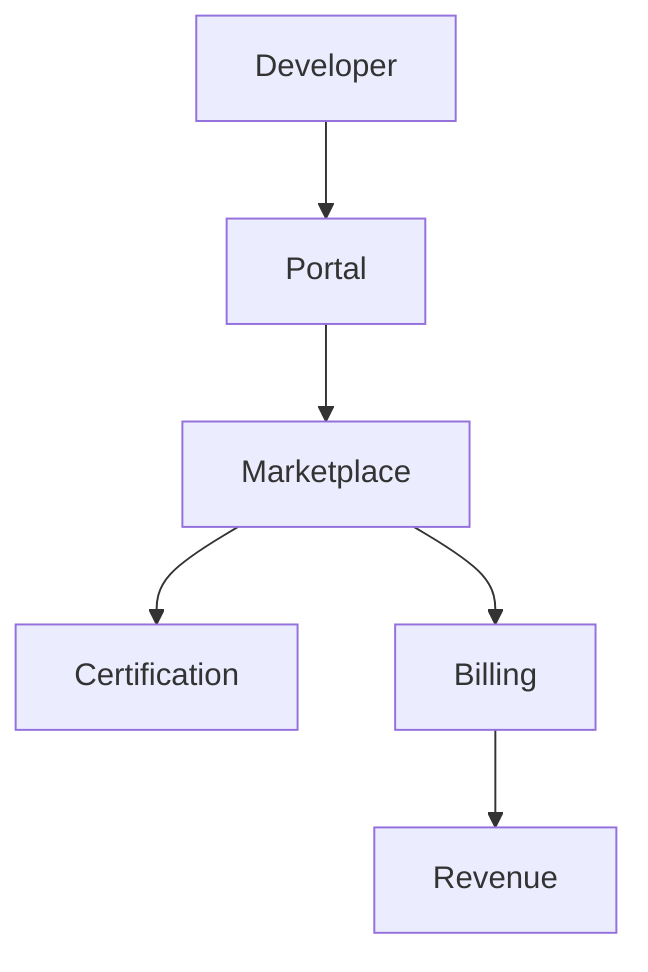

# PEP-019

# Platform Ecosystem & Marketplace Production Engineering Package

**Package ID：PEP-019**  
**Status：Official Edition v1.0**

---

# 01 Package Scope

涵蓋：

- TIGI Platform Ecosystem
- StyleMatch AI Marketplace
- TWCID Partner Network
- iSAFE Certified Ecosystem
- Marketplace Engine
- Developer Portal
- Plugin Framework
- Extension SDK
- API Marketplace
- Revenue Sharing
- Certification Center
- Billing & Settlement

---

# 02 Ecosystem Architecture

```text
Partner
      │
Developer Portal
      │
Marketplace Gateway
      │
Marketplace Service
├── Partner Registry
├── Plugin Registry
├── API Marketplace
├── Certification Center
├── Billing Engine
├── Revenue Engine
├── License Engine
└── Audit Engine
```

---

# 03 Ecosystem Domains

| Domain | Description |
|---------|-------------|
| StyleMatch AI | AI Design Services |
| TWCID | Industry Network |
| iSAFE | Governance Platform |
| Marketplace | Partner Ecosystem |
| Developer | Third-party Development |
| Certification | Certification System |
| Extension | Platform Extensions |
| API | External Services |

---

# 04 Partner Types

- Interior Designer
- Architecture Office
- Construction Company
- Material Supplier
- System Furniture
- Smart Home Vendor
- AI Service Provider
- Financial Institution
- Insurance Company
- Government Agency
- Education Partner
- Independent Developer

---

# 05 Marketplace Categories

Products

- AI Service
- Design Template
- Style Package
- Material Library
- BIM Component
- Workflow Extension
- Inspection Module
- Dashboard Widget

Services

- Consulting
- Training
- API
- SaaS
- Integration

---

# 06 Plugin Framework

Plugin Lifecycle

```text
Registered

↓

Verified

↓

Published

↓

Installed

↓

Activated

↓

Updated

↓

Deprecated

↓

Retired
```

---

# 07 Extension SDK

SDK Components

- Authentication SDK
- OpenAPI SDK
- Event SDK
- Notification SDK
- AI SDK
- Marketplace SDK
- Payment SDK
- Analytics SDK

---

# 08 Certification Center

Certification

- Certified Designer
- Certified Contractor
- Certified Supplier
- Certified Inspector
- Certified AI Plugin
- Certified Integration
- Certified Marketplace App

Certification 必須可追溯至 TWCID 與 iSAFE 治理資料。

---

# 09 API Marketplace

提供：

- Public API
- Partner API
- Premium API
- Enterprise API
- Internal API

每個 API 必須具備：

- Version
- SLA
- Quota
- Billing Policy
- Deprecation Policy

---

# 10 Revenue Sharing

支援：

- Subscription
- Transaction Fee
- Revenue Sharing
- Enterprise License
- Marketplace Commission
- API Usage Billing

---

# 11 Billing Engine

Billing Model

- Monthly
- Annual
- Pay As You Go
- API Consumption
- AI Token Usage
- Marketplace Purchase

---

# 12 Developer Portal

提供：

- SDK Download
- OpenAPI Explorer
- Sandbox
- Documentation
- Sample Code
- API Key Management
- Usage Dashboard
- Release Notes

---

# 13 SQL

```sql
CREATE TABLE marketplace_partner(

partner_id BIGINT PRIMARY KEY,

partner_type VARCHAR(50),

organization_id BIGINT,

status VARCHAR(30),

created_at TIMESTAMP

);
```

```sql
CREATE TABLE marketplace_plugin(

plugin_id BIGINT PRIMARY KEY,

plugin_name VARCHAR(200),

plugin_version VARCHAR(50),

developer_id BIGINT,

status VARCHAR(30),

published_at TIMESTAMP

);
```

---

# 14 OpenAPI

```yaml
GET /marketplace/plugins

POST /marketplace/plugins

GET /marketplace/partners

POST /marketplace/certification

GET /marketplace/sdk

GET /developer/api-keys

POST /developer/api-keys

GET /developer/billing
```

---

# 15 PHP Structure

```text
Marketplace/

PartnerService.php

PluginService.php

CertificationService.php

BillingService.php

RevenueService.php

DeveloperPortalService.php
```

---

# 16 FastAPI Runtime

```text
marketplace/

router.py

partner.py

plugin.py

certification.py

billing.py

developer.py

sdk.py

audit.py
```

---

# 17 Runtime Events

```text
PartnerRegistered

PluginPublished

PluginInstalled

CertificationGranted

CertificationRevoked

APIKeyIssued

BillingGenerated

RevenueSettled
```

---

# 18 Runtime Metrics

- Active Partners
- Published Plugins
- API Calls
- SDK Downloads
- Marketplace Revenue
- Certification Count
- Plugin Installation Count
- Developer Activity

---

# 19 Performance Benchmark

| Operation | Target |
|-----------|--------|
| Marketplace Query | ≤300 ms |
| Plugin Install | ≤1 s |
| API Key Issue | ≤300 ms |
| Billing Query | ≤300 ms |
| Certification Validation | ≤500 ms |

---

# 20 PlantUML



---

# 21 Mermaid



---

# 22 Test Specification

```text
ECO-001 Partner Registration

ECO-002 Plugin Publish

ECO-003 Plugin Install

ECO-004 Certification

ECO-005 SDK Download

ECO-006 API Key

ECO-007 Billing

ECO-008 Revenue Sharing

ECO-009 Marketplace Search

ECO-010 Audit
```

---

# 23 Deliverables

完成交付：

- Platform Ecosystem
- Marketplace Engine
- Partner Registry
- Plugin Framework
- Extension SDK
- Developer Portal
- Certification Center
- Revenue Sharing
- Billing Engine
- Marketplace OpenAPI
- SQL Schema
- PHP Skeleton
- FastAPI Runtime
- PlantUML
- Mermaid
- Test Specification

---

# 24 PEP-019 Status

**PEP-019 Platform Ecosystem & Marketplace Production Engineering Package**

**Status：Completed**

**Frozen：Yes**

---

# Production Engineering Edition v1.0 — Final Freeze

至此，**PEP-001～PEP-019** 已完成並凍結，涵蓋：

- Core Governance（治理核心）
- Workflow & Evidence（流程與存證）
- Contract、Payment、Inspection、Warranty（業務流程）
- AI Platform & Multi-Agent（AI 平台）
- Knowledge Graph（知識圖譜）
- Integration & Security（整合與安全）
- Deployment & DevOps（部署與維運）
- UI/UX Engineering（介面工程）
- Data Intelligence（數據分析）
- Administration（平台管理）
- Engineering Standards（工程標準）
- Mobile（行動應用）
- BIM / CAD / Digital Twin（BIM 與數位孿生）
- Smart Construction IoT（智慧工地）
- Platform Ecosystem & Marketplace（平台生態系）

這套 **PEP-001～PEP-019** 可作為 TIGI（StyleMatch AI × TWCID × iSAFE 2.0）Production Engineering Edition v1.0 的正式工程基線。後續建議進入 **v2.0** 階段，開始逐一將各 PEP 細化為可直接交付開發的實作層（完整 OpenAPI YAML、資料庫 Migration、PHP/FastAPI 原始碼骨架、React 元件、CI/CD 設定與測試程式），讓工程團隊能直接依規格開發。
