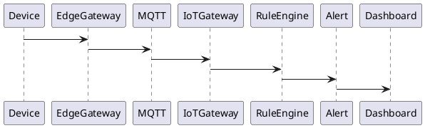
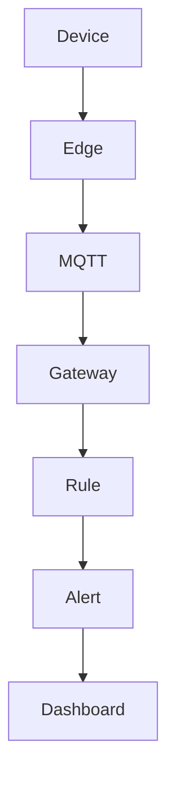

# PEP-018

# Smart Construction IoT Production Engineering Package

**Package ID：PEP-018**  
**Status：Official Edition v1.0**

---

# 01 Package Scope

涵蓋：

- IoT Gateway
- Device Registry
- Sensor Management
- Environmental Monitoring
- Smart Equipment
- Edge Gateway
- Edge AI
- MQTT Broker
- Event Streaming
- Real-time Alert
- Device Security
- OTA Firmware Management
- Digital Inspection Integration

---

# 02 IoT Architecture

```text
IoT Device
      │
Edge Gateway
      │
MQTT Broker
      │
IoT Gateway
      ├── Device Registry
      ├── Telemetry Engine
      ├── Alert Engine
      ├── Rule Engine
      ├── Edge AI
      ├── Event Bus
      └── Audit Engine
              │
      TIGI Platform
```

---

# 03 Supported Devices

Environment

- Temperature
- Humidity
- PM2.5
- CO₂
- VOC
- Noise

Construction

- Smart Meter
- Power Meter
- Water Meter
- Equipment Tracker
- Material Tag

Safety

- Helmet Beacon
- Fall Detection
- PPE Detection
- Restricted Area Beacon

Building

- Smart Lock
- Smart Camera
- Smart Switch
- Smart Lighting

---

# 04 Device Lifecycle

```text
Registered

↓

Provisioned

↓

Activated

↓

Running

↓

Maintenance

↓

Suspended

↓

Retired
```

---

# 05 Device Registry

Device Metadata

- Device ID
- Device Type
- Device Model
- Firmware Version
- Manufacturer
- Site
- Organization
- Project
- Case
- Status
- Last Heartbeat

---

# 06 MQTT Topics

```text
tigi/device/register

tigi/device/telemetry

tigi/device/event

tigi/device/alert

tigi/device/config

tigi/device/ota

tigi/device/status
```

---

# 07 Telemetry Engine

支援：

- Real-time Stream
- Time Series
- Aggregation
- Window Analysis
- Threshold Detection

---

# 08 Rule Engine

Rule：

- Temperature Threshold
- Humidity Threshold
- Noise Threshold
- Device Offline
- Battery Low
- Sensor Failure
- Unauthorized Device

---

# 09 Edge AI

支援：

- Image Classification
- PPE Detection
- Occupancy Detection
- Smoke Detection
- Intrusion Detection

Edge AI 可離線運作。

---

# 10 Real-time Alert

Alert Level

- Information
- Warning
- Critical
- Emergency

Delivery

- Mobile Push
- Email
- SMS（選配）
- Webhook
- Dashboard

---

# 11 Device Security

必須：

- Mutual TLS
- Device Certificate
- Secure Boot（選配）
- OTA Signature
- Device Authentication
- Device Revocation

---

# 12 SQL

```sql
CREATE TABLE device_registry(

device_id BIGINT PRIMARY KEY,

device_code VARCHAR(100),

device_type VARCHAR(50),

firmware_version VARCHAR(30),

project_id BIGINT,

case_id BIGINT,

status VARCHAR(30),

last_seen TIMESTAMP

);
```

```sql
CREATE TABLE telemetry_record(

telemetry_id BIGINT PRIMARY KEY,

device_id BIGINT,

metric_name VARCHAR(100),

metric_value DECIMAL(18,4),

recorded_at TIMESTAMP

);
```

---

# 13 OpenAPI

```yaml
POST /iot/device/register

POST /iot/device/heartbeat

POST /iot/device/event

POST /iot/device/telemetry

GET /iot/device/{id}

GET /iot/telemetry

GET /iot/alerts

POST /iot/device/ota
```

---

# 14 PHP Structure

```text
IoT/

DeviceRegistry.php

TelemetryService.php

AlertService.php

RuleEngine.php

OTAService.php

AuditService.php
```

---

# 15 FastAPI Runtime

```text
iot/

router.py

device.py

telemetry.py

rule_engine.py

alert.py

ota.py

edge_ai.py

audit.py
```

---

# 16 Runtime Events

```text
DeviceRegistered

DeviceOnline

DeviceOffline

TelemetryReceived

ThresholdExceeded

AlertGenerated

FirmwareUpdated

EdgeAICompleted
```

---

# 17 Runtime Metrics

- Online Device Count
- Heartbeat Success Rate
- Alert Count
- Telemetry Throughput
- OTA Success Rate
- Edge AI Accuracy
- Device Availability
- Average Latency

---

# 18 Performance Benchmark

| Operation | Target |
|-----------|--------|
| Heartbeat | ≤100 ms |
| Telemetry Ingest | ≤200 ms |
| Alert Generation | ≤300 ms |
| Device Query | ≤200 ms |
| OTA Dispatch | ≤2 s |

---

# 19 PlantUML



---

# 20 Mermaid



---

# 21 Test Specification

```text
IOT-001 Device Register

IOT-002 Heartbeat

IOT-003 Telemetry

IOT-004 Alert Rule

IOT-005 Device Offline

IOT-006 OTA

IOT-007 Edge AI

IOT-008 Security

IOT-009 Event Streaming

IOT-010 Audit
```

---

# 22 Deliverables

完成交付：

- IoT Gateway
- Device Registry
- Telemetry Engine
- Rule Engine
- Edge AI
- MQTT Integration
- Real-time Alert
- Device Security
- SQL Schema
- OpenAPI Contract
- PHP Skeleton
- FastAPI Runtime
- PlantUML
- Mermaid
- Test Specification

---

# 23 PEP-018 Status

**PEP-018 Smart Construction IoT Production Engineering Package**

**Status：Completed**

**Frozen：Yes**

---

## PEP-019

下一段將直接開始 **Platform Ecosystem & Marketplace Production Engineering Package**，完整定義：

- StyleMatch AI 生態系
- TWCID 合作夥伴平台
- iSAFE 認證體系
- 設計師／廠商 Marketplace
- AI Plugin Framework
- API Marketplace
- 第三方開發者平台
- SDK 與 Extension Framework
- Revenue Sharing
- Developer Portal
- Marketplace OpenAPI
- SQL Schema
- PHP/FastAPI Runtime
- PlantUML
- Mermaid
- Test Specification
