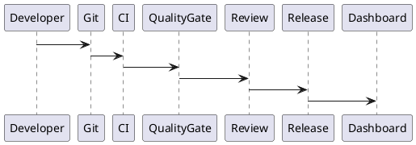
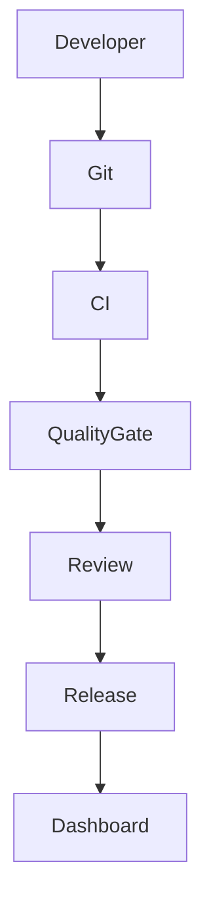

# PEP-015

# Engineering Standards & Quality Production Engineering Package

**Package ID：PEP-015**  
**Status：Official Edition v1.0**

---

# 01 Package Scope

涵蓋：

- Engineering Standards
- Coding Standards
- Repository Standards
- API Standards
- Database Standards
- Documentation Standards
- Testing Standards
- Release Standards
- Quality Gates
- Architecture Decision Records (ADR)
- Technical Debt Management
- Engineering KPI
- Quality Dashboard
- Continuous Improvement

---

# 02 Engineering Principles

| ID | Principle |
|----|-----------|
| ENG-001 | Single Source of Truth |
| ENG-002 | Specification First |
| ENG-003 | Architecture Driven |
| ENG-004 | Security by Default |
| ENG-005 | Test First |
| ENG-006 | Traceability |
| ENG-007 | Automation First |
| ENG-008 | Continuous Improvement |

---

# 03 Repository Standard

```text
tigi/

engineering/

frontend/

backend/

ai/

openapi/

database/

deployment/

architecture/

tests/

scripts/

docs/

release/
```

每個目錄皆應包含：

- README.md
- CHANGELOG.md
- OWNERS
- VERSION

---

# 04 Branch Strategy

Branch：

```text
main

develop

release/*

feature/*

hotfix/*

bugfix/*
```

Merge Policy：

- Pull Request
- Code Review
- CI Success
- Security Scan
- Architecture Review（重大變更）

---

# 05 Coding Standard

PHP：

- PSR-12
- PHPStan Level Max
- Rector（自動重構）

Python：

- PEP 8
- Ruff
- Black
- MyPy

TypeScript：

- ESLint
- Prettier
- Strict Mode

SQL：

- ANSI SQL
- Migration First
- Naming Convention

---

# 06 API Standard

所有 API：

- OpenAPI 3.1
- RESTful
- Versioned
- Idempotent（適用時）
- Trace ID
- Correlation ID
- Error Code
- Pagination
- Rate Limit

---

# 07 Database Standard

命名：

- snake_case
- Primary Key：`*_id`
- Foreign Key：`*_id`
- Timestamp：`created_at`、`updated_at`
- Soft Delete：`deleted_at`（適用時）

所有 Schema 必須透過 Migration 管理。

---

# 08 Documentation Standard

每個模組至少包含：

- Engineering Specification
- API Contract
- SQL Schema
- UML
- Mermaid
- Release Note
- ADR（如適用）

---

# 09 Testing Standard

測試層級：

- Unit Test
- Integration Test
- Contract Test
- End-to-End Test
- Performance Test
- Security Test
- UAT

Coverage 目標：

- Domain：≥ 90%
- Application：≥ 80%
- API：≥ 80%

---

# 10 Quality Gates

Merge 前必須通過：

- Build
- Lint
- Static Analysis
- Unit Test
- Integration Test
- Security Scan
- Dependency Scan
- License Scan
- API Contract Validation
- SQL Migration Validation

任何一項失敗不得進入主分支。

---

# 11 Definition of Ready（DoR）

開始開發前必須具備：

- Business Requirement 已核准
- Engineering Specification 完成
- OpenAPI 定義完成
- Database Schema 完成
- Test Case 完成
- UX 規格完成
- ADR（如適用）完成

---

# 12 Definition of Done（DoD）

完成條件：

- 程式完成
- Code Review 完成
- 所有測試通過
- 文件更新
- Migration 驗證
- 安全掃描完成
- 效能符合 SLA
- Release Note 完成
- Audit 已記錄

---

# 13 Architecture Decision Records（ADR）

每項重大決策建立 ADR：

```text
ADR-001 PHP + FastAPI Architecture

ADR-002 Governance Runtime

ADR-003 Knowledge Graph

ADR-004 AI Gateway

ADR-005 MinIO Storage

ADR-006 Multi-Agent Runtime

ADR-007 Deployment Strategy

ADR-008 Database Strategy
```

ADR 應包含：

- Context
- Decision
- Alternatives
- Consequences
- Status

---

# 14 Technical Debt Management

分類：

- Architecture Debt
- Code Debt
- Data Debt
- Security Debt
- Performance Debt
- Documentation Debt
- Test Debt

每筆 Debt 應包含：

- Debt ID
- Priority
- Impact
- Owner
- Planned Resolution

---

# 15 Engineering KPI

核心指標：

- Deployment Frequency
- Lead Time for Changes
- Change Failure Rate
- Mean Time to Recovery（MTTR）
- Defect Escape Rate
- Test Coverage
- Code Review Time
- Technical Debt Trend

---

# 16 Quality Dashboard

Dashboard：

- Build Status
- Test Status
- Security Score
- Coverage
- Code Quality
- Technical Debt
- Deployment History
- API Compatibility

---

# 17 SQL

```sql
CREATE TABLE engineering_adr(

adr_id BIGINT PRIMARY KEY,

adr_code VARCHAR(50),

title VARCHAR(255),

status VARCHAR(30),

created_at TIMESTAMP

);
```

```sql
CREATE TABLE technical_debt(

debt_id BIGINT PRIMARY KEY,

debt_type VARCHAR(50),

priority VARCHAR(20),

owner_id BIGINT,

status VARCHAR(30),

created_at TIMESTAMP

);
```

---

# 18 OpenAPI

```yaml
GET /engineering/quality

GET /engineering/adr

POST /engineering/adr

GET /engineering/debt

POST /engineering/debt

GET /engineering/kpi

GET /engineering/releases
```

---

# 19 PHP Structure

```text
Engineering/

ADRService.php

QualityService.php

DebtService.php

KPIService.php

ReleaseService.php
```

---

# 20 FastAPI Runtime

```text
engineering/

router.py

quality.py

adr.py

debt.py

kpi.py

release.py

dashboard.py
```

---

# 21 Runtime Events

```text
ADRCreated

ADRApproved

TechnicalDebtCreated

TechnicalDebtResolved

QualityGatePassed

QualityGateFailed

ReleaseCompleted

KPIUpdated
```

---

# 22 Runtime Metrics

- Code Coverage
- Static Analysis Score
- Security Vulnerability Count
- API Compatibility Rate
- Build Success Rate
- Release Frequency
- Technical Debt Index
- Documentation Coverage

---

# 23 Performance Benchmark

| Operation | Target |
|-----------|--------|
| Quality Dashboard | ≤300 ms |
| ADR Query | ≤200 ms |
| KPI Query | ≤300 ms |
| Technical Debt Query | ≤300 ms |
| Release History | ≤300 ms |

---

# 24 PlantUML



---

# 25 Mermaid



---

# 26 Test Specification

```text
ENG-001 Repository

ENG-002 Coding Standard

ENG-003 API Standard

ENG-004 Database Standard

ENG-005 Documentation

ENG-006 Quality Gate

ENG-007 ADR

ENG-008 Technical Debt

ENG-009 KPI

ENG-010 Release
```

---

# 27 Deliverables

完成交付：

- Engineering Standards
- Repository Standards
- Branch Strategy
- Coding Standards
- API Standards
- Database Standards
- Documentation Standards
- Testing Standards
- Quality Gates
- Definition of Ready
- Definition of Done
- ADR Framework
- Technical Debt Framework
- Engineering KPI
- Quality Dashboard
- OpenAPI Contract
- SQL Schema
- PHP Skeleton
- FastAPI Runtime
- PlantUML
- Mermaid
- Test Specification

---

# 28 PEP-015 Status

**PEP-015 Engineering Standards & Quality Production Engineering Package**

**Status：Completed**

**Frozen：Yes**

---

# Production Engineering Edition v1.0 — Core Freeze

**Production Engineering Packages（PEP）已完成並凍結：**

- PEP-001：Case Management
- PEP-002：Workflow Governance
- PEP-003：Evidence Management
- PEP-004：Contract & Payment
- PEP-005：Inspection & Warranty
- PEP-006：AI Platform
- PEP-007：Knowledge Graph
- PEP-008：Integration
- PEP-009：Security
- PEP-010：Deployment & Operations
- PEP-011：UI/UX Engineering
- PEP-012：Agent Engineering
- PEP-013：Data Intelligence & Analytics
- PEP-014：Operations Governance & Administration
- PEP-015：Engineering Standards & Quality

**Production Engineering Edition v1.0 核心工程規格至此完成，可作為 TIGI（StyleMatch AI × TWCID × iSAFE 2.0）後續實作、測試、部署與維運的正式工程基線。**
