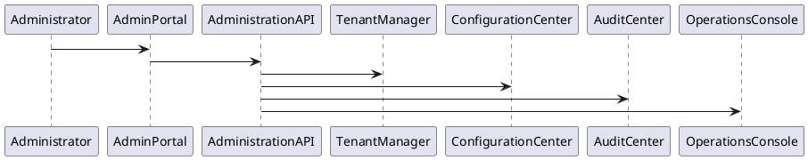
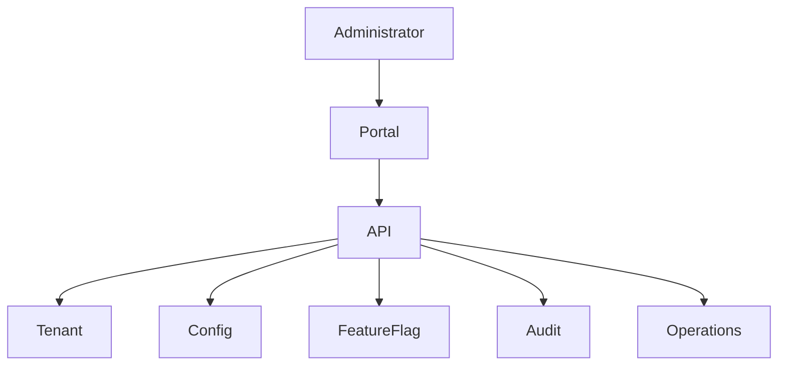

# PEP-014

# Operations Governance & Administration Production Engineering Package

**Package ID：PEP-014**  
**Status：Official Edition v1.0**

---

# 01 Package Scope

涵蓋：

- Enterprise Administration
- Tenant Management
- Organization Management
- User Administration
- Role Management
- System Configuration
- Feature Flag
- License Management
- Scheduler
- Task Center
- Notification Center
- Audit Center
- Operations Console
- Runtime Monitoring
- Administration API

---

# 02 Administration Architecture

```text
Administrator
        │
Admin Portal
        │
Administration API
        │
Administration Service
├── Tenant Manager
├── Organization Manager
├── User Manager
├── Role Manager
├── Configuration Center
├── Feature Flag
├── License Manager
├── Notification Center
├── Scheduler
├── Task Center
├── Audit Center
└── Operations Console
```

---

# 03 Administration Principles

| ID | Principle |
|----|-----------|
| ADM-001 | Multi-Tenant Isolation |
| ADM-002 | Least Privilege |
| ADM-003 | Configuration Versioning |
| ADM-004 | Immutable Audit |
| ADM-005 | Feature Controlled Release |
| ADM-006 | Centralized Management |
| ADM-007 | Policy Driven Administration |
| ADM-008 | Operational Traceability |

---

# 04 Tenant Model

Tenant Lifecycle

```text
Created

↓

Configured

↓

Activated

↓

Suspended

↓

Archived
```

Tenant 不得共享：

- Users
- Cases
- Workflow
- Evidence
- Payment
- Knowledge
- Audit

---

# 05 Organization Management

Organization Type

- Platform Owner
- Enterprise
- Design Company
- Construction Company
- Supplier
- Inspector
- Government
- Customer

---

# 06 User Administration

管理：

- Identity
- Department
- Position
- Organization
- Status
- Login Policy
- MFA
- API Access

---

# 07 Role Management

System Role

- Super Admin
- Platform Admin
- Tenant Admin
- Organization Admin
- Project Manager
- Designer
- Supervisor
- Inspector
- Customer
- AI Service
- Integration Service

---

# 08 Feature Flag

Feature Flag 類型：

- Global
- Tenant
- Organization
- Project
- User
- Beta
- Experimental

Feature Flag 必須具備：

- Version
- Effective Time
- Expiration
- Rollback

---

# 09 Configuration Center

Configuration Scope

- Platform
- Tenant
- Organization
- Project
- Module
- AI
- Notification
- Security

所有 Configuration 必須版本化。

---

# 10 License Management

License 類型：

- Trial
- Standard
- Professional
- Enterprise
- Government

License 控制：

- Module
- AI Usage
- Storage
- API Quota
- Organization Count
- User Count

---

# 11 Scheduler

支援：

- Cron
- Fixed Interval
- Event Trigger
- Manual Trigger

工作：

- Backup
- ETL
- AI Batch
- Notification
- Cleanup
- Report Generation

---

# 12 Task Center

Task Category

- Workflow
- Payment
- Inspection
- AI
- Integration
- Administration
- Maintenance

Task State

```text
Created

↓

Queued

↓

Running

↓

Completed

↓

Failed

↓

Archived
```

---

# 13 Notification Center

Channel

- Email
- SMS（選配）
- Push
- In-App
- Webhook

Notification Policy

- Immediate
- Scheduled
- Digest
- Retry

---

# 14 Audit Center

集中管理：

- Login
- Configuration
- Security
- Workflow
- Payment
- AI
- Administration
- Integration

所有 Audit 不得修改。

---

# 15 Operations Console

管理：

- Service Health
- Runtime
- Queue
- AI Runtime
- Workflow Runtime
- Storage
- Database
- API Gateway

---

# 16 SQL

```sql
CREATE TABLE tenant_master(

tenant_id BIGINT PRIMARY KEY,

tenant_code VARCHAR(50),

tenant_name VARCHAR(200),

status VARCHAR(30),

created_at TIMESTAMP

);
```

```sql
CREATE TABLE feature_flag(

flag_id BIGINT PRIMARY KEY,

flag_key VARCHAR(100),

scope VARCHAR(30),

enabled BOOLEAN,

effective_time TIMESTAMP,

expire_time TIMESTAMP

);
```

```sql
CREATE TABLE system_configuration(

config_id BIGINT PRIMARY KEY,

config_key VARCHAR(200),

config_value TEXT,

version_no INT,

updated_at TIMESTAMP

);
```

---

# 17 OpenAPI

```yaml
GET /admin/tenants

POST /admin/tenants

GET /admin/organizations

GET /admin/users

GET /admin/roles

GET /admin/configuration

PATCH /admin/configuration

GET /admin/feature-flags

PATCH /admin/feature-flags

GET /admin/license

GET /admin/tasks

GET /admin/audit

GET /admin/runtime
```

---

# 18 PHP Structure

```text
Administration/

TenantService.php

OrganizationService.php

UserService.php

RoleService.php

ConfigurationService.php

FeatureFlagService.php

LicenseService.php

SchedulerService.php

AuditService.php
```

---

# 19 FastAPI Runtime

```text
administration/

router.py

tenant.py

organization.py

user.py

role.py

configuration.py

feature_flag.py

license.py

scheduler.py

audit.py

runtime.py
```

---

# 20 Runtime Events

```text
TenantCreated

OrganizationCreated

UserRegistered

RoleAssigned

ConfigurationUpdated

FeatureFlagEnabled

LicenseActivated

TaskExecuted

NotificationSent

AuditRecorded
```

---

# 21 Runtime Metrics

- Tenant Count
- Organization Count
- Active User Count
- Feature Flag Usage
- Scheduler Success Rate
- Notification Delivery Rate
- Runtime Availability
- Configuration Change Count

---

# 22 Performance Benchmark

| Operation | Target |
|-----------|--------|
| Tenant Query | ≤200 ms |
| User Query | ≤200 ms |
| Configuration Read | ≤100 ms |
| Feature Flag Evaluation | ≤20 ms |
| Scheduler Trigger | ≤200 ms |

---

# 23 PlantUML



---

# 24 Mermaid



---

# 25 Test Specification

```text
ADM-001 Tenant

ADM-002 Organization

ADM-003 User

ADM-004 Role

ADM-005 Configuration

ADM-006 Feature Flag

ADM-007 License

ADM-008 Scheduler

ADM-009 Notification

ADM-010 Audit
```

---

# 26 Deliverables

完成交付：

- Enterprise Administration
- Tenant Management
- Organization Management
- User & Role Management
- Configuration Center
- Feature Flag
- License Management
- Scheduler
- Task Center
- Notification Center
- Audit Center
- Operations Console
- Administration OpenAPI
- SQL Schema
- PHP Skeleton
- FastAPI Runtime
- PlantUML
- Mermaid
- Test Specification

---

# 27 PEP-014 Status

**PEP-014 Operations Governance & Administration Production Engineering Package**

**Status：Completed**

**Frozen：Yes**

---

## PEP-015

下一段將直接開始 **Engineering Standards & Quality Production Engineering Package**，作為 **Production Engineering Edition v1.0** 最後一個核心 Package，內容包括：

- Engineering Coding Standards
- Repository Standards
- Branch Strategy
- API Standards
- SQL Standards
- Documentation Standards
- Testing Standards
- Release Standards
- Quality Gates
- Definition of Ready / Definition of Done
- Architecture Decision Records（ADR）
- Technical Debt Management
- Engineering KPI
- Quality Dashboard
- PlantUML
- Mermaid
- Test Specification

完成後，將正式凍結 **Production Engineering Edition v1.0** 第一版核心工程規格。
