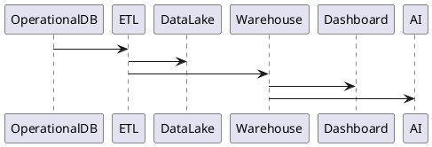
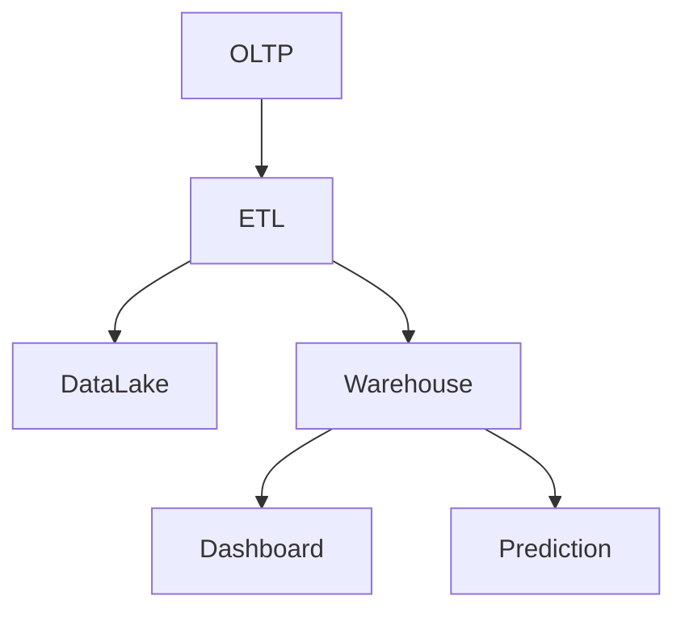

# PEP-013

# Data Intelligence & Analytics Production Engineering Package

**Package ID：PEP-013**  
**Status：Official Edition v1.0**

---

# 01 Package Scope

涵蓋：

- Data Warehouse
- Data Lake
- Data Mart
- OLTP / OLAP Separation
- ETL / ELT Pipeline
- KPI Engine
- BI Dashboard
- AI Analytics
- Predictive Analytics
- Executive Dashboard
- Semantic Metrics
- Reporting Engine
- Data Governance
- Analytics API

---

# 02 Analytics Architecture

```text
Operational Systems
        │
        ▼
Data Ingestion
        │
        ▼
ETL / ELT Engine
        │
 ┌──────┼────────────┐
 ▼      ▼            ▼
Data Lake
Data Warehouse
Feature Store
        │
        ▼
Semantic Layer
        │
 ┌──────┼────────────┐
 ▼      ▼            ▼
BI Dashboard
AI Analytics
Executive Dashboard
```

---

# 03 Data Domains

| Domain | Source |
|---------|--------|
| Customer | TWCID |
| Project | iSAFE |
| Workflow | Governance |
| Payment | Finance |
| Inspection | QA |
| Warranty | Service |
| AI | AI Runtime |
| Knowledge | KG |
| Security | IAM |
| Operations | DevOps |

---

# 04 Data Architecture

```text
OLTP

↓

CDC

↓

Data Lake

↓

ELT

↓

Data Warehouse

↓

Semantic Layer

↓

Dashboard / AI
```

---

# 05 Data Lake

保存：

- Raw JSON
- Evidence Metadata
- AI Logs
- Audit Logs
- Workflow Events
- Integration Events
- IoT（預留）

Data Lake 永不直接提供查詢。

---

# 06 Data Warehouse

Fact Tables

- FactCase
- FactWorkflow
- FactPayment
- FactInspection
- FactWarranty
- FactAI
- FactOperation

Dimension Tables

- DimDate
- DimOrganization
- DimUser
- DimProject
- DimCase
- DimRegion
- DimMaterial
- DimStyle

---

# 07 Data Mart

建立主題：

- Executive
- Finance
- Governance
- AI
- Operation
- Marketing
- Customer
- Risk

---

# 08 KPI Engine

核心 KPI：

- Case Completion Rate
- Workflow Efficiency
- Average Project Duration
- Payment Collection Rate
- Inspection Pass Rate
- Warranty Claim Rate
- AI Adoption Rate
- Customer Satisfaction
- Risk Score Distribution
- Governance Compliance

---

# 09 Executive Dashboard

提供：

- Overall KPI
- Revenue
- Pipeline
- Active Cases
- AI Usage
- Risk Heatmap
- Organization Ranking
- Regional Statistics

---

# 10 Predictive Analytics

模型：

- Delay Prediction
- Cost Overrun Prediction
- Risk Prediction
- Payment Default Prediction
- Warranty Claim Prediction
- Customer Churn Prediction

AI 僅提供預測，不直接產生治理決策。

---

# 11 Semantic Layer

統一指標：

- Active Case
- Completed Case
- Revenue
- Average Cost
- AI Task
- Inspection Score
- Governance Score
- Payment Progress

所有 Dashboard 使用相同 Metric Definition。

---

# 12 SQL

```sql
CREATE TABLE fact_case(

fact_case_id BIGINT PRIMARY KEY,

case_id BIGINT,

project_id BIGINT,

organization_id BIGINT,

status VARCHAR(30),

duration_day INT,

created_date DATE

);
```

```sql
CREATE TABLE dim_project(

project_id BIGINT PRIMARY KEY,

project_name VARCHAR(200),

project_type VARCHAR(50),

region VARCHAR(100)

);
```

---

# 13 OpenAPI

```yaml
GET /analytics/dashboard

GET /analytics/kpi

GET /analytics/revenue

GET /analytics/workflow

GET /analytics/risk

GET /analytics/inspection

GET /analytics/ai

POST /analytics/predict
```

---

# 14 PHP Structure

```text
Analytics/

DashboardService.php

KPIService.php

PredictService.php

WarehouseService.php

MetricService.php

```

---

# 15 FastAPI Runtime

```text
analytics/

router.py

warehouse.py

etl.py

prediction.py

dashboard.py

metric.py

feature_store.py
```

---

# 16 Runtime Events

```text
WarehouseLoaded

ETLCompleted

MetricCalculated

DashboardGenerated

PredictionCompleted

FeatureUpdated

DataQualityPassed

ReportGenerated
```

---

# 17 Data Quality

驗證：

- Completeness
- Accuracy
- Consistency
- Timeliness
- Uniqueness
- Referential Integrity

Data Quality Score 必須保存。

---

# 18 Runtime Metrics

- ETL Duration
- Warehouse Size
- Data Freshness
- Dashboard Response Time
- Prediction Accuracy
- Feature Store Hit Rate
- KPI Refresh Time

---

# 19 Performance Benchmark

| Operation | Target |
|-----------|--------|
| Dashboard | ≤500 ms |
| KPI Query | ≤300 ms |
| Warehouse Query | ≤1 s |
| Prediction | ≤3 s |
| ETL Batch | 依批次 SLA |

---

# 20 PlantUML



---

# 21 Mermaid



---

# 22 Test Specification

```text
BI-001 ETL

BI-002 Warehouse

BI-003 Dashboard

BI-004 KPI

BI-005 Prediction

BI-006 Data Quality

BI-007 Feature Store

BI-008 Semantic Metrics

BI-009 Report

BI-010 Audit
```

---

# 23 Deliverables

完成交付：

- Data Lake
- Data Warehouse
- Data Mart
- ETL／ELT Pipeline
- KPI Engine
- Executive Dashboard
- Predictive Analytics
- Semantic Layer
- Analytics OpenAPI
- SQL Schema
- PHP Skeleton
- FastAPI Runtime
- PlantUML
- Mermaid
- Test Specification

---

# 24 PEP-013 Status

**PEP-013 Data Intelligence & Analytics Production Engineering Package**

**Status：Completed**

**Frozen：Yes**

---

# PEP-014

**Operations Governance & Administration Production Engineering Package**

下一段將直接開始：

- Enterprise Administration
- Organization Management
- Tenant Management
- System Configuration
- Feature Flag
- License Management
- Audit Center
- Notification Center
- Task Center
- Scheduler
- Operations Console
- Admin OpenAPI
- SQL Schema
- PHP/FastAPI Runtime
- PlantUML
- Mermaid
- Test Specification
