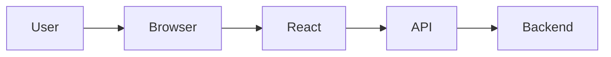

# PEP-011

# UI/UX Engineering Production Package

**Package ID：PEP-011**  
**Status：Official Edition v1.0**

---

# 01 Package Scope

涵蓋：

- Enterprise Design System
- Design Tokens
- Responsive Grid
- Component Library
- Accessibility（WCAG 2.2 AA）
- Interaction Pattern
- Navigation Framework
- Dashboard Layout
- Mobile First
- Dark / Light Theme
- Frontend Engineering Standard

---

# 02 Design Principles

| ID | Principle |
|----|-----------|
| UI-001 | Consistency First |
| UI-002 | Mobile First |
| UI-003 | Accessibility by Default |
| UI-004 | Progressive Disclosure |
| UI-005 | Single Responsibility Screen |
| UI-006 | Governance Visibility |
| UI-007 | Evidence First |
| UI-008 | Traceability Everywhere |

---

# 03 Information Architecture

```text
Portal
├── Landing
├── Authentication
├── Dashboard
│   ├── Personal
│   ├── Organization
│   ├── Admin
│   └── AI
├── Case
├── Workflow
├── Contract
├── Payment
├── Inspection
├── Warranty
├── Evidence
├── Knowledge
├── AI Workspace
├── Reports
├── Notifications
└── Settings
```

---

# 04 Navigation Hierarchy

```text
Level 1

Dashboard

Cases

Projects

AI

Knowledge

Reports

Administration

--------------------------------

Level 2

Detail

List

History

Timeline

Audit

--------------------------------

Level 3

Operation

Review

Approval

Archive
```

---

# 05 Layout System

Desktop

```
Header

Sidebar

Content

Inspector Panel

Footer
```

Tablet

```
Header

Navigation Drawer

Content

Bottom Action
```

Mobile

```
Top Bar

Content

Floating Action Button

Bottom Navigation
```

---

# 06 Responsive Breakpoints

| Device | Width |
|----------|-------|
| Mobile S | <480 |
| Mobile | 480 |
| Tablet | 768 |
| Laptop | 1024 |
| Desktop | 1440 |
| Large Desktop | 1920 |

---

# 07 Grid System

Desktop

12 Columns

Tablet

8 Columns

Mobile

4 Columns

Spacing 採 8pt Grid。

---

# 08 Design Tokens

Typography

```
Font Family

Font Size

Font Weight

Line Height
```

Spacing

```
4

8

12

16

24

32

48

64
```

Radius

```
4

8

12

16

24
```

Elevation

```
Level0

Level1

Level2

Level3

Level4
```

---

# 09 Theme

Light Theme

Dark Theme

High Contrast Theme

Government Accessibility Theme（預留）

---

# 10 Component Library

Core

- Button
- Input
- Textarea
- Select
- Checkbox
- Radio
- Switch

Navigation

- Sidebar
- Breadcrumb
- Menu
- Tabs
- Pagination

Display

- Table
- Card
- Timeline
- Tree
- Tag
- Badge

Feedback

- Toast
- Dialog
- Alert
- Loading
- Skeleton

Governance

- Workflow Timeline
- State Badge
- Gate Badge
- GS Badge
- Risk Badge
- Evidence Card

---

# 11 Dashboard Widgets

Personal Dashboard

- My Cases
- Pending Tasks
- Notifications
- AI Recommendations

Organization Dashboard

- Active Projects
- Workflow Progress
- Payment Status
- Inspection Status

Admin Dashboard

- KPI
- Runtime
- Security
- Audit
- AI Usage

---

# 12 Accessibility

符合：

WCAG 2.2 AA

Requirements

- Keyboard Navigation
- Screen Reader
- Color Contrast
- Focus Indicator
- Skip Navigation
- Alternative Text

---

# 13 Interaction Standard

所有操作均應：

- 明確 Loading
- 可取消
- 可回復
- 提供 Audit
- 顯示 Trace ID（管理模式）

---

# 14 Frontend Architecture

```
React

↓

Feature Module

↓

Application Layer

↓

API SDK

↓

OpenAPI Client

↓

Backend
```

---

# 15 State Management

Frontend

- TanStack Query（Server State）
- Zustand（Client State）

所有 Workflow 狀態以後端為唯一真實來源（Single Source of Truth）。

---

# 16 Routing

```
/

login

dashboard

cases

cases/:id

workflow

inspection

payment

knowledge

ai

settings
```

---

# 17 Runtime Metrics

- First Contentful Paint
- Largest Contentful Paint
- Interaction to Next Paint
- Time to Interactive
- JavaScript Error Rate
- API Failure Rate

---

# 18 PlantUML

```plantuml
@startuml

User

Browser

React

API

User -> Browser

Browser -> React

React -> API

@enduml
```

---

# 19 Mermaid



---

# 20 Test Specification

```
UI-001 Responsive

UI-002 Accessibility

UI-003 Navigation

UI-004 Dashboard

UI-005 Case Detail

UI-006 Workflow

UI-007 Evidence Viewer

UI-008 AI Workspace

UI-009 Dark Theme

UI-010 Performance
```

---

# 21 Deliverables

完成交付：

- Design System
- Component Library
- Design Tokens
- Responsive Grid
- Dashboard Framework
- Accessibility Specification
- Frontend Architecture
- React Engineering Standard
- PlantUML
- Mermaid
- Test Specification

---

# 22 PEP-011 Status

**PEP-011 UI/UX Engineering Production Package**

**Status：Completed**

**Frozen：Yes**

---

## PEP-012

下一段將直接開始 **Agent Engineering Production Package**，完整定義：

- Multi-Agent Runtime
- Agent Registry
- MCP Tool Registry
- Agent Memory
- Agent Communication Protocol
- Task Planner
- Tool Calling
- Guardrails
- Human-in-the-Loop
- Agent Evaluation
- OpenAPI
- SQL Schema
- PHP/FastAPI Runtime
- PlantUML
- Mermaid
- Test Specification
