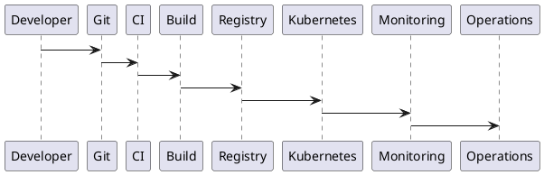
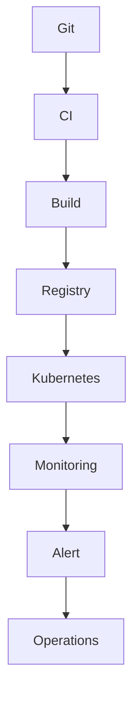

# PEP-010

# Deployment & Operations Production Engineering Package

**Package ID：PEP-010**  
**Status：Official Edition v1.0**

---

# 01 Package Scope

涵蓋：

- Container Platform
- Docker
- Kubernetes
- CI/CD
- GitOps
- Release Pipeline
- Blue/Green Deployment
- Canary Deployment
- Infrastructure as Code
- Monitoring
- Logging
- OpenTelemetry
- Backup
- Disaster Recovery
- Operations Dashboard
- Runtime Observability

---

# 02 Production Architecture

```text
Internet
      │
Load Balancer
      │
API Gateway
      │
Ingress Controller
      │
────────────────────────────
Kubernetes Cluster
────────────────────────────
Frontend
PHP API
FastAPI AI
Worker
Scheduler
Gateway
Notification
────────────────────────────
Redis
MySQL
MinIO
Vector DB
Graph DB
Message Queue
────────────────────────────
Monitoring
Logging
Tracing
Backup
```

---

# 03 Environment Strategy

| Environment | Purpose |
|-------------|---------|
| Local | Developer |
| Dev | Development |
| SIT | System Integration Test |
| UAT | User Acceptance Test |
| Staging | Release Validation |
| Production | Live Service |

環境設定不得共用帳號、金鑰或正式資料。

---

# 04 Docker Standard

所有服務均須：

- Dockerfile
- Health Check
- Non-root User
- Multi-stage Build
- Image Version Tag
- SBOM（Software Bill of Materials）

---

# 05 Kubernetes Standard

Workload：

- Deployment
- StatefulSet
- CronJob
- Job

Infrastructure：

- ConfigMap
- Secret
- Service
- Ingress
- PersistentVolume
- HorizontalPodAutoscaler

---

# 06 CI/CD Pipeline

```text
Git Commit

↓

Static Analysis

↓

Unit Test

↓

Build

↓

Security Scan

↓

Container Build

↓

Integration Test

↓

Deploy Staging

↓

UAT

↓

Deploy Production
```

---

# 07 Release Strategy

支援：

- Rolling Update
- Blue/Green Deployment
- Canary Deployment

正式環境預設採 Rolling Update，可依服務特性切換。

---

# 08 Infrastructure as Code

支援：

- Terraform
- Helm
- Kubernetes YAML
- Docker Compose（Development）

所有基礎設施配置納入版本控制。

---

# 09 Monitoring

監測項目：

- CPU
- Memory
- Disk
- Network
- Pod Health
- API Latency
- Queue Length
- AI Latency
- Database Connection
- Storage Capacity

---

# 10 Logging

集中式 Logging：

- Application Log
- Audit Log
- Security Log
- AI Log
- Integration Log

Log 保留期限依 Operations Policy 設定。

---

# 11 OpenTelemetry

追蹤資訊：

- Trace ID
- Span ID
- Parent Span
- Service Name
- Duration
- Error Status

所有跨服務請求均須支援分散式追蹤。

---

# 12 Backup Strategy

備份範圍：

- MySQL
- Object Storage
- Vector Database
- Graph Database
- Configuration
- Secrets（加密）

策略：

- Daily Incremental
- Weekly Full
- Monthly Archive

---

# 13 Disaster Recovery

Recovery Level：

| Level | Target |
|--------|--------|
| RPO | ≤ 15 分鐘 |
| RTO | ≤ 2 小時 |

應定期執行災難復原演練並保留紀錄。

---

# 14 SQL Migration Pipeline

流程：

```text
Migration Script

↓

Review

↓

Version Control

↓

Staging Validation

↓

Production Execution

↓

Verification

↓

Audit
```

Migration 必須具備回滾（Rollback）機制。

---

# 15 OpenAPI（Operations）

```yaml
GET /ops/health

GET /ops/metrics

GET /ops/logs

GET /ops/traces

POST /ops/backup

POST /ops/restore

POST /ops/restart

GET /ops/version
```

---

# 16 PHP Structure

```text
Operations/

HealthService.php

MetricsService.php

BackupService.php

RestoreService.php

ReleaseService.php

AuditService.php
```

---

# 17 FastAPI Structure

```text
ops/

router.py

health.py

metrics.py

backup.py

restore.py

release.py

tracing.py
```

---

# 18 Runtime Metrics

監測指標：

```text
CPU Usage

Memory Usage

Pod Restart Count

API Response Time

Database Latency

AI Inference Time

Queue Depth

Storage Usage

Backup Success Rate

Deployment Success Rate
```

---

# 19 Performance Benchmark

| Operation | Target |
|-----------|--------|
| Health Check | ≤ 50 ms |
| Metrics Query | ≤ 200 ms |
| Backup Trigger | ≤ 500 ms |
| Restore Validation | ≤ 1 s |
| Deployment Verification | ≤ 2 min |

---

# 20 PlantUML



---

# 21 Mermaid



---

# 22 Test Specification

```text
OPS-001 Docker Build

OPS-002 Kubernetes Deploy

OPS-003 CI Pipeline

OPS-004 Blue/Green Release

OPS-005 Canary Release

OPS-006 Backup

OPS-007 Restore

OPS-008 Monitoring

OPS-009 OpenTelemetry

OPS-010 Disaster Recovery
```

---

# 23 Deliverables

完成交付：

- Docker 規範
- Kubernetes 規範
- CI/CD Pipeline
- GitOps 流程
- Release Strategy
- Infrastructure as Code
- Monitoring
- Logging
- OpenTelemetry
- Backup & Recovery
- Disaster Recovery
- SQL Migration Pipeline
- Operations OpenAPI
- PHP Skeleton
- FastAPI Skeleton
- PlantUML
- Mermaid
- Test Specification

---

# 24 PEP-010 Status

**PEP-010 Deployment & Operations Production Engineering Package**

**Status：Completed**

**Frozen：Yes**

---

# Production Engineering Edition v1.0（第一階段完成）

已完成並凍結：

- ✅ PEP-001：Case Management
- ✅ PEP-002：Workflow Governance
- ✅ PEP-003：Evidence Management
- ✅ PEP-004：Contract & Payment
- ✅ PEP-005：Inspection & Warranty
- ✅ PEP-006：AI Platform
- ✅ PEP-007：Knowledge Graph
- ✅ PEP-008：Integration
- ✅ PEP-009：Security
- ✅ PEP-010：Deployment & Operations

這十個 Production Engineering Package 已形成 TIGI Production Engineering Edition v1.0 的核心工程規格，可作為後續實作 PHP、FastAPI、React/Vue、AI 平台、資料庫、CI/CD 與維運體系的正式基線。
