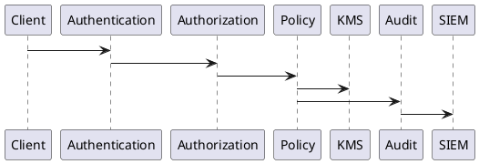
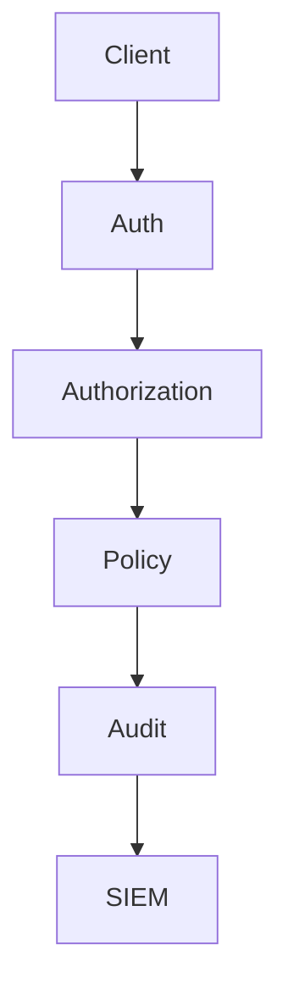

# PEP-009

# Security Production Engineering Package

**Package ID：PEP-009**  
**Status：Official Edition v1.0**

---

# 01 Package Scope

涵蓋：

- Zero Trust Architecture
- Identity & Access Management (IAM)
- Authentication
- Authorization
- RBAC / ABAC
- Policy Decision Point (PDP)
- Policy Enforcement Point (PEP)
- Key Management Service (KMS)
- Secret Management
- Encryption
- Digital Signature
- Security Audit
- SIEM Integration
- Incident Response
- Security Monitoring

---

# 02 Security Architecture

```text
Client
    │
Identity Gateway
    │
Authentication Service
    │
Authorization Service
    ├── RBAC Engine
    ├── ABAC Engine
    ├── Policy Engine
    ├── Token Service
    ├── KMS
    ├── Secret Vault
    ├── Audit Engine
    └── SIEM Adapter
```

---

# 03 Security Principles

| Principle ID | Principle |
|--------------|-----------|
| SEC-001 | Zero Trust |
| SEC-002 | Least Privilege |
| SEC-003 | Default Deny |
| SEC-004 | Defense in Depth |
| SEC-005 | Immutable Audit |
| SEC-006 | Traceability |
| SEC-007 | Secure by Default |
| SEC-008 | Privacy by Design |

---

# 04 Identity Lifecycle

```text
Registered

↓

Verified

↓

Activated

↓

Suspended

↓

Revoked

↓

Archived
```

---

# 05 Authentication

支援：

- OAuth2
- OpenID Connect
- JWT
- API Key（Integration）
- Service Account
- MFA（TOTP）
- Passkey（FIDO2／WebAuthn，選配）

---

# 06 Authorization

採雙層授權：

## RBAC

角色：

- Owner
- Customer
- Designer
- Contractor
- Supervisor
- Inspector
- Auditor
- Administrator
- System

---

## ABAC

條件：

- Organization
- Project
- Case
- Workflow
- Time
- Region
- Device
- Risk Level

最終由 Policy Engine 決策。

---

# 07 Policy Decision Flow

```text
Request

↓

Authentication

↓

RBAC

↓

ABAC

↓

Policy Engine

↓

Permit

or

Deny

↓

Audit
```

---

# 08 SQL

```sql
CREATE TABLE security_policy(

policy_id BIGINT PRIMARY KEY,

policy_code VARCHAR(50),

policy_name VARCHAR(200),

priority INT,

status VARCHAR(30),

created_at TIMESTAMP

);
```

```sql
CREATE TABLE user_role(

user_role_id BIGINT PRIMARY KEY,

user_id BIGINT,

role_code VARCHAR(50),

organization_id BIGINT,

effective_from TIMESTAMP,

effective_to TIMESTAMP

);
```

```sql
CREATE TABLE security_audit(

audit_id BIGINT PRIMARY KEY,

trace_id VARCHAR(100),

operator_id BIGINT,

action VARCHAR(100),

resource VARCHAR(200),

result VARCHAR(20),

created_at TIMESTAMP

);
```

---

# 09 Key Management

KMS 管理：

- JWT Signing Key
- API Signing Key
- Webhook Secret
- Database Encryption Key
- Object Storage Key
- PGP Signature Key

所有金鑰均需支援：

- Rotation
- Version
- Expiration
- Revocation

---

# 10 Secret Management

集中管理：

- Database Password
- API Secret
- OAuth Secret
- SMTP Password
- Storage Secret
- AI Provider Secret

禁止將 Secret 寫入程式碼。

---

# 11 Encryption

| Type | Algorithm |
|------|-----------|
| Hash | SHA-256 |
| Password | Argon2id |
| Symmetric | AES-256-GCM |
| Signature | Ed25519 或 RSA-3072 |
| Transport | TLS 1.3 |

---

# 12 Digital Signature

適用於：

- Contract
- Evidence
- PGP
- Audit Export

簽章資訊：

- Signature ID
- Signer
- Algorithm
- Certificate
- Signed Time

---

# 13 SIEM Integration

支援：

- Syslog
- OpenTelemetry
- Splunk
- Elastic
- Microsoft Sentinel（選配）

---

# 14 OpenAPI

```yaml
POST /security/login

POST /security/logout

POST /security/token/refresh

GET /security/profile

GET /security/policies

GET /security/audit

POST /security/mfa

POST /security/passkey/register

POST /security/passkey/verify
```

---

# 15 PHP Structure

```text
Security/

AuthenticationService.php

AuthorizationService.php

PolicyEngine.php

TokenService.php

KeyService.php

SecretService.php

AuditService.php
```

---

# 16 FastAPI Runtime

```text
security/

router.py

authentication.py

authorization.py

policy.py

token.py

kms.py

secret.py

audit.py

siem.py
```

---

# 17 Runtime Events

```text
UserAuthenticated

TokenIssued

TokenRevoked

RoleAssigned

PolicyUpdated

PermissionDenied

SecurityAlert

SignatureVerified

KeyRotated
```

---

# 18 Runtime Metrics

```text
Login Success Rate

Login Failure Rate

Token Issue Count

Permission Denied Count

Policy Evaluation Time

Security Alert Count

Key Rotation Count
```

---

# 19 Performance Benchmark

| Operation | Target |
|-----------|--------|
| Login | ≤300 ms |
| Token Refresh | ≤150 ms |
| Policy Evaluation | ≤50 ms |
| JWT Validation | ≤20 ms |
| Signature Verification | ≤100 ms |

---

# 20 PlantUML



---

# 21 Mermaid



---

# 22 Test Specification

```text
SEC-001 Login

SEC-002 MFA

SEC-003 JWT Validation

SEC-004 RBAC

SEC-005 ABAC

SEC-006 Policy Engine

SEC-007 Key Rotation

SEC-008 Secret Access

SEC-009 Signature Verify

SEC-010 Audit Log
```

---

# 23 Deliverables

完成交付：

- Zero Trust Security Architecture
- IAM
- Authentication
- Authorization（RBAC／ABAC）
- Policy Engine
- KMS
- Secret Management
- Encryption Standard
- Digital Signature
- Security OpenAPI
- SQL Schema
- PHP Skeleton
- FastAPI Runtime
- PlantUML
- Mermaid
- Runtime Metrics
- Test Specification

---

# 24 PEP-009 Status

**PEP-009 Security Production Engineering Package**

**Status：Completed**

**Frozen：Yes**

---

# PEP-010

## Deployment & Operations Production Engineering Package

下一段直接開始：

- Docker Architecture
- Kubernetes Deployment
- CI/CD Pipeline
- Release Strategy
- Blue/Green Deployment
- Canary Deployment
- Backup & Recovery
- Disaster Recovery
- Monitoring
- Logging
- OpenTelemetry
- Infrastructure as Code
- SQL Migration Pipeline
- DevOps Specification
- PlantUML
- Mermaid
- Test Specification
