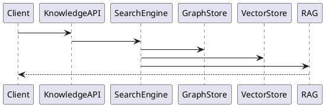
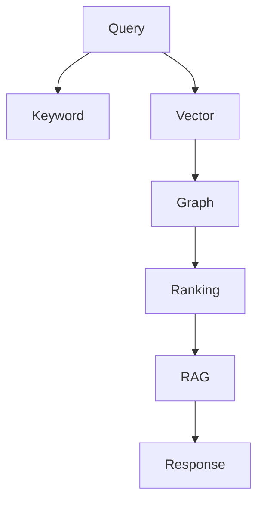

# PEP-007

# Knowledge Graph Production Engineering Package

**Package ID：PEP-007**  
**Status：Official Edition v1.0**

---

# 01 Package Scope

涵蓋：

- Domain Ontology
- Knowledge Entity
- Knowledge Relationship
- Semantic Layer
- Vector Index
- Graph Store
- Hybrid Search
- Graph Query
- Knowledge Governance
- RAG Integration
- Knowledge API
- Graph Runtime

---

# 02 Knowledge Graph Architecture

```text
Client
    │
Knowledge API
    │
Knowledge Service
    ├── Ontology Engine
    ├── Entity Engine
    ├── Relationship Engine
    ├── Graph Store
    ├── Vector Store
    ├── Semantic Search
    ├── Hybrid Search
    ├── RAG Adapter
    └── Audit Engine
```

---

# 03 Domain Ontology

核心領域：

| Ontology ID | Domain |
|-------------|--------|
| ON-001 | User |
| ON-002 | Organization |
| ON-003 | Project |
| ON-004 | Case |
| ON-005 | Workflow |
| ON-006 | State |
| ON-007 | Gate |
| ON-008 | Checklist |
| ON-009 | Evidence |
| ON-010 | Contract |
| ON-011 | Payment |
| ON-012 | Inspection |
| ON-013 | Warranty |
| ON-014 | Material |
| ON-015 | Space |
| ON-016 | Style |
| ON-017 | Regulation |
| ON-018 | Risk |
| ON-019 | PGP |
| ON-020 | AI Knowledge |

---

# 04 Knowledge Entity

```text
Entity ID

Ontology

Entity Name

Canonical Name

Description

Alias

Version

Status

Owner

Created Time
```

---

# 05 Relationship Model

正式 Relationship：

```text
BELONGS_TO

PART_OF

REFERENCES

DERIVED_FROM

APPROVED_BY

GENERATED_BY

REQUIRES

DEPENDS_ON

RELATED_TO

SUPERSEDES
```

---

# 06 Graph Schema

```text
User

↓

Organization

↓

Project

↓

Case

↓

Workflow

↓

State

↓

Gate

↓

Checklist

↓

Evidence

↓

PGP
```

---

# 07 Semantic Layer

Semantic Index：

- Requirement
- Design
- Material
- Cost
- Construction
- Inspection
- Warranty
- Regulation
- Knowledge

---

# 08 Vector Index

每筆 Knowledge 建立：

- Embedding ID
- Model Version
- Vector Dimension
- Source Document
- Chunk ID
- Language
- Updated Time

Embedding 必須可重新建置。

---

# 09 Hybrid Search

流程：

```text
User Query

↓

Intent Analysis

↓

Keyword Search

↓

Vector Search

↓

Graph Traversal

↓

Ranking

↓

Context Merge

↓

RAG
```

---

# 10 Graph API

```yaml
GET /knowledge/entities

GET /knowledge/entity/{id}

GET /knowledge/relations

POST /knowledge/search

POST /knowledge/vector-search

POST /knowledge/hybrid-search

POST /knowledge/rag

GET /knowledge/ontology
```

---

# 11 SQL（Metadata）

```sql
CREATE TABLE knowledge_entity(

entity_id BIGINT PRIMARY KEY,

ontology_code VARCHAR(30),

canonical_name VARCHAR(200),

entity_version INT,

status VARCHAR(30),

created_at TIMESTAMP

);
```

```sql
CREATE TABLE knowledge_relation(

relation_id BIGINT PRIMARY KEY,

source_entity BIGINT,

target_entity BIGINT,

relation_type VARCHAR(50),

created_at TIMESTAMP

);
```

---

# 12 Graph Store

支援：

- Neo4j
- Memgraph
- Apache AGE（PostgreSQL）
- RDF Triple Store（選配）

Graph Store 實作需透過 Graph Repository 抽象層，不得耦合特定產品。

---

# 13 Vector Store

支援：

- PostgreSQL + pgvector
- Milvus
- Qdrant
- Weaviate

Vector Index 與 Graph Store 可獨立部署。

---

# 14 RAG Integration

```text
Prompt

↓

Knowledge Search

↓

Graph Traversal

↓

Vector Ranking

↓

Context Builder

↓

LLM

↓

Response
```

所有 RAG 回應須附帶來源引用（Source Reference）。

---

# 15 Knowledge Governance

所有 Knowledge 必須具備：

- Canonical ID
- Version
- Source
- Owner
- Review Status
- Approval Status
- Trace ID

未核准知識不得作為正式治理依據。

---

# 16 Runtime Events

```text
KnowledgeCreated

KnowledgeUpdated

KnowledgeApproved

KnowledgeArchived

RelationCreated

VectorGenerated

GraphIndexed

RAGCompleted
```

---

# 17 PHP Skeleton

```text
Knowledge/

OntologyService.php

EntityService.php

RelationService.php

GraphRepository.php

VectorRepository.php

SearchService.php
```

---

# 18 FastAPI Runtime

```text
knowledge/

router.py

ontology.py

entity.py

relation.py

graph.py

vector.py

hybrid_search.py

rag.py

audit.py
```

---

# 19 PlantUML



---

# 20 Mermaid



---

# 21 Performance Benchmark

| Operation | Target |
|-----------|--------|
| Keyword Search | ≤200 ms |
| Vector Search | ≤500 ms |
| Hybrid Search | ≤700 ms |
| Graph Traversal | ≤300 ms |
| RAG Response | ≤5 s |

---

# 22 Test Specification

```text
KG-001 Entity Create

KG-002 Relation Create

KG-003 Ontology Validation

KG-004 Vector Generation

KG-005 Hybrid Search

KG-006 Graph Traversal

KG-007 RAG Citation

KG-008 Knowledge Version

KG-009 Graph Consistency

KG-010 Audit Verification
```

---

# 23 Cross Reference

- BRS-001
- SAD-001
- TGS-001
- SDD-001
- DDS-001
- OAS-001
- AI-001
- PGP-001

---

# 24 Deliverables

完成交付：

- Domain Ontology
- Knowledge Entity Model
- Relationship Model
- Graph Schema
- Vector Index
- Hybrid Search
- RAG Integration
- Knowledge OpenAPI
- SQL Metadata Schema
- PHP Skeleton
- FastAPI Runtime
- PlantUML
- Mermaid
- Performance Benchmark
- Test Specification

---

# 25 PEP-007 Status

**PEP-007 Knowledge Graph Production Engineering Package**

**Status：Completed**

**Frozen：Yes**

---

## 下一個 Package

直接進入 **PEP-008：Integration Production Engineering Package**，將完整定義：

- API Gateway
- Event Bus
- Message Queue
- Webhook
- ETL Pipeline
- Connector Framework
- Third-party Integration
- Integration OpenAPI
- Integration Runtime
- Integration Security
- Integration Monitoring
- SQL Schema
- PHP/FastAPI Skeleton
- PlantUML
- Mermaid
- Test Specification
