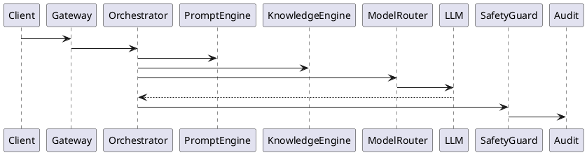
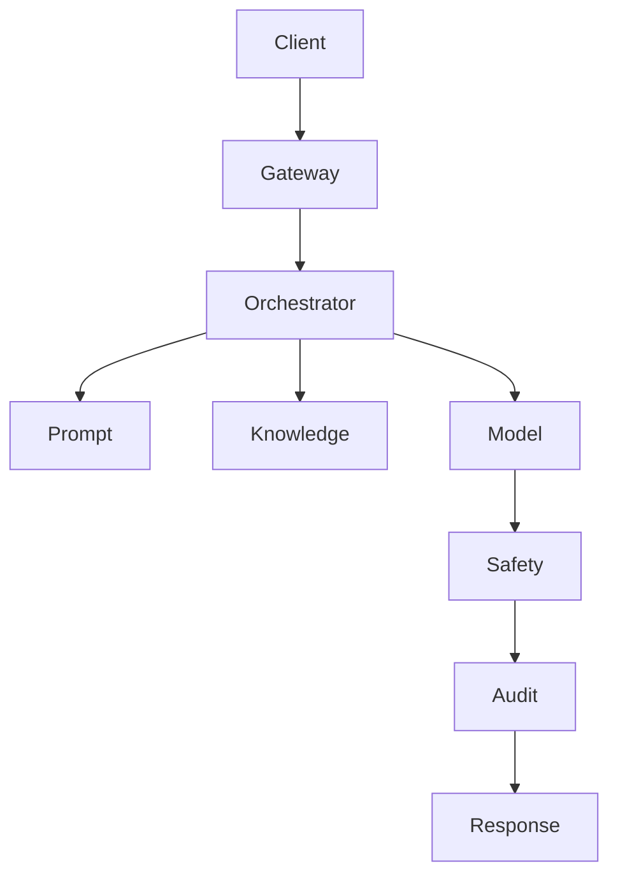

# PEP-006

# AI Platform Production Engineering Package

**Package ID：PEP-006**  
**Status：Official Edition v1.0**

---

# 01 Package Scope

涵蓋：

- AI Gateway
- Multi-Agent Runtime
- Agent Orchestrator
- Prompt Engine
- Prompt Registry
- Model Registry
- Memory Engine
- Knowledge Engine
- RAG Pipeline
- AI Governance
- AI Safety
- AI Evaluation
- AI Audit
- AI OpenAPI
- AI Runtime Metrics

---

# 02 AI Platform Architecture

```text
Client
    │
AI API Gateway
    │
AI Orchestrator
    ├── Prompt Engine
    ├── Model Router
    ├── Agent Runtime
    ├── Memory Engine
    ├── Knowledge Engine
    ├── Safety Guard
    ├── Evaluation Engine
    └── Audit Engine
```

---

# 03 AI Runtime Pipeline

```text
Request

↓

Authentication

↓

Authorization

↓

Prompt Builder

↓

Knowledge Retrieval

↓

Context Builder

↓

Model Routing

↓

Inference

↓

Safety Validation

↓

Governance Validation

↓

Response Builder

↓

Audit

↓

PGP Reference
```

---

# 04 Agent Registry

| Agent ID | Agent Name | Responsibility |
|-----------|------------|----------------|
| AG-001 | Requirement Agent | 需求分析 |
| AG-002 | Style Agent | 風格分析 |
| AG-003 | Space Agent | 空間配置 |
| AG-004 | Budget Agent | 預算估算 |
| AG-005 | Material Agent | 材料建議 |
| AG-006 | Vendor Agent | 廠商媒合 |
| AG-007 | Inspection Agent | 驗收分析 |
| AG-008 | Risk Agent | 風險評估 |
| AG-009 | Governance Agent | 治理檢查 |
| AG-010 | Report Agent | 文件產生 |

---

# 05 Model Registry

```text
Model ID

Model Name

Provider

Version

Capability

Context Length

Input Type

Output Type

Status
```

---

# 06 Prompt Registry

```text
Prompt ID

Prompt Name

Prompt Version

Owner

Language

Model

Variables

Output Schema

Safety Level

Status
```

所有 Prompt 必須版本化。

---

# 07 Memory Engine

Memory 分層：

```text
Session Memory

↓

Case Memory

↓

Project Memory

↓

Organization Memory

↓

Platform Knowledge
```

不得將敏感資料寫入共享 Memory。

---

# 08 Knowledge Engine

Knowledge Source：

- Governance Standards
- Case History
- Design Standards
- Material Library
- Cost Library
- Inspection Standards
- Regulations
- Internal Knowledge Graph

所有知識來源均須具備版本資訊。

---

# 09 RAG Pipeline

```text
Question

↓

Intent Analysis

↓

Knowledge Retrieval

↓

Ranking

↓

Context Merge

↓

Prompt Assembly

↓

LLM

↓

Validation

↓

Response
```

---

# 10 AI Governance

AI 可執行：

- Recommendation
- Classification
- Extraction
- Summarization
- Prediction
- Generation

AI 不可執行：

- State Transition
- Gate Approval
- Payment Approval
- Contract Signature
- Governance Override

---

# 11 AI OpenAPI

```yaml
POST /ai/chat

POST /ai/analyze

POST /ai/style

POST /ai/layout

POST /ai/budget

POST /ai/report

POST /ai/risk

POST /ai/inspection

GET /ai/models

GET /ai/prompts

GET /ai/agents
```

---

# 12 SQL

```sql
CREATE TABLE ai_task(

task_id BIGINT PRIMARY KEY,

case_id BIGINT,

agent_id VARCHAR(30),

prompt_id VARCHAR(50),

model_id VARCHAR(50),

status VARCHAR(20),

started_at TIMESTAMP,

completed_at TIMESTAMP

);
```

```sql
CREATE TABLE ai_response(

response_id BIGINT PRIMARY KEY,

task_id BIGINT,

confidence DECIMAL(5,2),

token_input INT,

token_output INT,

latency_ms INT,

trace_id VARCHAR(100)

);
```

---

# 13 PHP Gateway

```text
AI/

Gateway.php

AgentManager.php

PromptService.php

ModelService.php

KnowledgeService.php

AuditService.php
```

---

# 14 FastAPI Runtime

```text
ai/

router.py

orchestrator.py

gateway.py

prompt_engine.py

model_router.py

memory_engine.py

knowledge_engine.py

rag_engine.py

evaluation.py

audit.py
```

---

# 15 Runtime Events

```text
AITaskCreated

PromptGenerated

KnowledgeRetrieved

ModelSelected

InferenceCompleted

SafetyPassed

SafetyRejected

ResponseGenerated

EvaluationCompleted
```

---

# 16 Safety Guard

驗證：

- Prompt Injection
- Sensitive Data Leakage
- Unsafe Output
- Hallucination Risk
- Governance Conflict
- Restricted Operation

任何檢查失敗均中止回應並寫入 Audit。

---

# 17 Runtime Metrics

```text
Inference Time

Prompt Length

Context Length

Knowledge Hit Rate

Agent Success Rate

Safety Reject Rate

Average Token Usage

Average Cost Per Request
```

---

# 18 Performance Benchmark

| Operation | Target |
|-----------|--------|
| Prompt Build | ≤100 ms |
| Knowledge Retrieval | ≤300 ms |
| Model Routing | ≤100 ms |
| AI Response | ≤5 s |
| Safety Validation | ≤200 ms |

---

# 19 PlantUML



---

# 20 Mermaid



---

# 21 Test Specification

```text
AI-001 Prompt Build

AI-002 Knowledge Retrieval

AI-003 Model Routing

AI-004 Agent Execution

AI-005 Safety Reject

AI-006 Hallucination Detection

AI-007 Response Validation

AI-008 Audit Verification

AI-009 Token Statistics

AI-010 Cost Analysis
```

---

# 22 Cross Reference

- BRS-001
- SAD-001
- TGS-001
- SDD-001
- DDS-001
- OAS-001
- Knowledge Graph Specification
- PGP-001

---

# 23 PEP-006 Status

**PEP-006 AI Platform Production Engineering Package**

**Status：Completed**

**Frozen：Yes**

---

# PEP-007

## Knowledge Graph Production Engineering Package

下一段直接開始：

- Ontology
- Entity Model
- Relationship Model
- Semantic Layer
- Vector Index
- Hybrid Search
- Graph API
- SQL Schema
- Graph Schema
- RAG Integration
- PlantUML
- Mermaid
- Test Specification
