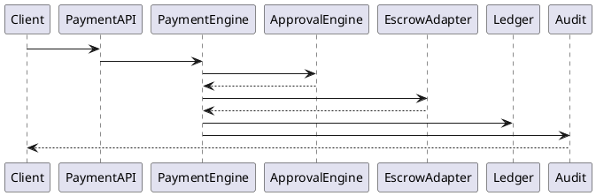
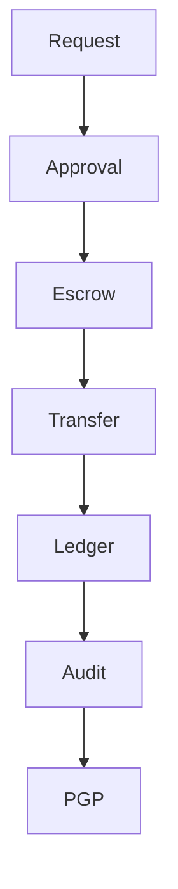

# PEP-004（續）

# Contract & Payment Production Engineering Package

**Package ID：PEP-004**  
**Part 2：Payment Runtime & Financial Governance**

---

# 21 Payment Rule Engine

## Runtime Flow

```text
Payment Request
      │
Contract Validation
      │
Milestone Validation
      │
Gate Validation
      │
Checklist Validation
      │
Evidence Validation
      │
Approval Policy
      │
Escrow Validation
      │
Transfer
      │
Payment Verification
      │
Audit
      │
PGP Update
```

---

# 22 Payment Rule Matrix

| Rule ID | Rule | Result |
|---------|------|--------|
| PR-001 | Contract Active | PASS |
| PR-002 | Milestone Completed | PASS |
| PR-003 | Gate Passed | PASS |
| PR-004 | Checklist Completed | PASS |
| PR-005 | Evidence Verified | PASS |
| PR-006 | Payment Within Budget | PASS |
| PR-007 | Authorization Granted | PASS |
| PR-008 | Escrow Confirmed | PASS |

任何 Rule 失敗不得撥款。

---

# 23 Approval Engine

Approval Mode：

```text
Single Approval

Dual Approval

Committee Approval

Automatic Approval（Policy）

Manual Review
```

Approval Policy 由 Governance Core 管理。

---

# 24 Escrow Runtime

Escrow State

```text
Pending

Reserved

Transferred

Confirmed

Released

Cancelled

Refunded
```

Escrow Runtime 不允許直接修改狀態。

---

# 25 Invoice Engine

Invoice Lifecycle

```text
Draft

Issued

Delivered

Confirmed

Cancelled

Archived
```

所有 Invoice 應與 Contract、Payment 保持一對一追溯關係。

---

# 26 Financial Audit

Audit Object

```text
Audit ID

Contract ID

Payment ID

Invoice ID

Operator

Action

Amount

Before

After

Trace ID

Timestamp
```

任何金額異動均須保留 Before / After。

---

# 27 SQL Migration

```sql
ALTER TABLE payment_record
ADD COLUMN trace_id VARCHAR(100);

ALTER TABLE payment_record
ADD COLUMN escrow_reference VARCHAR(100);

ALTER TABLE payment_record
ADD COLUMN approval_id BIGINT;

CREATE INDEX idx_payment_contract
ON payment_record(contract_id);

CREATE INDEX idx_payment_status
ON payment_record(payment_status);
```

---

# 28 Payment Ledger

```sql
CREATE TABLE payment_ledger(

ledger_id BIGINT PRIMARY KEY,

payment_id BIGINT,

ledger_type VARCHAR(30),

debit DECIMAL(18,2),

credit DECIMAL(18,2),

balance DECIMAL(18,2),

created_at TIMESTAMP

);
```

---

# 29 OpenAPI YAML（Payment）

```yaml
POST /payments/request

POST /payments/approve

POST /payments/reject

POST /payments/transfer

POST /payments/verify

POST /payments/refund

GET /payments/{paymentId}

GET /payments/{paymentId}/ledger

GET /contracts/{contractId}/payments
```

---

# 30 Repository Interface

```text
ContractRepository

PaymentRepository

InvoiceRepository

LedgerRepository

ApprovalRepository
```

---

# 31 PHP Domain Skeleton

```php
final class PaymentAggregate
{
    public function request(){}

    public function approve(){}

    public function transfer(){}

    public function verify(){}

    public function refund(){}

    public function archive(){}
}
```

---

# 32 FastAPI Runtime

```text
payment/

runtime.py

approval.py

ledger.py

invoice.py

escrow.py

audit.py

metrics.py
```

---

# 33 Runtime Metrics

```text
Payment Request Count

Approval Time

Transfer Time

Escrow Success Rate

Refund Rate

Invoice Issued Count

Ledger Consistency

Average Payment Duration
```

---

# 34 Performance Benchmark

| Operation | Target |
|-----------|--------|
| Payment Request | ≤300 ms |
| Approval | ≤300 ms |
| Escrow Validation | ≤500 ms |
| Transfer Record | ≤300 ms |
| Ledger Query | ≤200 ms |

---

# 35 PlantUML



---

# 36 Mermaid



---

# 37 Test Specification

```text
CP-011 Approval Success

CP-012 Approval Reject

CP-013 Escrow Success

CP-014 Escrow Failure

CP-015 Transfer Complete

CP-016 Refund

CP-017 Ledger Verification

CP-018 Invoice Archive

CP-019 Audit Consistency

CP-020 PGP Synchronization
```

---

# 38 Deliverables

完成交付：

- Payment Rule Engine
- Approval Engine
- Escrow Runtime
- Invoice Engine
- Financial Audit
- SQL Migration
- Payment Ledger
- OpenAPI Contract
- PHP Skeleton
- FastAPI Skeleton
- Runtime Metrics
- PlantUML
- Mermaid
- Test Specification

---

# 39 PEP-004 Status

**PEP-004 Contract & Payment Production Engineering Package**

**Status：Completed**

**Frozen：Yes**

---

# PEP-005

## Inspection & Warranty Production Engineering Package

下一段直接開始：

- Inspection Engine
- Acceptance Workflow
- Defect Management
- Warranty Engine
- Maintenance Request
- Service History
- Warranty OpenAPI
- SQL Schema
- PHP Domain
- FastAPI Runtime
- PlantUML
- Mermaid
- Test Specification
