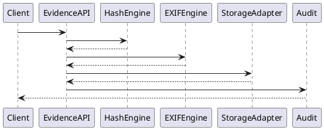
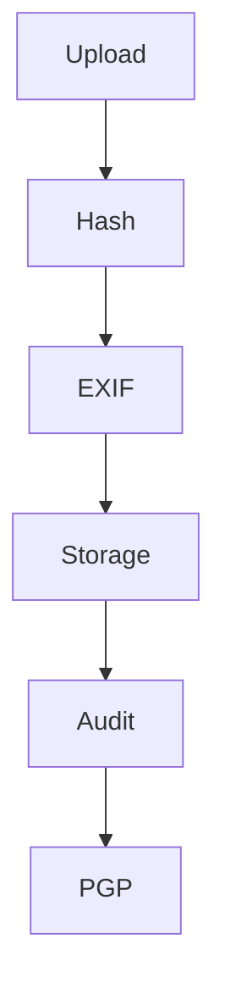

# PEP-003（續）

# Evidence Management Production Engineering Package

**Package ID：PEP-003**  
**Part 2：Evidence Vault & Integrity Framework**

---

# 19 Evidence Vault Architecture

```text id="v1o2w3"
Evidence API
        │
        ▼
Evidence Service
        │
 ┌──────┼─────────────┐
 ▼      ▼             ▼
Hash    EXIF      Version Engine
Engine  Engine
        │
        ▼
Evidence Vault
        │
 ┌──────┼─────────────┐
 ▼      ▼             ▼
MinIO   Archive    Backup
Storage Storage
        │
        ▼
PGP Engine
```

---

# 20 Immutable Evidence Policy

所有 Evidence 建立後：

- 原始檔不得覆寫。
- 不得修改 SHA-256。
- 不得修改 EXIF。
- 不得修改建立時間。
- 僅允許新增版本（Version）。
- 所有版本均保留完整追溯鏈。

---

# 21 Evidence Chain

Evidence Chain 定義：

```text id="evchain01"
Evidence

↓

SHA-256

↓

Metadata

↓

Version

↓

Audit

↓

PGP Reference

↓

Archive
```

任何節點遺失即視為鏈結中斷。

---

# 22 Digital Signature

Evidence 可支援數位簽章。

Signature Object：

```text id="evsign01"
Signature ID

Evidence ID

Algorithm

Signer

Signature Value

Signed Time

Certificate Reference
```

支援後續電子簽章整合。

---

# 23 Storage Adapter Interface

```text id="storage01"
StorageAdapter

upload()

download()

exists()

delete()

archive()

restore()

generateSignedUrl()
```

所有 Storage Provider 必須實作相同介面。

---

# 24 Object Storage Structure

```text id="storage02"
/case/

case_id/

workflow/

stage/

evidence/

version/

file
```

不得直接以檔名作為永久識別。

---

# 25 Archive Strategy

Archive 分層：

```text id="archive01"
Hot Storage

↓

Warm Storage

↓

Cold Storage

↓

Long-term Archive
```

Archive Policy 由 Operations Specification 管理。

---

# 26 Migration Script

```sql id="migration01"
ALTER TABLE evidence_master
ADD COLUMN signature_id BIGINT;

ALTER TABLE evidence_master
ADD COLUMN archive_flag BOOLEAN DEFAULT FALSE;

ALTER TABLE evidence_master
ADD COLUMN trace_id VARCHAR(100);

CREATE INDEX idx_evidence_case
ON evidence_master(case_id);

CREATE INDEX idx_evidence_hash
ON evidence_master(sha256);
```

---

# 27 Integrity Verification

定期執行：

- SHA-256 Recheck
- Missing File Detection
- Metadata Validation
- Version Consistency
- Storage Consistency

驗證結果寫入 Audit。

---

# 28 Performance Benchmark

| Operation | Target |
|-----------|--------|
| Upload | ≤ 500 ms（Metadata 完成） |
| SHA-256 | ≤ 2 秒（100 MB 以下） |
| EXIF | ≤ 300 ms |
| Download Metadata | ≤ 200 ms |
| Version Query | ≤ 200 ms |

---

# 29 Runtime Metrics

監測指標：

```text id="metric01"
Upload Count

Upload Success Rate

Hash Failure Rate

Storage Failure Rate

Version Count

Archive Count

Average Upload Time
```

---

# 30 Audit Record

每次操作均須記錄：

```text id="audit01"
Evidence ID

Case ID

Version

Operator

Operation

Storage Provider

Hash

Result

Trace ID

Timestamp
```

---

# 31 PHP Domain Skeleton

```php
final class EvidenceAggregate
{
    public function upload(){}
    public function verify(){}
    public function archive(){}
    public function restore(){}
    public function createVersion(){}
}
```

---

# 32 FastAPI Service Skeleton

```text
evidence/

integrity.py

signature.py

archive.py

metrics.py

audit.py

storage_adapter.py
```

---

# 33 Deployment Configuration

Storage 預設：

- Development：Local File System
- Testing：MinIO
- Production：MinIO（S3 Compatible）
- Backup：Object Storage Replication

---

# 34 PlantUML Sequence



---

# 35 Mermaid Flow



---

# 36 Test Specification

```text
EV-011 Digital Signature

EV-012 Archive File

EV-013 Restore Archive

EV-014 Storage Replication

EV-015 Hash Recheck

EV-016 Missing File Detection

EV-017 Version Integrity

EV-018 Metadata Consistency

EV-019 Signed URL

EV-020 Backup Recovery
```

---

# 37 Deliverables

完成交付：

- Evidence Vault
- Immutable Storage
- Storage Adapter
- Digital Signature
- Archive Strategy
- SQL Migration
- OpenAPI Contract
- PHP Skeleton
- FastAPI Skeleton
- PlantUML
- Mermaid
- Performance Benchmark
- Test Specification

---

# 38 PEP-003 Status

**PEP-003 Evidence Management Production Engineering Package**

**Status：Completed**

**Frozen：Yes**

---

# PEP-004

## Contract & Payment Production Engineering Package

下一段直接開始：

- Contract Aggregate
- Payment Engine
- Milestone Payment
- Escrow / Trust Integration
- Invoice
- Approval Workflow
- Payment OpenAPI
- SQL Schema
- PHP Domain
- FastAPI Service
- UML
- Mermaid
- Test Specification
