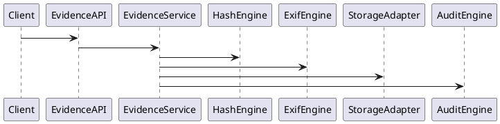
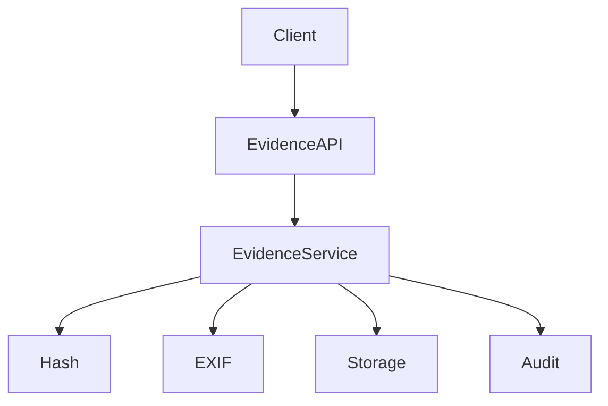

# PEP-003

# Evidence Management Production Engineering Package

**Package ID：PEP-003**  
**Status：Official Edition v1.0**

---

# 01 Package Scope

涵蓋：

- Evidence Vault
- Object Storage
- SHA-256 Integrity
- EXIF Verification
- Version Management
- Immutable Storage
- Audit Chain
- Evidence API
- SQL Schema
- PHP Domain
- FastAPI Service

---

# 02 Evidence Architecture

```text
Client
    │
Evidence API
    │
Evidence Service
    ├── Upload Engine
    ├── Hash Engine
    ├── EXIF Engine
    ├── Version Engine
    ├── Audit Engine
    ├── Storage Adapter
    └── PGP Adapter
```

---

# 03 Evidence Aggregate

Aggregate Root

```text
Evidence
```

Children

```text
EvidenceFile
EvidenceVersion
EvidenceHash
EvidenceMetadata
EvidenceAudit
EvidenceSignature
```

---

# 04 Evidence Lifecycle

```text
Created

↓

Uploaded

↓

Verified

↓

Approved

↓

Referenced

↓

Archived
```

---

# 05 Evidence SQL

```sql
CREATE TABLE evidence_master(

evidence_id BIGINT PRIMARY KEY,

case_id BIGINT NOT NULL,

workflow_id BIGINT,

file_name VARCHAR(255),

mime_type VARCHAR(100),

storage_uri VARCHAR(500),

sha256 CHAR(64),

version_no INT,

status VARCHAR(30),

created_at TIMESTAMP

);
```

---

```sql
CREATE TABLE evidence_version(

version_id BIGINT PRIMARY KEY,

evidence_id BIGINT,

version_no INT,

storage_uri VARCHAR(500),

sha256 CHAR(64),

created_by BIGINT,

created_at TIMESTAMP

);
```

---

```sql
CREATE TABLE evidence_metadata(

metadata_id BIGINT PRIMARY KEY,

evidence_id BIGINT,

capture_time TIMESTAMP,

gps_lat DECIMAL(10,7),

gps_lng DECIMAL(10,7),

device_model VARCHAR(120),

file_size BIGINT

);
```

---

# 06 Storage Strategy

支援：

- Local Storage（Development）
- MinIO（Production Default）
- S3 Compatible Storage
- Azure Blob（Optional）
- Google Cloud Storage（Optional）

Storage Adapter 必須符合統一介面，不得耦合特定廠商。

---

# 07 Hash Verification

所有檔案上傳後立即產生：

- SHA-256
- File Length
- MIME Validation

任何版本變更均重新計算雜湊值，不覆寫歷史紀錄。

---

# 08 EXIF Verification

影像 Evidence 應擷取：

- Capture Time
- GPS
- Device Model
- Orientation
- Resolution

EXIF 驗證結果寫入 Evidence Metadata，供 Audit、Risk Engine 與 PGP 使用。

---

# 09 Version Policy

每次更新建立新版本：

- Version No.
- Parent Version
- Created By
- Created Time
- Change Reason

歷史版本不得刪除或覆寫。

---

# 10 OpenAPI

```yaml
POST /cases/{caseId}/evidence

GET /cases/{caseId}/evidence

GET /evidence/{evidenceId}

POST /evidence/{evidenceId}/verify

GET /evidence/{evidenceId}/versions

POST /evidence/{evidenceId}/archive
```

---

# 11 PHP Structure

```text
Evidence/

Domain/

EvidenceAggregate.php

EvidenceRepository.php

HashService.php

ExifService.php

StorageService.php

EvidencePolicy.php

Application/

UploadEvidenceHandler.php

VerifyEvidenceHandler.php

ArchiveEvidenceHandler.php

Api/

EvidenceController.php
```

---

# 12 FastAPI Structure

```text
evidence/

router.py

service.py

storage.py

hash.py

exif.py

version.py

audit.py

schemas.py
```

---

# 13 Runtime Events

```text
EvidenceUploaded

EvidenceVerified

EvidenceVersionCreated

EvidenceArchived

HashVerified

ExifExtracted

StorageCompleted
```

---

# 14 Security Rules

- 僅授權角色可上傳。
- 檔案 MIME 類型驗證。
- 檔案大小限制。
- SHA-256 必須一致。
- Storage URI 不對外公開。
- 下載須經授權。

---

# 15 PlantUML



---

# 16 Mermaid



---

# 17 Test Cases

```text
EV-001 Upload Evidence

EV-002 Duplicate Upload

EV-003 Hash Verification

EV-004 EXIF Extraction

EV-005 Version Creation

EV-006 Archive Evidence

EV-007 Unauthorized Access

EV-008 Storage Failure

EV-009 Metadata Validation

EV-010 PGP Reference
```

---

# 18 Cross Reference

- BRS-001
- SAD-001
- TGS-001
- SDD-001
- DDS-001
- OAS-001
- PGP-001

---

**PEP-003（Evidence Management）Part 1 完成。下一段直接接續 Immutable Evidence Vault、Object Storage Adapter、Evidence Chain、Digital Signature、PGP Integration、Migration Script、Performance Benchmark、Deployment Configuration。**
