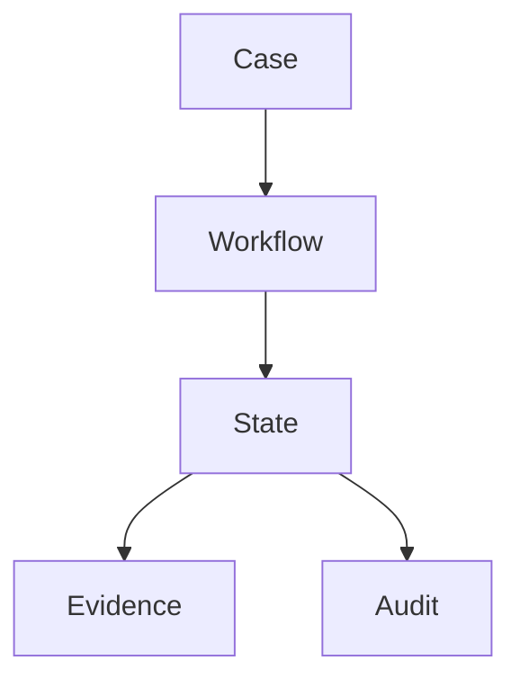

# PEP-001（開始）

# Case Management Production Engineering Package

**Package ID：PEP-001**  
**Status：Official Edition v1.0**

---

# 01 Package Scope

本 Package 為 TIGI Case Management 完整工程資產。

涵蓋：

- Case Domain
- Workflow Binding
- State Binding
- Assignment
- Audit
- API
- SQL
- PHP
- FastAPI
- Frontend SDK

---

# 02 Repository Structure

```text
pep-001-case/

├── engineering/
│   ├── CaseSpecification.md
│   ├── CaseSpecification.docx
│   └── CaseSpecification.pdf
│
├── openapi/
│   └── case.yaml
│
├── database/
│   ├── ddl/
│   ├── migration/
│   └── seed/
│
├── php/
│
├── fastapi/
│
├── frontend/
│
├── uml/
│
├── mermaid/
│
├── svg/
│
├── tests/
│
└── release/
```

---

# 03 Case Aggregate

Aggregate Root

```
Case
```

Child

```
Workflow

State

Evidence

Assignment

Audit

PGP Reference
```

---

# 04 Case Lifecycle

```
Registered

↓

Initialized

↓

Planning

↓

Executing

↓

Inspection

↓

Warranty

↓

Closed

↓

Archived
```

---

# 05 SQL DDL

```sql
CREATE TABLE case_master (

case_id BIGINT PRIMARY KEY,

case_no VARCHAR(40) UNIQUE NOT NULL,

project_id BIGINT NOT NULL,

organization_id BIGINT NOT NULL,

current_state_id BIGINT NOT NULL,

case_status VARCHAR(30) NOT NULL,

created_at TIMESTAMP NOT NULL,

updated_at TIMESTAMP NOT NULL

);
```

---

```sql
CREATE TABLE case_assignment (

assignment_id BIGINT PRIMARY KEY,

case_id BIGINT NOT NULL,

user_id BIGINT NOT NULL,

role_code VARCHAR(40),

assigned_at TIMESTAMP

);
```

---

```sql
CREATE TABLE case_history (

history_id BIGINT PRIMARY KEY,

case_id BIGINT,

before_state BIGINT,

after_state BIGINT,

operator_id BIGINT,

event_time TIMESTAMP

);
```

---

# 06 OpenAPI

```yaml
GET /cases

POST /cases

GET /cases/{caseId}

PATCH /cases/{caseId}

POST /cases/{caseId}/close

GET /cases/{caseId}/history

GET /cases/{caseId}/workflow

GET /cases/{caseId}/evidence

GET /cases/{caseId}/audit
```

---

# 07 PHP Structure

```text
Case/

Domain/

Case.php

CaseRepository.php

CaseService.php

CasePolicy.php

CaseValidator.php

CaseAggregate.php

Application/

CreateCaseHandler.php

UpdateCaseHandler.php

CloseCaseHandler.php

QueryCaseHandler.php

Infrastructure/

MysqlCaseRepository.php

Api/

CaseController.php
```

---

# 08 FastAPI

```text
case/

router.py

service.py

repository.py

schemas.py

validator.py

events.py

dependencies.py
```

---

# 09 Frontend SDK

```text
case/

case.api.ts

case.types.ts

case.hooks.ts

case.store.ts

case.validation.ts
```

---

# 10 PlantUML

```plantuml
@startuml

User

Case

Workflow

State

Evidence

Audit

User --> Case

Case --> Workflow

Workflow --> State

State --> Evidence

State --> Audit

@enduml
```

---

# 11 Mermaid



---

# 12 Test Cases

```
TC-CASE-001

Create Case

TC-CASE-002

Update Case

TC-CASE-003

Invalid State

TC-CASE-004

Duplicate Case No

TC-CASE-005

Close Case

TC-CASE-006

Audit Generated

TC-CASE-007

History Query
```

---

# 13 Release Checklist

- DDL Review
- API Review
- Security Review
- Governance Review
- Performance Review
- Integration Test
- UAT
- Release Approval

---

# 14 Cross Reference

- BRS-001
- SAD-001
- TGS-001
- SDD-001
- DDS-001
- OAS-001

---

**PEP-001（Case Management）持續編寫中……下一段直接接續 Workflow Runtime、State Machine、Case API YAML、Migration Script、PHP Skeleton、FastAPI Skeleton，不重複內容。**
