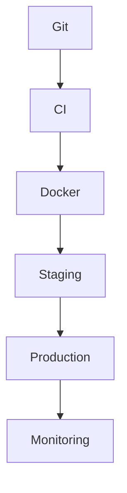

# BOOK-3

# PS-005

# Deployment & DevOps Specification

**Document ID：PS-005**  
**Module：Deployment & DevOps Platform**  
**Status：Official Edition v2.0**  
**Baseline：TIGI Platform、StyleMatch AI、TWCID、iSAFE 2.0**

---

# 1. Module Information

Module Code

```text
DEVOPS
```

Canonical ID

```text
DEVOPS-001
```

Owner

```text
Platform Infrastructure Team
```

---

# 2. Responsibility

DevOps Platform 負責：

- Deployment
- CI/CD
- Docker
- Environment Management
- Secrets Management
- Monitoring
- Logging
- Alerting
- Backup
- Disaster Recovery
- Release Management
- Blue/Green Deployment
- Rollback

---

# 3. Design Principles

DEVOPS-001

Everything As Code

---

DEVOPS-002

Immutable Deployment

---

DEVOPS-003

Zero Downtime

---

DEVOPS-004

Rollback Ready

---

DEVOPS-005

Environment Isolation

---

DEVOPS-006

Observability First

---

DEVOPS-007

Secure By Default

---

DEVOPS-008

Automation First

---

# 4. Deployment Architecture

```text
Developer

↓

GitHub

↓

CI

↓

Artifact

↓

Docker Registry

↓

Deployment

↓

Production

↓

Monitoring
```

---

# 5. Environment

正式建議四個環境：

```text
Local

↓

Development

↓

Staging

↓

Production
```

---

# 6. MVP Deployment（第一階段）

依目前確定架構：

Frontend

```text
PHP 8.3

Laravel（或現有 PHP）

Nginx

MySQL 8
```

AI Layer

```text
FastAPI

Python 3.12

Redis

Qdrant

ComfyUI

RTX5070Ti
```

Storage

```text
MinIO

S3 Compatible
```

---

# 7. Production Architecture

```text
Internet

↓

Nginx

↓

PHP Application

↓

MySQL

↓

Redis

↓

FastAPI

↓

AI Gateway

↓

ComfyUI GPU

↓

Vector DB

↓

Object Storage
```

---

# 8. Docker Containers

官方 Container：

```text
frontend

php-fpm

nginx

mysql

redis

fastapi

agent-runtime

knowledge

qdrant

comfyui

minio

grafana

prometheus

loki
```

---

# 9. Docker Compose

官方：

```yaml
docker-compose.yml

docker-compose.dev.yml

docker-compose.prod.yml
```

---

# 10. CI/CD

Pipeline

```text
Git Push

↓

Test

↓

Lint

↓

Build

↓

Docker

↓

Deploy Staging

↓

Integration Test

↓

Approval

↓

Deploy Production
```

---

# 11. Git Branch

```text
main

develop

release/*

feature/*

hotfix/*
```

---

# 12. Release Strategy

支援：

```text
Rolling

Blue/Green

Canary（未來）

Feature Flag
```

MVP

建議：

Blue/Green

---

# 13. Configuration

所有設定：

```text
.env

Secrets

Vault（未來）

GitHub Secret
```

不得：

硬寫 API Key。

---

# 14. Monitoring

使用：

```text
Prometheus

Grafana
```

監控：

- CPU
- Memory
- GPU
- Disk
- API
- AI
- Workflow
- Payment
- Queue

---

# 15. Logging

使用：

```text
Loki

Promtail
```

格式：

```text
JSON Log
```

包含：

- Trace ID
- User
- Organization
- Module
- Duration

---

# 16. Alert

通知：

```text
Email

Slack

LINE Notify（可替換為 Messaging API）

Webhook
```

---

# 17. Backup

每日：

```text
MySQL

Vector DB

MinIO

Configuration
```

保留：

```text
30 Days
```

---

# 18. Disaster Recovery

Recovery

```text
Database

↓

Storage

↓

AI Models

↓

Knowledge

↓

Workflow

↓

Ready
```

RPO

```text
< 15 Minutes
```

RTO

```text
< 1 Hour
```

---

# 19. Security

支援：

- HTTPS
- TLS1.3
- JWT
- CSP
- Rate Limit
- WAF
- Secret Rotation
- Audit Log

---

# 20. OpenAPI

```text
/api/health

/api/ready

/api/version

/api/status
```

---

# 21. SQL Migration

工具：

```text
Laravel Migration

Alembic（FastAPI）

Flyway（未來）
```

---

# 22. Repository

```text
infra/

docker/

k8s/

terraform/

ansible/

scripts/

monitoring/
```

---

# 23. PHP Structure

```text
deployment/

docker/

nginx/

php/

scripts/
```

---

# 24. FastAPI

```text
deployment/

uvicorn/

gunicorn/

systemd/

docker/
```

---

# 25. Runtime Services

```text
Nginx

PHP-FPM

Redis

MySQL

FastAPI

ComfyUI

Qdrant

MinIO

Prometheus

Grafana

Loki
```

---

# 26. PlantUML

```plantuml
@startuml

GitHub

-> CI

CI

-> Docker

Docker

-> Staging

Staging

-> Production

Production

-> Monitoring

@enduml
```

---

# 27. Mermaid



---

# 28. Unit Test

```text
DEVOPS-UT-001 Build

DEVOPS-UT-002 Docker

DEVOPS-UT-003 Deployment

DEVOPS-UT-004 Health Check

DEVOPS-UT-005 Monitoring

DEVOPS-UT-006 Backup

DEVOPS-UT-007 Restore

DEVOPS-UT-008 Rollback
```

---

# 29. Integration Test

```text
DEVOPS-IT-001 PHP Deployment

DEVOPS-IT-002 FastAPI Deployment

DEVOPS-IT-003 AI Gateway

DEVOPS-IT-004 ComfyUI

DEVOPS-IT-005 Knowledge Platform

DEVOPS-IT-006 Monitoring

DEVOPS-IT-007 Backup

DEVOPS-IT-008 Disaster Recovery
```

---

# 30. TIGI 官方部署架構（符合目前規劃）

## 第一階段（MVP）

- PHP + MySQL（延續 TWCID）
- FastAPI AI Gateway
- ComfyUI GPU Server
- Redis
- MinIO
- Qdrant
- Docker Compose

---

## 第二階段（SaaS）

新增：

- Agent Runtime
- Event Bus
- Analytics
- 多租戶（Multi-Tenant）
- 多 GPU 節點

---

## 第三階段（Enterprise）

新增：

- Kubernetes
- Auto Scaling
- Multi-Region
- CDN
- WAF
- Disaster Recovery Site
- Enterprise Monitoring

---

# 31. Acceptance Criteria

- Docker Build 成功
- Docker Compose 可一鍵啟動
- CI/CD 自動部署成功
- Blue/Green 部署可切換
- FastAPI 與 PHP 整合正常
- ComfyUI GPU 可正常服務
- Qdrant 與 MinIO 正常
- Health Check 通過
- Backup／Restore 驗證成功
- Rollback 可於 5 分鐘內完成
- 監控與告警正常
- 整合測試全部通過

---

# 32. Codex Build Instruction

**Input**

- BOOK-1
- BOOK-2
- BOOK-3（PS-001～PS-005）

**Output**

- Docker Compose（Dev／Prod）
- GitHub Actions CI/CD
- Nginx Configuration
- PHP Deployment Scripts
- FastAPI Deployment
- ComfyUI Deployment
- Qdrant Deployment
- MinIO Deployment
- Monitoring Stack（Prometheus／Grafana／Loki）
- Backup Scripts
- Disaster Recovery Scripts
- Health Check API
- Rollback Scripts

---

## PS-005 Status

**Deployment & DevOps Platform**

**Status：Completed**

**Frozen：Yes**

---

### BOOK-3 完成進度

- ✅ PS-001：Platform API & SDK Architecture
- ✅ PS-002：Event Bus & Messaging
- ✅ PS-003：MCP Integration
- ✅ PS-004：SDK & Developer Platform
- ✅ PS-005：Deployment & DevOps Specification

BOOK-3 已建立完整的 API、事件、MCP、SDK 與部署規範，可作為後續實作與自動化開發的技術基礎。下一階段可進入更高層級的 BOOK-4（產品需求與 UI/UX 規範）或直接依此規格展開工程實作。
