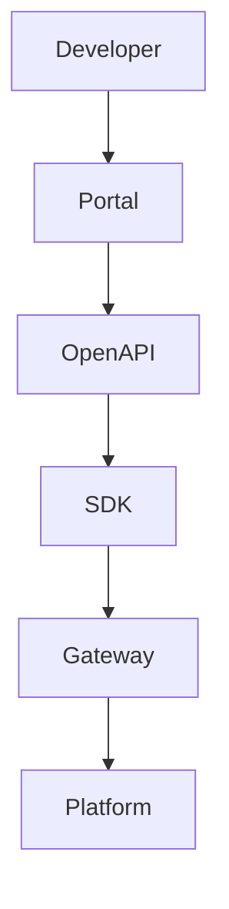

# BOOK-3

# PS-004

# SDK & Developer Platform Specification

**Document ID：PS-004**  
**Module：Developer Platform & SDK**  
**Status：Official Edition v2.0**  
**Baseline：OpenAPI 3.1、AsyncAPI 3.0、MCP、TIGI Platform**

---

# 1. Module Information

Module Code

```text
DEV
```

Canonical ID

```text
DEV-001
```

Owner

```text
Developer Experience Team
```

---

# 2. Responsibility

Developer Platform 負責：

- Developer Portal
- API Documentation
- SDK
- CLI
- Sandbox
- API Key Management
- OAuth Client
- Sample Projects
- Code Generator
- Postman Collection
- Insomnia Collection
- Release Notes
- Changelog

Developer Platform 不負責：

- Business Workflow
- AI Runtime
- Governance Decision

---

# 3. Design Principles

DEV-001

Developer First

---

DEV-002

OpenAPI First

---

DEV-003

Everything Documented

---

DEV-004

One SDK Per Language

---

DEV-005

Sample Before Documentation

---

DEV-006

Backward Compatible

---

DEV-007

Self-Service

---

DEV-008

Automation First

---

# 4. Developer Architecture

```text
Developer

↓

Developer Portal

↓

API Documentation

↓

SDK

↓

CLI

↓

Sandbox

↓

API Gateway

↓

Platform Services
```

---

# 5. Developer Portal

提供：

```text
Quick Start

API Explorer

SDK Download

CLI Download

Sample Projects

Webhook Test

MCP Tool Explorer

Release Notes

Status Page

Support Center
```

---

# 6. Official SDK

提供：

```text
PHP SDK

Python SDK

TypeScript SDK

Java SDK

Go SDK

C# SDK（規劃）
```

SDK 功能：

- Authentication
- Retry
- Pagination
- Error Handling
- File Upload
- Webhook Verify
- Streaming
- Logging

---

# 7. CLI

官方 CLI

```bash
tigi init

tigi login

tigi project create

tigi api test

tigi deploy

tigi openapi generate

tigi webhook listen

tigi sandbox reset

tigi doctor
```

---

# 8. API Key

支援：

```text
Sandbox Key

Development Key

Production Key

Read Only Key

Organization Key
```

每組 Key：

```text
Key ID

Organization

Permission

Created Time

Expired Time

Last Used

Status
```

---

# 9. OAuth2

支援：

```text
Authorization Code

Client Credentials

PKCE

Refresh Token
```

Scopes

```text
workflow.read

workflow.write

payment.read

payment.write

inspection.read

inspection.write

ai.generate

analytics.read
```

---

# 10. Sandbox

Sandbox 提供：

```text
Demo Organization

Demo Projects

Demo Cases

Demo Workflow

Mock AI

Mock Payment

Mock Inspection

Reset Environment
```

---

# 11. Sample Projects

官方提供：

```text
PHP Laravel

Python FastAPI

Node.js Express

Next.js

React

Vue

Flutter

Android

iOS
```

---

# 12. Code Generator

依 OpenAPI 自動產生：

```text
SDK

Client

Server Stub

Model

Validation

Mock API
```

---

# 13. API Explorer

功能：

- Try It Out
- JWT 測試
- OAuth 測試
- Webhook 模擬
- Event Replay
- MCP Tool Test

---

# 14. Postman

提供：

```text
Collection

Environment

Variables

Examples

Test Script
```

---

# 15. Documentation

包含：

```text
Quick Start

Authentication

REST API

Webhook

AsyncAPI

MCP

SDK

CLI

FAQ

Migration Guide
```

---

# 16. OpenAPI

```text
/api/openapi.yaml

/api/openapi.json
```

每次 Release：

自動更新。

---

# 17. OpenAPI Generator

支援：

```text
PHP

Python

Java

Go

TypeScript

Kotlin

Swift
```

---

# 18. Error Codes

```text
DEV-4001

API Key Invalid

DEV-4002

OAuth Failed

DEV-4003

Sandbox Disabled

DEV-4004

SDK Version Mismatch

DEV-4005

CLI Failed

DEV-5001

Developer Platform Failure
```

---

# 19. SQL

```sql
CREATE TABLE developer_api_key(

api_key_id BIGINT PRIMARY KEY,

organization_id BIGINT,

key_hash CHAR(64),

scope JSON,

status VARCHAR(30),

created_at TIMESTAMP

);
```

```sql
CREATE TABLE developer_sdk_release(

release_id BIGINT PRIMARY KEY,

sdk_name VARCHAR(50),

sdk_version VARCHAR(30),

release_note TEXT,

released_at TIMESTAMP

);
```

```sql
CREATE TABLE developer_application(

application_id BIGINT PRIMARY KEY,

organization_id BIGINT,

client_id VARCHAR(100),

redirect_uri VARCHAR(500),

status VARCHAR(30)

);
```

---

# 20. Repository

```text
DeveloperRepository

APIKeyRepository

SDKRepository

ApplicationRepository

ReleaseRepository
```

---

# 21. Domain Services

```text
DeveloperPortalService

APIKeyService

SDKService

CLIService

OAuthService

SandboxService

DocumentationService
```

---

# 22. Commands

```text
CreateAPIKeyCommand

CreateApplicationCommand

GenerateSDKCommand

ResetSandboxCommand

PublishSDKCommand
```

---

# 23. Queries

```text
GetSDK

GetAPIKey

GetApplication

GetRelease

GetSandbox
```

---

# 24. PHP Structure

```text
src/

Domain/Developer/

Application/

Infrastructure/

Presentation/
```

Classes

```text
DeveloperPortal.php

SDKService.php

CLIService.php

APIKeyService.php

OAuthService.php

DeveloperController.php
```

---

# 25. FastAPI

```text
developer/

router.py

sdk.py

apikey.py

oauth.py

sandbox.py

cli.py

portal.py
```

---

# 26. React

Pages

```text
Developer Portal

SDK Center

API Explorer

Sandbox

CLI Download

Release Notes

Application Management
```

Components

```text
SDKCard

APIExplorer

OAuthTester

CLIConsole

ReleaseTimeline

SandboxStatus
```

---

# 27. Runtime Events

```text
APIKeyCreated

SDKGenerated

SandboxReset

OAuthAuthorized

SDKReleased

ApplicationRegistered

DeveloperLoggedIn
```

---

# 28. PlantUML

```plantuml
@startuml

Developer

-> Portal

Portal

-> OpenAPI

OpenAPI

-> SDK Generator

SDK Generator

-> SDK

SDK

-> API Gateway

@enduml
```

---

# 29. Mermaid



---

# 30. 官方 SDK 套件名稱

```text
tigi-php-sdk

tigi-python-sdk

tigi-ts-sdk

tigi-java-sdk

tigi-go-sdk
```

CLI：

```text
tigi-cli
```

Developer Portal：

```text
developer.tigi.tw
```

API：

```text
api.tigi.tw
```

Sandbox：

```text
sandbox.tigi.tw
```

Documentation：

```text
docs.tigi.tw
```

---

# 31. Acceptance Criteria

- Developer Portal 可自助使用
- OpenAPI 文件完整
- SDK 自動產生並可下載
- CLI 支援主要開發流程
- Sandbox 可快速重置
- OAuth2 與 API Key 驗證正常
- Postman／Insomnia 範例可直接使用
- Release Notes 自動更新
- OpenAPI 驗證通過
- 單元測試覆蓋率 ≥90%
- 整合測試全部通過

---

# 32. Codex Build Instruction

**Input**

- PS-001 Platform API
- PS-002 Event Bus
- PS-003 MCP Integration
- PS-004 Developer Platform

**Output**

- Developer Portal
- SDK（PHP／Python／TypeScript／Java／Go）
- CLI（tigi-cli）
- OpenAPI Generator
- OAuth2 Server Integration
- API Explorer
- Sandbox
- Postman Collection
- Insomnia Collection
- Unit Tests
- Integration Tests
- Docker Configuration

---

## PS-004 Status

**Developer Platform & SDK**

**Status：Completed**

**Frozen：Yes**

---

### BOOK-3 目前完成進度

- ✅ PS-001：Platform API & SDK Architecture
- ✅ PS-002：Event Bus & Messaging
- ✅ PS-003：MCP Integration
- ✅ PS-004：SDK & Developer Platform

下一份將進入 **PS-005：Deployment & DevOps Specification**，完整定義 TIGI／StyleMatch AI／TWCID／iSAFE 2.0 的 Docker、CI/CD、Kubernetes（選配）、監控、日誌、備援、災難復原、版本發布、Linex PHP 主機部署（MVP）與 FastAPI AI 服務部署策略，形成可直接交付開發團隊與 Codex 執行的正式部署規格。
