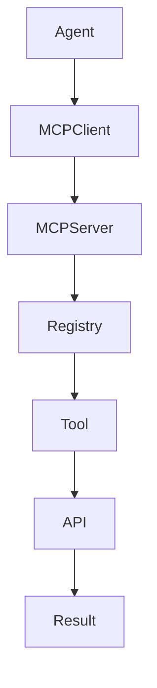

# BOOK-3

# PS-003

# MCP (Model Context Protocol) Integration Specification

**Document ID：PS-003**  
**Module：MCP Integration Platform**  
**Status：Official Edition v2.0**  
**Baseline：MCP Specification、TIGI AI Platform、IS-017、IS-018**

---

# 1. Module Information

Module Code

```text
MCP
```

Canonical ID

```text
MCP-001
```

Owner

```text
AI Platform Team
```

---

# 2. Responsibility

MCP Platform 負責：

- MCP Server
- MCP Client
- Tool Registry
- Tool Discovery
- Tool Permission
- Context Sharing
- Resource Registry
- Prompt Registry
- Session Management
- Tool Audit
- Tool Governance

MCP Platform 不負責：

- Business Logic
- Workflow Runtime
- Payment Processing
- AI Model Execution

---

# 3. Design Principles

MCP-001

Everything Is Tool

---

MCP-002

Everything Discoverable

---

MCP-003

Everything Permission Controlled

---

MCP-004

Context Never Lost

---

MCP-005

Stateless Protocol

---

MCP-006

Tool Independent

---

MCP-007

Provider Independent

---

MCP-008

Open Standard First

---

# 4. MCP Architecture

```text
StyleMatch AI

↓

AI Gateway

↓

Agent Runtime

↓

MCP Client

↓

MCP Server

↓

Tool Registry

↓

Tools

↓

Business APIs
```

---

# 5. MCP Components

```text
MCP Server

MCP Client

Tool Registry

Prompt Registry

Resource Registry

Context Manager

Permission Manager

Session Manager

Audit Logger
```

---

# 6. Tool Categories

Platform

```text
Workflow

Gate

Checklist

Evidence

Contract

Payment

Inspection

Warranty
```

AI

```text
Image Generation

LLM

Embedding

RAG

Knowledge Graph

OCR
```

Business

```text
CRM

Project

Vendor

Designer

Organization

Analytics
```

Infrastructure

```text
Filesystem

Database

Email

Calendar

Slack

GitHub

Web Search

Python
```

---

# 7. Tool Definition

每個 Tool 必須包含：

```text
Tool ID

Tool Name

Version

Description

Input Schema

Output Schema

Permission

Timeout

Retry Policy

Owner

Status
```

---

# 8. Tool Permission

Permission Scope

```text
Platform

Organization

Project

Case

Private
```

Authorization

```text
RBAC

+

ABAC

+

Context Validation
```

---

# 9. Resource Registry

Resource Types

```text
Documents

Evidence

Contracts

Knowledge

Project

Checklist

Workflow

Inspection

Reports
```

---

# 10. Prompt Registry

Prompt 必須包含：

```text
Prompt ID

Version

Variables

Output Schema

Safety Level

Owner

Created Time
```

Prompt 不可覆寫。

---

# 11. Context Sharing

Context

```text
Conversation

Knowledge

Memory

Workflow

Project

Case

Organization

Tool Result
```

所有 Context：

Versioned。

---

# 12. Session

Session

```text
Create

Update

Suspend

Resume

Close
```

Session Metadata

```text
User

Organization

Project

Language

Model

Provider

Context Budget
```

---

# 13. MCP Discovery

Client

↓

Registry

↓

Capability

↓

Permission

↓

Load Tool

↓

Execute

---

# 14. Tool Execution

Execution

↓

Permission Check

↓

Context Injection

↓

Tool Call

↓

Result Validation

↓

Audit

↓

Return

---

# 15. OpenAPI

## POST

```text
/api/v1/mcp/tools/execute
```

---

## GET

```text
/api/v1/mcp/tools
```

---

## GET

```text
/api/v1/mcp/resources
```

---

## GET

```text
/api/v1/mcp/prompts
```

---

## POST

```text
/api/v1/mcp/session
```

---

## POST

```text
/api/v1/mcp/context
```

---

## GET

```text
/api/v1/mcp/discovery
```

---

# 16. Error Codes

```text
MCP-4001

Tool Not Found

MCP-4002

Permission Denied

MCP-4003

Context Invalid

MCP-4004

Resource Missing

MCP-4005

Prompt Invalid

MCP-4006

Execution Timeout

MCP-5001

MCP Runtime Failure
```

---

# 17. SQL

```sql
CREATE TABLE mcp_tool_registry(

tool_id BIGINT PRIMARY KEY,

tool_code VARCHAR(50),

tool_name VARCHAR(100),

version VARCHAR(30),

permission_scope VARCHAR(50),

status VARCHAR(30)

);
```

```sql
CREATE TABLE mcp_resource(

resource_id BIGINT PRIMARY KEY,

resource_type VARCHAR(50),

resource_uri VARCHAR(500),

version_no INT,

created_at TIMESTAMP

);
```

```sql
CREATE TABLE mcp_session(

session_id BIGINT PRIMARY KEY,

user_id BIGINT,

organization_id BIGINT,

context_budget INT,

status VARCHAR(30),

created_at TIMESTAMP

);
```

---

# 18. Repository

```text
ToolRepository

PromptRepository

ResourceRepository

SessionRepository

ContextRepository
```

---

# 19. Domain Services

```text
MCPServer

MCPClient

ToolRegistryService

DiscoveryService

PermissionService

ContextService

SessionService

AuditService
```

---

# 20. Commands

```text
RegisterToolCommand

ExecuteToolCommand

CreateSessionCommand

UpdateContextCommand

PublishResourceCommand
```

---

# 21. Queries

```text
GetTool

SearchTool

GetResource

GetPrompt

GetSession
```

---

# 22. PHP Structure

```text
src/

Domain/MCP/

Application/

Infrastructure/

Presentation/
```

Classes

```text
MCPServer.php

MCPClient.php

ToolRegistry.php

DiscoveryService.php

ContextManager.php

PermissionService.php

MCPController.php
```

---

# 23. FastAPI

```text
mcp/

router.py

server.py

client.py

tool.py

registry.py

resource.py

prompt.py

context.py

session.py

audit.py
```

---

# 24. React

Pages

```text
MCP Dashboard

Tool Registry

Resource Registry

Prompt Registry

Session Monitor

Context Explorer
```

Components

```text
ToolCard

CapabilityTree

PromptViewer

ResourceViewer

SessionTimeline

ContextInspector
```

---

# 25. Runtime Events

```text
ToolRegistered

ToolExecuted

ContextUpdated

SessionCreated

SessionClosed

PromptPublished

ResourceLoaded

PermissionValidated
```

---

# 26. PlantUML

```plantuml
@startuml

Agent

-> MCP Client

MCP Client

-> MCP Server

MCP Server

-> Tool Registry

Tool Registry

-> Business Tool

Business Tool

-> API

API

-> Response

@enduml
```

---

# 27. Mermaid



---

# 28. Unit Test

```text
MCP-UT-001 Tool Registration

MCP-UT-002 Tool Discovery

MCP-UT-003 Tool Execution

MCP-UT-004 Context Sharing

MCP-UT-005 Permission

MCP-UT-006 Session

MCP-UT-007 Prompt Registry

MCP-UT-008 Resource Registry
```

---

# 29. Integration Test

```text
MCP-IT-001 AI Gateway

MCP-IT-002 Agent Runtime

MCP-IT-003 Workflow

MCP-IT-004 Knowledge Platform

MCP-IT-005 Business API

MCP-IT-006 Event Bus

MCP-IT-007 Analytics

MCP-IT-008 Audit
```

---

# 30. TIGI 官方 MCP Tool Registry

建議預設註冊下列官方 Tool：

1. Workflow Tool
2. Gate Tool
3. Checklist Tool
4. Evidence Tool
5. Contract Tool
6. Payment Tool
7. Inspection Tool
8. Warranty Tool
9. StyleMatch AI Tool
10. Designer Match Tool
11. Vendor Match Tool
12. Budget Tool
13. Proposal Tool
14. Knowledge Search Tool
15. RAG Query Tool
16. Image Generation Tool
17. Analytics Tool
18. Report Tool
19. Notification Tool
20. Administration Tool

---

# 31. Acceptance Criteria

- MCP Tool Discovery 正常
- Tool Registry 支援熱更新
- Tool Permission 驗證正確
- Context 可跨 Agent 共用
- Resource Registry 可追蹤版本
- Prompt Registry 支援版本控制
- Session 管理正常
- MCP 與 AI Gateway、Agent Runtime 整合成功
- OpenAPI 驗證通過
- 單元測試覆蓋率 ≥90%
- 整合測試全部通過

---

# 32. Codex Build Instruction

**Input**

- PS-001 Platform API
- PS-002 Event Bus
- IS-017 AI Gateway
- IS-018 AI Agent Runtime
- PS-003 MCP Integration

**Output**

- PHP DDD MCP Module
- FastAPI MCP Server
- React MCP Console
- OpenAPI 3.1 YAML
- Tool Registry
- Resource Registry
- Prompt Registry
- Session Manager
- Unit Tests
- Integration Tests
- Docker Configuration

---

## PS-003 Status

**MCP Integration Platform**

**Status：Completed**

**Frozen：Yes**

---

下一份將直接進入 **PS-004：SDK & Developer Platform Specification**，建立 TIGI/StyleMatch AI/TWCID/iSAFE 2.0 的官方開發者平台，包括 SDK、CLI、API Key、Sandbox、Developer Portal、Postman Collection、範例專案與完整 DevEx（Developer Experience）規範。
