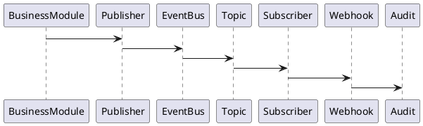
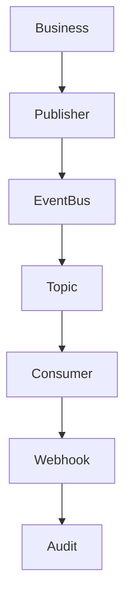

# BOOK-3

# PS-002

# Event Bus & Messaging Implementation Specification

**Document ID：PS-002**  
**Module：Platform Event Bus & Messaging**  
**Status：Official Edition v2.0**  
**Baseline：TIGI Event-Driven Architecture、CloudEvents 1.0、AsyncAPI 3.0**

---

# 1. Module Information

Module Code

```text
EVENT
```

Canonical ID

```text
EVENT-001
```

Owner

```text
Platform Infrastructure Team
```

---

# 2. Responsibility

Event Bus 負責：

- Event Publishing
- Event Subscription
- Message Routing
- Event Persistence
- Retry
- Dead Letter Queue
- Webhook Delivery
- Event Replay
- Event Versioning
- Event Audit
- Event Security

Event Bus 不負責：

- Business Decision
- Workflow Validation
- UI Rendering

---

# 3. Design Principles

EVENT-001

Everything Is Event

---

EVENT-002

Immutable Event

---

EVENT-003

At Least Once Delivery

---

EVENT-004

Event Version Controlled

---

EVENT-005

Trace Every Event

---

EVENT-006

Replay Supported

---

EVENT-007

Subscriber Independent

---

EVENT-008

CloudEvents Compatible

---

# 4. Event Architecture

```text
Business Module

↓

Event Publisher

↓

Event Bus

↓

Topic Router

↓

Consumer Group

↓

Subscribers

↓

Audit

↓

Analytics
```

---

# 5. Supported Brokers

```text
Kafka

RabbitMQ

NATS

Redis Streams

AWS SNS/SQS

Google Pub/Sub

Azure Service Bus
```

Local Development

```text
Redis Streams

RabbitMQ
```

---

# 6. Standard Topics

```text
case.*

workflow.*

state.*

gate.*

checklist.*

evidence.*

contract.*

payment.*

inspection.*

warranty.*

analytics.*

ai.*

agent.*

notification.*

audit.*
```

---

# 7. Event Naming

Format

```text
<Entity>.<Action>.<Version>
```

Examples

```text
Workflow.Created.v1

Workflow.StageChanged.v1

Gate.Passed.v1

Gate.Failed.v1

Checklist.Completed.v1

Evidence.Uploaded.v1

Contract.Signed.v1

Payment.Released.v1

Inspection.Accepted.v1

Warranty.Created.v1
```

---

# 8. CloudEvents Schema

```json
{
  "specversion":"1.0",
  "id":"uuid",
  "source":"workflow",
  "type":"Workflow.StageChanged.v1",
  "subject":"case-10001",
  "time":"2026-06-29T12:00:00Z",
  "datacontenttype":"application/json",
  "traceId":"...",
  "data":{}
}
```

---

# 9. Event Metadata

所有 Event 必須包含：

```text
Event ID

Trace ID

Correlation ID

Tenant ID

Organization ID

Case ID

Workflow ID

Operator

Created Time

Version

Retry Count
```

---

# 10. Delivery Guarantee

Default

```text
At Least Once
```

Critical Events

```text
Exactly Once（若 Broker 支援）
```

例如：

- Payment Released
- Contract Signed
- Warranty Deposit Released

---

# 11. Retry Policy

Retry

```text
5 sec

30 sec

2 min

10 min

30 min
```

Maximum

```text
5 Times
```

之後：

```text
Dead Letter Queue
```

---

# 12. Dead Letter Queue

Topic

```text
dlq.*
```

保存：

- Payload
- Exception
- Stack
- Retry Count
- Trace ID

---

# 13. Event Replay

支援：

```text
Replay By

Case

Workflow

Topic

Date

Trace ID
```

Replay

不得修改：

任何 Business Data。

---

# 14. Webhook

Webhook Events

```text
WorkflowChanged

GateFailed

PaymentReleased

InspectionCompleted

WarrantyExpired

AICompleted

ReportGenerated
```

Headers

```text
X-TIGI-Signature

X-TIGI-Trace-ID

X-TIGI-Event

X-TIGI-Version
```

---

# 15. Signature

Webhook

採：

```text
HMAC SHA256
```

Payload

不可修改。

---

# 16. Event Security

支援：

- JWT
- HMAC
- TLS
- mTLS
- IP Whitelist
- Replay Protection
- Timestamp Validation

---

# 17. AsyncAPI

版本：

```text
AsyncAPI 3.0
```

每個 Topic：

獨立 Spec。

---

# 18. OpenAPI

## POST

```text
/api/v1/events/publish
```

---

## GET

```text
/api/v1/events/history
```

---

## POST

```text
/api/v1/events/replay
```

---

## GET

```text
/api/v1/events/topics
```

---

## GET

```text
/api/v1/events/subscribers
```

---

## POST

```text
/api/v1/webhooks/register
```

---

# 19. Error Codes

```text
EVENT-4001

Topic Not Found

EVENT-4002

Subscriber Missing

EVENT-4003

Replay Failed

EVENT-4004

DLQ Overflow

EVENT-4005

Webhook Invalid

EVENT-4006

Signature Failed

EVENT-5001

Messaging Failure
```

---

# 20. SQL

```sql
CREATE TABLE event_store(

event_id BIGINT PRIMARY KEY,

event_type VARCHAR(100),

topic_name VARCHAR(100),

trace_id VARCHAR(100),

payload JSON,

version_no INT,

created_at TIMESTAMP

);
```

```sql
CREATE TABLE event_subscription(

subscription_id BIGINT PRIMARY KEY,

subscriber_name VARCHAR(100),

topic_name VARCHAR(100),

status VARCHAR(30),

created_at TIMESTAMP

);
```

```sql
CREATE TABLE event_dlq(

dlq_id BIGINT PRIMARY KEY,

event_id BIGINT,

reason TEXT,

retry_count INT,

created_at TIMESTAMP

);
```

---

# 21. Repository

```text
EventRepository

SubscriptionRepository

ReplayRepository

DLQRepository

WebhookRepository
```

---

# 22. Domain Services

```text
EventBus

PublisherService

SubscriberService

ReplayService

DLQService

WebhookService

SignatureService
```

---

# 23. Commands

```text
PublishEventCommand

ReplayEventCommand

RegisterWebhookCommand

RetryDLQCommand
```

---

# 24. Queries

```text
GetEvent

GetTopic

GetSubscription

GetReplayHistory

GetDLQ
```

---

# 25. PHP Structure

```text
src/

Domain/Event/

Application/

Infrastructure/

Presentation/
```

Classes

```text
EventBus.php

Publisher.php

Subscriber.php

ReplayService.php

DLQService.php

WebhookService.php

EventController.php
```

---

# 26. FastAPI

```text
event/

router.py

publisher.py

subscriber.py

replay.py

webhook.py

dlq.py

audit.py
```

---

# 27. React

Pages

```text
Event Dashboard

Topic Monitor

Subscriber Monitor

Webhook Center

DLQ Center

Replay Console
```

Components

```text
TopicCard

EventTimeline

ReplayDialog

WebhookTable

DLQViewer

ConsumerStatus
```

---

# 28. Runtime Events

```text
EventPublished

EventDelivered

SubscriberConnected

ReplayStarted

ReplayCompleted

DLQCreated

WebhookDelivered

WebhookFailed
```

---

# 29. PlantUML



---

# 30. Mermaid



---

# 31. Unit Test

```text
EVENT-UT-001 Publish

EVENT-UT-002 Subscribe

EVENT-UT-003 Replay

EVENT-UT-004 DLQ

EVENT-UT-005 Webhook

EVENT-UT-006 Signature

EVENT-UT-007 Retry

EVENT-UT-008 Audit
```

---

# 32. Integration Test

```text
EVENT-IT-001 Workflow Events

EVENT-IT-002 Payment Events

EVENT-IT-003 AI Events

EVENT-IT-004 Analytics Events

EVENT-IT-005 Kafka

EVENT-IT-006 RabbitMQ

EVENT-IT-007 Webhook

EVENT-IT-008 Replay
```

---

# 33. Acceptance Criteria

- Event 發布成功
- Topic Routing 正常
- Consumer Group 正常運作
- Retry 機制完整
- DLQ 可追蹤與重送
- Replay 不影響原始資料
- Webhook HMAC 驗證成功
- AsyncAPI 3.0 驗證通過
- OpenAPI 驗證通過
- 單元測試覆蓋率 ≥90%
- 整合測試全部通過

---

# 34. Codex Build Instruction

**Input**

- PS-001 Platform API
- PS-002 Event Bus

**Output**

- Event Bus Module
- AsyncAPI 3.0 Specification
- Kafka/RabbitMQ Adapter
- Webhook Engine
- Event Store
- Replay Engine
- DLQ Service
- Unit Tests
- Integration Tests

---

## PS-002 Status

**Event Bus & Messaging Platform**

**Status：Completed**

**Frozen：Yes**

---

下一份將直接進入 **PS-003：MCP（Model Context Protocol）Integration Specification**，完整定義 TIGI／StyleMatch AI／TWCID／iSAFE 2.0 的 MCP Server、Tool Registry、Tool Permission、Tool Discovery、Context Sharing 與 AI Tool 生態系統。
