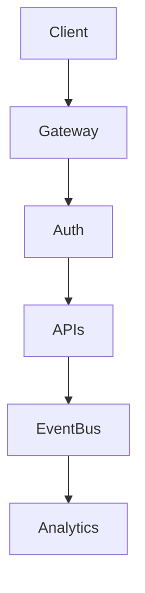

# BOOK-3

# PS-001

# Platform API & SDK Architecture Specification

**Document ID：PS-001**  
**Module：Platform API Architecture**  
**Status：Official Edition v2.0**  
**Baseline：TIGI Platform Architecture、OpenAPI 3.1、REST、Event-Driven、MCP**

---

# 1. Platform Architecture

```text
StyleMatch AI

↓

AI Gateway

↓

Agent Runtime

↓

Knowledge Platform

↓

API Gateway

↓

Business APIs

↓

Workflow Engine

↓

Gate Engine

↓

Checklist

↓

Evidence

↓

Contract

↓

Payment

↓

Inspection

↓

Warranty

↓

Analytics
```

---

# 2. API Design Principles

PS-001

API First

---

PS-002

Everything RESTful

---

PS-003

Event Driven

---

PS-004

Versioned API

---

PS-005

OpenAPI First

---

PS-006

Idempotent Write

---

PS-007

JWT + OAuth2

---

PS-008

Trace Everything

---

# 3. API Version

```text
/api/v1/

/api/v2/
```

版本不得覆寫。

---

# 4. API Naming

Resource

```text
/cases

/workflows

/contracts

/payments

/checklists

/evidence

/inspection

/warranty

/style-ai

/agents
```

Action

```text
POST

GET

PATCH

DELETE（Soft）

PUT（特殊）
```

---

# 5. HTTP Status

```text
200 OK

201 Created

202 Accepted

204 No Content

400 Bad Request

401 Unauthorized

403 Forbidden

404 Not Found

409 Conflict

422 Validation Error

429 Rate Limit

500 Internal Error
```

---

# 6. Response Standard

Success

```json
{
  "success": true,
  "traceId": "...",
  "data": {},
  "meta": {}
}
```

Error

```json
{
  "success": false,
  "traceId": "...",
  "error": {
    "code": "WF-4002",
    "message": "Illegal Transition"
  }
}
```

---

# 7. Pagination

```http
GET /cases?page=1&pageSize=20
```

Response

```json
{
  "page":1,
  "pageSize":20,
  "total":153,
  "items":[]
}
```

---

# 8. Filtering

Example

```http
GET /cases

?status=RUNNING

&organizationId=1001

&risk=HIGH
```

---

# 9. Sorting

```http
sort=createdAt

order=DESC
```

---

# 10. Authentication

支援：

- OAuth2
- JWT
- API Key（Server）
- MCP Token

---

# 11. Authorization

RBAC

+

ABAC

+

Organization Scope

+

Project Scope

---

# 12. Idempotency

所有 POST：

```http
Idempotency-Key:
```

Header 必須支援。

---

# 13. Traceability

所有 Request：

```text
Trace-ID

Request-ID

Correlation-ID
```

---

# 14. OpenAPI

版本：

```text
OpenAPI 3.1
```

每個 Module：

```text
獨立 YAML

整合 YAML
```

---

# 15. SDK

官方：

```text
PHP SDK

Python SDK

TypeScript SDK

Java SDK

Go SDK
```

---

# 16. Webhook

Events

```text
WorkflowChanged

GatePassed

GateFailed

PaymentReleased

InspectionCompleted

WarrantyExpired

AICompleted
```

Retry：

```text
Exponential Backoff
```

---

# 17. Event Bus

Topics

```text
workflow.*

gate.*

checklist.*

payment.*

inspection.*

warranty.*

analytics.*

agent.*

ai.*
```

---

# 18. Rate Limit

Default

```text
100 req/min
```

AI

```text
20 req/min
```

Upload

```text
10 req/min
```

---

# 19. PlantUML

```plantuml
@startuml

Client

↓

API Gateway

↓

Authentication

↓

Authorization

↓

Business APIs

↓

Event Bus

↓

Analytics

@enduml
```

---

# 20. Mermaid



---

# 21. SDK Structure

```text
sdk/

php/

python/

typescript/

java/

go/
```

---

# 22. Repository Layout

```text
apis/

openapi/

sdk/

examples/

postman/

insomnia/
```

---

# 23. Acceptance Criteria

- REST API 完整
- OpenAPI 3.1 驗證通過
- SDK 可呼叫全部 API
- Webhook 可正常通知
- Event Bus 可運作
- Trace 完整
- JWT/OAuth2 正常
- Rate Limit 正常
- Integration Test 全部通過

---

# 24. Codex Build Instruction

**Input**

- BOOK-2（IS-001～IS-020）
- PS-001

**Output**

- OpenAPI 3.1 Specifications
- SDK（PHP／Python／TypeScript／Java／Go）
- API Gateway
- Webhook
- Event Bus
- Postman Collection
- Integration Tests

---

## PS-001 Status

**Platform API & SDK Architecture**

**Status：Completed**

**Frozen：Yes**

---

下一份直接進入 **PS-002：Event Bus & Messaging Specification**，完整定義 Event Schema、Kafka／RabbitMQ 相容介面、Webhook、安全簽章、重試策略與 TIGI 全平台事件模型。
